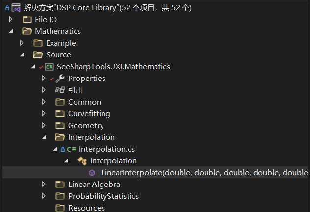

# JXI DSP-Core Note 01320_C# DSP-Core Library 

# Mathematics: Interpolation Linear

**Author:** Peter Park

**Date:**  July-25-2022

## Interpolation类在Mathematics 文件中的显示



## 类及方法说明

### class Interpolation

```C#
public static double LinearInterpolate(double xStart, double yStart, double xEnd, double yEnd, double x)
```

**方法功能描述：**计算在二维平面内点[xStart, yStart]与点[xEnd, yEnd]所连成的直线上给定的x所对应的y值

**输入参数：**

* xStart：起始点横坐标， 数据类型 ：double
* yStart：起始点纵坐标，数据类型 ：double
* xEnd：终点横坐标，数据类型 ：double
* yEnd：终点纵坐标，数据类型 ：double
* x：给定的横坐标，数据类型 ：double

**输出参数：**

* 返回值：直线上给定点的纵坐标，数据类型 ：double

## 核心代码

```C#
 	/// <summary>
    /// 内插方法，包括线性
    /// 可扩展多项式内插
    /// </summary>
    public class Interpolation
    {
        public static double LinearInterpolate(double xStart, double yStart, double xEnd, double yEnd, double x)
        {
            // 如果输入的x与xStart或xEnd相同，则直接返回对应的yStart/yEnd。
            if (x == xStart) { return yStart; }
            if (x == xEnd) { return yEnd; }

            // 如果xStart与xEnd相同，则抛出异常。
            if (xStart == xEnd) { throw new ArgumentException("xStart and xEnd are the same."); }

            // 如果yStart与yEnd相同，则直接返回yStart/yEnd。
            if (yStart == yEnd) { return yStart; }

            // 并非上述边界条件，则插值计算x对应的y。
            double ratio = (x - xStart) / (xEnd - xStart);
            return yStart + ratio * (yEnd - yStart);
        }
    }
```

