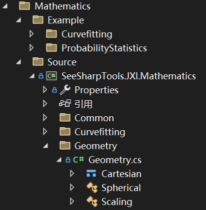

# JXI DSP-Core Note 01330_C# DSP-Core Library 

# Mathematics Geometry

**Author:** LandauRZ

**Date:** July-25-2022


该类的定义的路径为*Core Library\Mathematics\Source\SeeSharpTools.JXI.Mathematics\Geometry*



## 公共类（结构体）及方法说明

### 1，struct Cartesian

#### 结构体的申明

```c#
public struct Cartesian
```

#### 公共属性

* x：第一直角坐标，数据类型：double
* y：第二直角坐标，数据类型：double
* z：第三直角坐标，数据类型：double

#### 构造函数

```c#
public Cartesian(double X = 0.0, double Y = 0.0, double Z = 0.0)
```

**功能描述：**设置了三个直角坐标（缺省时默认坐标为(0.0, 0.0, 0.0)）：

**输入参数：**

* X：第一直角坐标，数据类型：double
* Y：第二直角坐标，数据类型：double
* Z：第三直角坐标，数据类型：double

#### 运算符重载

* +：三维直角坐标加法
  * 输入Cartesian(x1, x2, x3), Cartesian(y1, y2, y3)
  * 输出Cartesian(x1+y1, x2+y2, x3+y3)
* -：三维直角坐标减法
  * 输入Cartesian(x1, x2, x3), Cartesian(y1, y2, y3)
  * 输出Cartesian(x1-y1, x2-y2, x3-y3)
* *：三维直角坐标放缩
  * 输入Cartesian(x1, x2, x3), Cartesian(y1, y2, y3)
  * 输出Cartesian(x1\*y1, x2\*y2, x3*y3)

#### 方法说明

##### **1，CrossProduct**

```c#
public static Cartesian CrossProduct(Cartesian b, Cartesian c)
```

**方法功能描述：**计算两个三维矢量b与c的外积（叉积）

**输入参数：**

* b：第一个三维矢量，数据类型：Cartesian
* c：第二个三维矢量，数据类型：Cartesian

**输出参数：**

* **返回值：**两个三维矢量的外积结果，数据类型：Cartesian

##### **2，DotProduct**

```C#
public static double DotProduct(Cartesian b, Cartesian c)
```

**方法功能描述：**计算两个三维矢量b与c的内积（点积）

**输入参数：**

* b：第一个三维矢量，数据类型：Cartesian
* c：第二个三维矢量，数据类型：Cartesian

**输出参数：**

* **返回值：**两个三维矢量的内积结果，数据类型：Cartesian

##### **3，ConverterToSpherical**

```C#
public static Spherical ConverterToSpherical(Cartesian p)
```

**方法功能描述：**将直角坐标p转化为球坐标

**输入参数：**

* p：待转化的三维直角坐标，数据类型：Cartesian

**输出参数：**

* **返回值：**对应的球坐标，数据类型：Spherical

#### 核心代码

```C#
/// <summary>
        /// 三维向量积，也称叉积、外积 return = b ^ c in vector
        /// 向量积与两个求积向量所在平面垂直，遵守右手法则
        /// </summary>
        /// <param name="b"></param>
        /// <param name="c"></param>
        /// <returns>b^c</returns>
        public static Cartesian CrossProduct(Cartesian b, Cartesian c)
        {
            return new Cartesian(b.y * c.z - b.z * c.y, b.z * c.x - b.x * c.z, b.x * c.y - b.y * c.x);
        }
        /// <summary>
        /// 点积，也称内积
        /// </summary>
        /// <param name="b"></param>
        /// <param name="c"></param>
        /// <returns></returns>
        public static double DotProduct(Cartesian b, Cartesian c)
        {
            return (b.x * c.x + b.y * c.y + b.z * c.z);
        }
        /// <summary>
        /// 输入笛卡尔坐标转换输出球坐标
        /// </summary>
        /// <param name="p"></param>
        /// <returns></returns>
        public static Spherical ConverterToSpherical(Cartesian p)
        {
            Spherical result = new Spherical();
            result.theta = Math.Atan2(p.y, p.x);
            result.fai = Math.Atan2(p.z, Math.Sqrt(p.x * p.x + p.y * p.y));
            result.r = Math.Sqrt(p.x * p.x + p.y * p.y + p.z * p.z);
            return result;
        }
        /// <summary>
        /// 本实例的球坐标
        /// </summary>
        /// <returns></returns>
        public Spherical ConverterToSpherical()
        {
            return Cartesian.ConverterToSpherical(this);
        }


```


### 2，Class Spherical

#### 类的申明

```c#
public class Spherical
```

#### 公共属性

* R：径向距离，数据类型：double
* Theta：方位角，逆时针为正,，x+轴0,，y+轴pi/2，数据类型：double
* Fai：俯仰角，-pi/2 ~ pi/2，z+轴pi/2，数据类型：double

#### 构造函数

```c#
public Spherical(double R = 0.0, double Theta = 0.0, double Fai = 0.0)
```

**功能描述：**设置了三个球坐标分量（缺省时默认坐标为(0.0, 0.0, 0.0)）：

**输入参数：**

* R：径向距离，数据类型：double
* Theta：方位角，逆时针为正,，x+轴0,，y+轴pi/2，数据类型：double
* Fai：俯仰角，-pi/2 ~ pi/2，z+轴pi/2，数据类型：double

#### 方法说明

**1，ConvertToCartesian**

```c#
public static Cartesian ConvertToCartesian(Spherical point) 
```

**方法功能描述：**将球坐标转化为直角坐标

**输入参数：**

* point：待转化的球坐标，数据类型：Spherical

输出参数：

* **返回值：**对应的笛卡尔坐标，数据类型：Cartesian

#### 核心代码

```C#
public static Cartesian ConvertToCartesian(Spherical point)
{
    Cartesian result = new Cartesian();
    result.x = point.r * Math.Cos(point.fai) * Math.Cos(point.theta);
    result.y = point.r * Math.Cos(point.fai) * Math.Sin(point.theta);
    result.z = point.r * Math.Sin(point.fai);
    return result;
}
```

### 3，Class Scaling

#### 类的申明

```c#
public static class Scaling
```

#### 方法说明

##### **1，ClockwiseExchange**

```c#
public static double ClockwiseExchange(double input)
public static void ClockwiseExchange(double[] input)
```

方法功能描述：顺时针求余角变换（规定顺时针0度正北），结果是直角减去输入角。

输入参数：

* input(inout)：
  * 第一类：input，数据类型：double
  * 第二类：inout，数据类型：double数组

输出参数：

* 返回值：
  * 第一类：顺时针余角变换结果，数据类型：double
  * 第二类：根据文档JXI DSP-Core Note 01130_C# DSP-Core Library Numerics Vector Math Operations可知，调用Vector.ArraySub方法且输入两个参数的结果就是将结果存储到后面一个参数中，在这里是将结果存储在inout当中，所以没有额外的输出。inout存储了原先数组中所有数字变换后的结果。

##### **2，GetClockwiseExchange**

```C#
public static double[] GetClockwiseExchange(double[] input)
```

方法功能描述：与1相同，仍然是顺时针求余角变换（规定顺时针0度正北）。

输入参数：

* input：待变换量，数据类型：double数组

输出参数：

* 返回值：变换结果，数据类型：double数组

##### **3，ClockwiseExchangeDegree**

```C#
public static double ClockwiseExchangeDegree(double input) 
public static void ClockwiseExchangeDegree(double[] inout)
```

方法功能描述：同1，只不过转化为角度的语境来进行变换。

输入参数：

* input(inout)：
  * 第一类：input，数据类型：double
  * 第二类：inout，数据类型：double数组

输出参数：

* 返回值：同1，分为直接返回与间接存储到inout中无返回值两种。

##### **4，GetClockwiseExchangeDegree**

```c#
public static double[] GetClockwiseExchangeDegree(double[] input)
```

方法功能描述：同1，只不过转化为角度的语境来进行变换。

输入参数：

* input：待变换量，数据类型：double数组

输出参数：

* 返回值：返回

##### 5，Rad2Degree

```C#
public static double Rad2Degree(double input) 
public static void Rad2Degree(double[] inout)
```

方法功能描述：弧度转角度。

输入参数：

* input(inout)：
  * 第一类：input，待转化的弧度值，数据类型：double
  * 第二类：inout，待转化的弧度值数组，数据类型：double数组

输出参数：

* 返回值：
  * 第一类：转化的角度值，数据类型：double
  * 第二类：无返回值，转化的角度值结果存储到double型数组inout中

##### **6，GetDegree**

```C#
public static double[] GetDegree(double[] input) 
```

方法功能描述：与5相同，仍然是弧度转角度。

输入参数：

* input：待转化的弧度值数组，数据类型：double数组

输出参数：

* 返回值：转化成的角度值数组，数据类型：double数组

##### **7，Degree2Rad**

```c#
public static double Degree2Rad(double input)
public static void Degree2Rad(double[] inout)
```

方法功能描述：角度转弧度。

输入参数：

* input(inout)：
  * 第一类：input，待转化的角度值，数据类型：double
  * 第二类：inout，待转化的角度值数组，数据类型：double数组

输出参数：

* 返回值：
  * 第一类：转化的弧度值，数据类型：double
  * 第二类：无返回值，转化的弧度值结果存储到double型数组inout中

##### **8，GetRad**

```C#
public static double[] GetRad(double[] input)
```

方法功能描述：同7，仍然是弧度转角度

输入参数：

* input：待转化的弧度值数组，数据类型：double数组

输出参数：

* 返回值：转化成的角度值数组，数据类型：double数组


#### 核心代码

```C#
/// <summary>
        /// 三维向量积，也称叉积、外积 return = b ^ c in vector
        /// 向量积与两个求积向量所在平面垂直，遵守右手法则
        /// </summary>
        /// <param name="b"></param>
        /// <param name="c"></param>
        /// <returns>b^c</returns>
        public static Cartesian CrossProduct(Cartesian b, Cartesian c)
        {
            return new Cartesian(b.y * c.z - b.z * c.y, b.z * c.x - b.x * c.z, b.x * c.y - b.y * c.x);
        }
        /// <summary>
        /// 点积，也称内积
        /// </summary>
        /// <param name="b"></param>
        /// <param name="c"></param>
        /// <returns></returns>
        public static double DotProduct(Cartesian b, Cartesian c)
        {
            return (b.x * c.x + b.y * c.y + b.z * c.z);
        }
        /// <summary>
        /// 输入笛卡尔坐标转换输出球坐标
        /// </summary>
        /// <param name="p"></param>
        /// <returns></returns>
        public static Spherical ConverterToSpherical(Cartesian p)
        {
            Spherical result = new Spherical();
            result.theta = Math.Atan2(p.y, p.x);
            result.fai = Math.Atan2(p.z, Math.Sqrt(p.x * p.x + p.y * p.y));
            result.r = Math.Sqrt(p.x * p.x + p.y * p.y + p.z * p.z);
            return result;
        }
        /// <summary>
        /// 本实例的球坐标
        /// </summary>
        /// <returns></returns>
        public Spherical ConverterToSpherical()
        {
            return Cartesian.ConverterToSpherical(this);
        }


```

### 示例代码

```C#
using System;
using System.Collections.Generic;
using System.Linq;
using System.Text;
using System.Threading.Tasks;
using SeeSharpTools.JXI.Mathematics.Geometry;

namespace GeometryExapmple
{
    internal class Program
    {
        static public void PrintArray(double[] array)
        {
            for(int i = 0; i < array.Length; i++)
                Console.Write("{0} ", Math.Round(array[i], 3));
            Console.WriteLine();
        }


        static void Main(string[] args)
        {
            // ----------------------------笛卡尔坐标系操作测试-------------------------
            Console.WriteLine("----------------笛卡尔坐标系操作测试---------------");
            Cartesian cartesian = new Cartesian(1,2,3);
            Cartesian cartesian2 = new Cartesian(2,3,4);
            double scale = 5;
            Console.WriteLine();
            Console.WriteLine("第一个笛卡尔坐标：c1 = ({0},{1},{2})", cartesian.x, cartesian.y, cartesian.z);
            Console.WriteLine("第二个笛卡尔坐标：c2 = ({0},{1},{2})", cartesian2.x, cartesian2.y, cartesian2.z);
            Console.WriteLine("标量s = {0}", scale);


            // 基本运算
            Console.WriteLine("----------------------基本运算---------------------");
            Console.WriteLine("---------------------运算符重载--------------------");
            // 1，坐标加法
            var res = cartesian + cartesian2;
            Console.WriteLine("坐标加法结果：c1 + c2 = ({0},{1},{2})", res.x, res.y, res.z);
            // 2，坐标减法
            var res2 = cartesian - cartesian2;
            Console.WriteLine("坐标减法结果：c1 - c2 = ({0},{1},{2})", res2.x, res2.y, res2.z);
            // 3，三维矢量内积
            var res3 = cartesian * cartesian2;
            Console.WriteLine("三维矢量内积结果：c1 * c2 = {0}", res3);
            // 4，三维矢量标积
            var res4 = cartesian * scale;
            Console.WriteLine("三维矢量标积：c1 * scale = ({0},{1},{2})", res4.x, res4.y, res4.z);
            // 调用CrossProduct计算外积
            var res5 = Cartesian.CrossProduct(cartesian, cartesian2);
            Console.WriteLine();
            Console.WriteLine("--------------------CrossProduct-------------------");
            Console.WriteLine("调用CrossProduct计算外积结果：c1 x c2 = ({0},{1},{2})", res5.x, res5.y, res5.z);

            // 调用DotProduct计算内积
            var res6 = Cartesian.DotProduct(cartesian, cartesian2);
            Console.WriteLine();
            Console.WriteLine("---------------------DotProduct--------------------");
            Console.WriteLine("调用DotProduct计算点积结果：c1 * c2 = {0}", res6);


            // 调用ConverterToSpherical计算将笛卡尔坐标转换为球坐标
            var res7 = Cartesian.ConverterToSpherical(cartesian);
            Console.WriteLine();
            Console.WriteLine("-----------------ConverterToSpherical--------------");
            Console.WriteLine("调用ConverterToSpherical计算将c1转换为球坐标之后为：({0},{1},{2})", res7.r, res7.fai, res7.theta);


            // -----------------------------球坐标系操作测试----------------------------
            Console.WriteLine();
            Console.WriteLine();
            Console.WriteLine("------------------球坐标系操作测试-----------------");
            Spherical spherical = new Spherical(2,Math.PI / 4,Math.PI / 2);
            Console.WriteLine("球坐标：s = ({0},{1},{2})", Math.Round(spherical.r,3), Math.Round(spherical.fai,3), Math.Round(spherical.theta,3));


            // 调用ConvertToCartesian计算将球坐标转换为直角坐标
            Console.WriteLine();
            Console.WriteLine("-----------------ConvertToCartesian----------------");
            var res8 = Spherical.ConvertToCartesian(spherical);
            Console.WriteLine("调用ConvertToCartesian计算将s转换为直角坐标之后为：({0},{1},{2})", Math.Round(res8.x,3), Math.Round(res8.y,3), Math.Round(res8.z, 3));


            //  -------------------------------Scaling测试-----------------------------
            Console.WriteLine();
            Console.WriteLine();
            Console.WriteLine("--------------------Scaling测试--------------------");
            double input = Math.PI / 3;
            double[] input2 = new double[5] { Math.PI / 2, Math.PI / 3, Math.PI / 4, Math.PI / 6, Math.PI };
            double[] inout = new double[5] { Math.PI / 2, Math.PI / 3, Math.PI / 4, Math.PI / 6, Math.PI};
            Console.WriteLine("--------------------弧度制输入---------------------");
            Console.WriteLine("input = {0}", Math.Round(input, 3));
            Console.Write("input2 = ");
            PrintArray(input2);
            Console.Write("inout = ");
            PrintArray(inout);


            // 调用ClockwiseExchange与GetClockwiseExchange求余角（弧度制）
            Console.WriteLine();
            var res9 = Scaling.ClockwiseExchange(input);
            Console.WriteLine("调用ClockwiseExchange计算input的余角 = {0}", Math.Round(res9, 3));

            Scaling.ClockwiseExchange(inout);
            Console.Write("调用ClockwiseExchange计算inout的余角 = ");
            PrintArray(inout);

            var res10 = Scaling.GetClockwiseExchange(input2);
            Console.Write("调用GetClockwiseExchange计算input2的余角 = ");
            PrintArray(res10);

            // 调用ClockwiseExchangeDegree与GetClockwiseExchangeDegree求余角（角度制）
            Console.WriteLine();


            double input_degree = 45;
            double[] input2_degree = new double[5] { 15, 25, 45.5, 75, 85 };
            double[] inout_degree = new double[5] { 15, 25, 45.5, 75, 85 };
            Console.WriteLine("--------------------角度制输入---------------------");
            Console.WriteLine("input_degree = {0}", Math.Round(input_degree, 3));
            Console.Write("input2_degree = ");
            PrintArray(input2_degree);
            Console.Write("inout_degree = ");
            PrintArray(inout_degree);

            // 调用ClockwiseExchangeDegree与GetClockwiseExchangeDegree求余角（角度制）
            Console.WriteLine();
            var res11 = Scaling.ClockwiseExchangeDegree(input_degree);
            Console.WriteLine("调用ClockwiseExchangeDegree计算input_degree的余角 = {0}", Math.Round(res11, 3));

            Scaling.ClockwiseExchangeDegree(inout_degree);
            Console.Write("调用ClockwiseExchangeDegree计算inout_degree的余角 = ");
            PrintArray(inout_degree);

            var res12 = Scaling.GetClockwiseExchangeDegree(input2_degree);
            Console.Write("调用GetClockwiseExchangeDegree计算input2_degree的余角 = ");
            PrintArray(res12);


            
            Console.ReadKey();
        }
        /*
         *  ----------------笛卡尔坐标系操作测试---------------

            第一个笛卡尔坐标：c1 = (1,2,3)
            第二个笛卡尔坐标：c2 = (2,3,4)
            标量s = 5
            ----------------------基本运算---------------------
            ---------------------运算符重载--------------------
            坐标加法结果：c1 + c2 = (3,5,7)
            坐标减法结果：c1 - c2 = (-1,-1,-1)
            三维矢量内积结果：c1 * c2 = 20
            三维矢量标积：c1 * scale = (5,10,15)

            --------------------CrossProduct-------------------
            调用CrossProduct计算外积结果：c1 x c2 = (-1,2,-1)

            ---------------------DotProduct--------------------
            调用DotProduct计算点积结果：c1 * c2 = 20

            -----------------ConverterToSpherical--------------
            调用ConverterToSpherical计算将c1转换为球坐标之后为：(3.74165738677394,0.930274014115472,1.10714871779409)


            ------------------球坐标系操作测试-----------------
            球坐标：s = (2,1.571,0.785)

            -----------------ConvertToCartesian----------------
            调用ConvertToCartesian计算将s转换为直角坐标之后为：(0,0,2)


            --------------------Scaling测试--------------------
            --------------------弧度制输入---------------------
            input = 1.047
            input2 = 1.571 1.047 0.785 0.524 3.142
            inout = 1.571 1.047 0.785 0.524 3.142

            调用ClockwiseExchange计算input的余角 = 0.524
            调用ClockwiseExchange计算inout的余角 = 0 0.524 0.785 1.047 -1.571
            调用GetClockwiseExchange计算input2的余角 = 0 0.524 0.785 1.047 -1.571

            --------------------角度制输入---------------------
            input_degree = 45
            input2_degree = 15 25 45.5 75 85
            inout_degree = 15 25 45.5 75 85

            调用ClockwiseExchangeDegree计算input_degree的余角 = 45
            调用ClockwiseExchangeDegree计算inout_degree的余角 = 75 65 44.5 15 5
            调用GetClockwiseExchangeDegree计算input2_degree的余角 = 75 65 44.5 15 5

         */
    }
}

```

