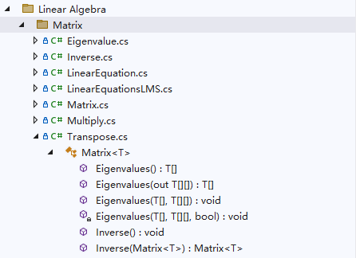

# JXI DSP-Core Note 01340_C# DSP-Core Library

# Mathematics: Linear Algebra Eigenvalue

**Author:** Hamburg

**Date:** Jul-25-2022

## Eigenvalue方法在Solution Explorer中的显示

该类的定义路径为Linear Algebra\Matrix\Eigenvalue



## 方法说明

方法功能描述：计算矩阵的特征值和特征向量

### 1. 单参数

```C#
/// <summary>
/// 计算特征值和特征向量
/// </summary>
public T[] Eigenvalues(out T[][] eigenvectors)
```

**输出参数：**

* eigenvectors：特征向量构成的矩阵，数据类型：泛型矩阵

**返回值：**特征值数组，数据类型：泛型数组

### 2. 双参数

```c#
/// <summary>
/// 计算特征值和特征向量
/// </summary>
public void Eigenvalues(T[] eigenvalues, T[][] eigenvectors)
```

**输入参数：**

* eigenvalues：特征值数组，数据类型：泛型数组
* eigenvectors：特征向量构成的矩阵，数据类型：泛型矩阵

## 示例代码

```c#
using System;
using System.Collections.Generic;
using System.Linq;
using System.Text;
using System.Numerics;
using System.Threading.Tasks;
using SeeSharpTools.JXI.Mathematics.LinearAlgebra.Matrix;
using SeeSharpTools.JXI.Numerics;

namespace Eigenvalue_Example
{
    internal class Program
    {
        static void Main(string[] args)
        {
            #region ---Eigenvalue Example---

            Console.WriteLine();
            Console.WriteLine("*** Eigenvalue ***");

            //define data
            Complex32[,] A = new Complex32[3, 3] { { 3, 2, 4 }, { 2, 0, 2 }, { 4, 2, 3 } };
            Matrix<Complex32> matAEigen = new Matrix<Complex32>(A);
            Complex32[] Eigenvalue = new Complex32[3];
            Complex32[][] Eigenvector = new Complex32[3][] { new Complex32[3], new Complex32[3], new Complex32[3] };
            Console.WriteLine();
            Console.WriteLine("* Original Matrix *");
            Console.WriteLine("3   2   4");
            Console.WriteLine("2   0   2");
            Console.WriteLine("4   2   3");

            //单参数计算
            Console.WriteLine();
            Console.WriteLine("* Single-Parameter Calculation *");
            Eigenvalue = matAEigen.Eigenvalues(out Eigenvector);
            Console.WriteLine("Eigenvalue:");
            foreach (var item in Eigenvalue)
            {
                Console.Write("{0} ", item);
                Console.WriteLine();
            }
            Console.WriteLine("Eigenvector:");
            PrintMatrix(Eigenvector);
            Console.WriteLine();

            //双参数计算
            Console.WriteLine();
            Console.WriteLine("* Double-Parameters Calculation *");
            matAEigen.Eigenvalues(Eigenvalue, Eigenvector);
            Console.WriteLine("Eigenvalue:");
            foreach (var item in Eigenvalue)
            {
                Console.Write("{0} ", item);
                Console.WriteLine();
            }
            Console.WriteLine("Eigenvector:");
            PrintMatrix(Eigenvector);
            Console.WriteLine();
            #endregion
        }
        static void PrintMatrix(Complex32[][] matrix)
        {
            int i;
            int j;
            for (i = 0; i < matrix.Length; i++)
            {
                for (j = 0; j < matrix[0].Length; j++)
                {
                    Console.Write("{0} ", matrix[i][j]);
                }
                Console.WriteLine();
            }
        }
    }
}

/*
output:

*** Eigenvalue ***

* Original Matrix *
3   2   4
2   0   2
4   2   3

* Single-Parameter Calculation *
Eigenvalue:
-1, 0 i
8, 0 i
-1, 0 i
Eigenvector:
0.745356, 0 i -0.2981424, 0 i -0.5962849, 0 i
0.6666667, 0 i 0.3333333, 0 i 0.6666667, 0 i
-0.508258, 0 i -0.4509217, 0 i 0.7337189, 0 i


* Double-Parameters Calculation *
Eigenvalue:
-1, 0 i
8, 0 i
-1, 0 i
Eigenvector:
0.745356, 0 i -0.2981424, 0 i -0.5962849, 0 i
0.6666667, 0 i 0.3333333, 0 i 0.6666667, 0 i
-0.508258, 0 i -0.4509217, 0 i 0.7337189, 0 i

*/
```

值得注意的是，每个特征值对应一行特征向量，如 -1+0i 对应[ 0.745356+0i,  -0.2881424+0i,  -0.5962849+0i]