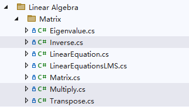

# JXI DSP-Core Note 01341_C# DSP-Core Library

# Mathematics: Linear Algebra Operate

**Author:** Hamburg

**Date:** Jul-26-2022

## Inverse/Multiply/Transpose方法在Solution Explorer中的显示

三个方法的定义路径分别为Linear Algebra\Matrix\Inverse、Linear Algebra\Matrix\Multiply、Linear Algebra\Matrix\Transpose



## Inverse方法说明

**方法功能描述：**求方阵的逆矩阵

```c#
/// <summary>
/// 方阵求逆
/// </summary>
public static Matrix<T> Inverse(Matrix<T> input)
{
    Matrix<T> output = Matrix<T>.Identity(input.Colum) ;
    SolveLinearEquations(input, output);
    return output;
}
```

**输入参数：**

* input：输入矩阵，数据类型：泛型矩阵

**返回值：**输出的逆矩阵，数据类型：泛型矩阵


## Transpose方法说明

**方法功能描述：**求矩阵的转置矩阵

```c#
/// <summary>
/// 矩阵转置
/// </summary>
public static Matrix<T> GetTranspose(Matrix<T> source)
{
    Matrix<T> result = new Matrix<T>(source);
    result.Transpose();
    return result;
}
```

**输入参数：**

* source：输入矩阵，数据类型：泛型矩阵

**返回值：**输出的转置矩阵，数据类型：泛型矩阵


## Multiply方法说明（包括运算符*的重载）

**方法功能描述：**求矩阵分别与常数、向量（包括左、右乘）、矩阵的乘积，向量与向量的点乘

### 矩阵与常数相乘

#### 1. scale*matrix

```c#
/// <summary>
/// 矩阵乘以常数
/// </summary>
public static Matrix<T> operator *( T scale, Matrix<T> matrix)
{
    return matrix * scale;
}
```

**输入参数：**

* scale：输入的常数，数据类型：泛型
* matrix：输入的矩阵，数据类型：泛型矩阵

**返回值：**输出相乘后的矩阵，数据类型：泛型矩阵

#### 2. matrix*scale

```c#
/// <summary>
/// 矩阵乘以常数
/// </summary>
public static Matrix<T> operator *(Matrix<T> matrix, T scale)
{
    Matrix<T> result = new Matrix<T>(matrix);
    Multiply(scale, result);
    return result;
}
```

**输入参数：**

* matrix：输入的矩阵，数据类型：泛型矩阵
* scale：输入的常数，数据类型：泛型

**返回值：**输出相乘后的矩阵，数据类型：泛型矩阵

#### 3. Multiply(scale, matrix)

```c#
/// <summary>
/// 矩阵乘以常数
/// </summary>
public static void Multiply(T scale, Matrix<T> inout)
```

**输入参数：**

* scale：输入的常数，数据类型：泛型
* inout：输入的矩阵，做原位计算，数据类型：泛型矩阵

### 矩阵右乘向量

#### 1. 双参数

```c#
/// <summary>
/// 矩阵右乘向量
/// </summary>
public static T[] operator *(Matrix<T> left, T[] right)
{
    T[] result = new T[left.Row];
    Multiply(left, right, result, true);
    return result;
}
```

**输入参数：**

* left：位于左侧的输入矩阵，数据类型：泛型矩阵
* right：位于右侧的输入向量，数据类型：泛型向量

**返回值：**输出矩阵右乘向量后得到的向量，数据类型：泛型向量

#### 2. 三参数

```c#
/// <summary>
/// 矩阵右乘向量
/// </summary>
public static void Multiply(Matrix<T> left, T[] right, T[] result)
{
    Multiply(left, right, result, true);
}
```

**输入参数：**

* left：位于左侧的输入矩阵，数据类型：泛型矩阵
* right：位于右侧的输入向量，数据类型：泛型向量

**输出参数：**

* result：矩阵右乘向量后得到的向量，数据类型：泛型向量

### 矩阵左乘向量

#### 1. 双参数

```c#
/// <summary>
/// 矩阵左乘向量
/// </summary>
public static T[] operator *(T[] left, Matrix<T> right)
{
    T[] result = new T[right.Colum];
    Multiply(right, left, result, false);
    return result;
}
```

**输入参数：**

* left：位于左侧的输入向量，数据类型：泛型向量
* right：位于右侧的输入矩阵，数据类型：泛型矩阵

**返回值：**输出矩阵左乘向量后得到的向量，数据类型：泛型向量

#### 2. 三参数

```c#
/// <summary>
/// 矩阵左乘向量
/// </summary>
public static void Multiply( T[] left, Matrix<T> right, T[] result)
{
    Multiply(right, left, result, false);
}
```

**输入参数：**

* left：位于左侧的输入向量，数据类型：泛型向量
* right：位于右侧的输入矩阵，数据类型：泛型矩阵

**输出参数：**

* result：矩阵左乘向量后得到的向量，数据类型：泛型向量

### 矩阵与矩阵相乘

```c#
/// <summary>
/// 矩阵乘以矩阵
/// </summary>
public static void Multiply(Matrix<T> a, Matrix<T> b, Matrix<T> c)
```

**输入参数：**

* a：位于左侧的输入矩阵，数据类型：泛型矩阵
* b：位于右侧的输入矩阵，数据类型：泛型矩阵

**输出参数：**

* c：a左乘b后的矩阵，数据类型：泛型矩阵

### 向量点乘向量

```c#
/// <summary>
/// 向量点乘向量
/// </summary>
public static T Multiply(T[] left, T[] right)
```

**输入参数：**

* left：位于左侧的输入向量，数据类型：泛型向量
* right：位于右侧的输入向量，数据类型：泛型向量

**返回值：**向量点乘后得到的值，数据类型：泛型