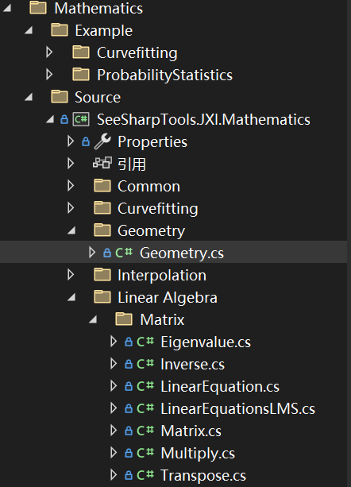

# JXI DSP-Core Note 01342_C# DSP-Core Library 

# Mathematics Linear Algebra LinearEquation

**Author:** LandauRZ

**Date:** July-26-2022


该类的定义的路径为*Core Library\Mathematics\Source\SeeSharpTools.JXI.Mathematics\Linear Algebra\Matrix\LinearEquation.cs*




## 公共类及方法说明

### Class Matrix

#### 类的申明

```c#
public partial class Matrix<T>
```

#### 方法说明

##### **1，SolveLinearEquations**

```c#
public static void SolveLinearEquations(Matrix<T> input, T[] knownSolution)
public static void SolveLinearEquations(Matrix<T> input, T[] known, T[] solution)
public static void SolveLinearEquations(Matrix<T> input, Matrix<T> knownSolution)
public static void SolveLinearEquations(Matrix<T> input, Matrix<T> known, Matrix<T> solution)
private static void SolveLinearEquations(T[] matrixInput, int N, bool isSymmetric, T[] dataKnownSolution, int M)
```

**方法功能描述：**通过调用intel的mkl中的函数来求解线性方程组，相关描述可参考intel官方文档(intel.com) 。经过本方法封装后，非法输入会抛出报错信息。矩阵方程一般可以写为
$$
AX=B
$$
的形式，本方法的目的就是求出解矩阵$X$。


**输入参数：**

* matrixInput（input）：待求解方程系数矩阵A，数据类型：泛型矩阵类
* N：matrixInput的矩阵行数，数据类型：int
* isSymmetric：矩阵matrixInput是否为对称矩阵，数据类型：bool
* datakownSolution（knownSolution，或solution）：矩阵方程右侧的矩阵B。数据类型：泛型数组
* M：B的列数，数据类型：int

**输出参数：**

* **返回值：**无，方程的解通过B来接收，数据类型：泛型数组

## **应用案例**

```C#
using System;
using System.Collections.Generic;
using System.Linq;
using System.Text;
using System.Threading.Tasks;
using SeeSharpTools.JXI.Mathematics.LinearAlgebra.Matrix;

namespace ConsoleApp2
{
    
    internal class Program
    {
        
        static void Main(string[] args)
        {
            void PrintMatrix(Matrix<double> m)
            {
                int i = 0;
                int j = 0;
                for (i = 0; i < m.Row; i++)
                {
                    for (j = 0; j < m.Colum; j++)
                    {
                        Console.Write("{0} ", m.MatrixArray[i, j]);
                    }
                    Console.WriteLine();
                }
            }
            double[,] a = new double[3, 3] { { 1, 2, 3 }, { 2, 3, 4 }, { 3, 4, 5 } };
            double[,] b = new double[3, 1] { { 1 }, { 2 }, { 3 } };
            double[,] c = new double[3, 3] { { 1, 2, 3 }, { 2, 3, 4 }, { 3, 4, 5 } };
            Matrix<double> matrix = new Matrix<double>(a);
            Matrix<double> matrix2 = new Matrix<double>(b);
            Matrix<double> matrix3 = new Matrix<double>(c);
            Matrix<double>.SolveLinearEquations(matrix, matrix3);
            PrintMatrix(matrix3);
            Console.WriteLine();
            Matrix<double>.SolveLinearEquations(matrix, matrix2);
            PrintMatrix(matrix2);
            Console.WriteLine();
            Console.ReadKey();
        }
    }
}


//output:
//-1.25 -0.999999999999999 0
//4.5 3 0
//-2.25 -0.999999999999999 1
//
//-1.25
//4.5
//-2.25
//注意第一个输出它也是矩阵方程的一个解（无穷多解的矩阵方程只输出一个结果）
```


