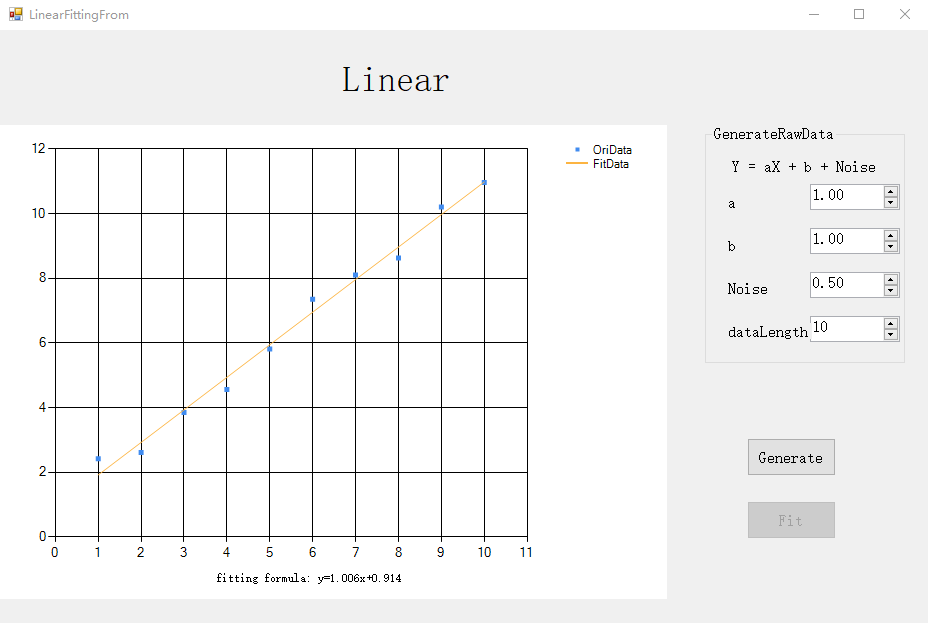

# JXI DSP-Core Note 01350_C# DSP-Core Library

# Mathematics: Linear Fitting

**Author:** Hamburg

**Date:** Jul-27-2022

## LinearFit方法说明

**方法功能描述：** 基于已知数据序列(x, y)，用最小二乘法计算(intersetX, fittedY)的线性拟合。 

### 一对数据点(intersetX, fittedY)的拟合

```c#
/// <summary>
/// Calculate the linear fit of a pair (intersetX, fittedY) based on known data sequence (x,y) using the Least Square method.
/// </summary>
public static void LinearFit(double[] x, double[] y, double interestX, out double fittedY)
```

**输入参数：**

* x，所有基础数据点的横坐标，数据类型：double数组
* y，所有基础数据点的纵坐标，数据类型：double数组
* intersetX，感兴趣点的横坐标，数据类型：double

**输出参数：**

* fittedY，对感兴趣点横坐标拟合后所得的y值，数据类型：double

### 一对数据点(intersetX, fittedY)的拟合及斜率和截距的输出

```c#
/// <summary>
/// Calculate the linear fit of a pair (intersetX, fittedY) based on known data sequence (x,y) using the Least Square method.
/// </summary>
public static void LinearFit(double[] x, double[] y, double interestX, out double fittedY, out double slope, out double intercept)
```

**输入参数：**

* x，所有基础数据点的横坐标，数据类型：double数组
* y，所有基础数据点的纵坐标，数据类型：double数组
* intersetX，感兴趣点的横坐标，数据类型：double

**输出参数：**

* fittedY，对感兴趣点横坐标拟合后所得的y值，数据类型：double
* slope，拟合直线的斜率，数据类型：double
* intercept，拟合直线的y轴截距，数据类型：double

### 数据点集(intersetX, fittedY)的拟合

```c#
/// <summary>
/// Calculate the linear fit of a data set (intersetX, fittedY) based on known data sequence (x,y) using the Least Square method.
/// </summary>
public static void LinearFit(double[] x, double[] y, double[] interestX, ref double[] fittedY)
```

**输入参数：**

* x，所有基础数据点的横坐标，数据类型：double数组
* y，所有基础数据点的纵坐标，数据类型：double数组
* intersetX，所有感兴趣点的横坐标，数据类型：double数组

**ref参数：**

* fittedY，对所有感兴趣点横坐标拟合后所修正的y值，数据类型：double数组

### 数据点集(intersetX, fittedY)的拟合及斜率和截距的输出

```c#
/// <summary>
/// Calculate the linear fit of a data set (intersetX, fittedY) based on known data sequence (x,y) using the Least Square method.
/// </summary>
public static void LinearFit(double[] x, double[] y, double[] interestX, ref double[] fittedY, out double slope, out double intercept)
```

**输入参数：**

* x，所有基础数据点的横坐标，数据类型：double数组
* y，所有基础数据点的纵坐标，数据类型：double数组
* intersetX，所有感兴趣点的横坐标，数据类型：double数组

**ref参数：**

* fittedY，对所有感兴趣点横坐标拟合后所修正的y值，数据类型：double数组

**输出参数：**

* slope，拟合直线的斜率，数据类型：double
* intercept，拟合直线的y轴截距，数据类型：double

## WinForm LinearFit

### 界面



### 核心代码

#### 数组X和Y的初始化

```c#
#region Private Fields
/// <summary>
/// input array X
/// 输入数组X
/// </summary>
double[] dataXOri;

/// <summary>
/// input array Y
/// 输入数组Y
/// </summary>
double[] dataYOri;
#endregion
```

#### 界面初始化

```c#
#region Constructor
public LinearFittingFrom()
{
    InitializeComponent();
}
#endregion
```

#### Generate事件

包括数组X和Y的生成、数据点的绘制。

```c#
/// <summary>
/// generate array X and arrray Y
/// 生成X数组以及Y数组
/// </summary>
/// <param name="sender"></param>
/// <param name="e"></param>
private void btnGenerate_Click(object sender, EventArgs e)
{
    dataXOri = new double[(int)numericUpDownDataLength.Value];
    dataYOri = new double[(int)numericUpDownDataLength.Value];
    double[] Noise = new double[(int)numericUpDownDataLength.Value];

    while (chart1.ChartAreas[0].AxisX.ScaleView.IsZoomed)
    {
        chart1.ChartAreas[0].AxisX.ScaleView.ZoomReset();
        chart1.ChartAreas[0].AxisY.ScaleView.ZoomReset();
    }
    chart1.Series[0].Points.Clear();
    chart1.Series[1].Points.Clear();
    Result.Visible = false;
    btnFit.Enabled = true;

    double a = (double)numericUpDownA.Value;
    double b = (double)numericUpDownB.Value;

    Random rand = new Random(DateTime.Now.Millisecond);
    for (int i = 0; i < dataXOri.Length; i++)
    {
        Noise[i] = rand.Next((int)(-numericUpDownNoise.Value * 100), (int)(numericUpDownNoise.Value * 100)) / 100.0;
        dataXOri[i] = i + 1;
        dataYOri[i] = a * dataXOri[i] + b + Noise[i];
        chart1.Series[0].Points.AddXY(dataXOri[i], dataYOri[i]);
    }
}
```

#### Fit事件

包括数据的拟合、拟合直线的绘制、拟合直线表达式的生成。

```c#
/// <summary>
/// fit
/// 拟合
/// </summary>
/// <param name="sender"></param>
/// <param name="e"></param>
private void btnFit_Click(object sender, EventArgs e)
{
    chart1.Series[1].Points.Clear();
    Result.Visible = true;
    btnFit.Enabled = false;

    double[] data=new double[dataXOri.Length];
    double slop;
    double inte;
    EasyCurveFitting.LinearFit(dataXOri, dataYOri, dataXOri, ref data, out slop, out inte);
    if (data == null)
    {
        //MessageBox.Show("参数设置错误，请重新设置！\n可能原因：未输入拟合参数", "提示", MessageBoxButtons.OK);
        MessageBox.Show(" Parameters error, pls set again!\nPossible reason: fitting parameters not input","Note",MessageBoxButtons.OK);
        return;
    }
    for (int i = 0; i < dataXOri.Length; i++)
    {
        chart1.Series[1].Points.AddXY(dataXOri[i], data[i]);
    }

    bool zeroFlag = true;
    //Result.Text = "拟合公式:y = ";
    Result.Text = "fitting formula: y=";
    if (System.Math.Abs(slop) > 0.00001)
    {
        zeroFlag = false;
        Result.Text += slop.ToString("f3") + "x";
    }
    if (System.Math.Abs(inte) > 0.00001)
    {
        zeroFlag = false;
        if (inte < 0)
        {
            Result.Text += inte.ToString("f3");
        }
        else
        {
            Result.Text += "+" + inte.ToString("f3");
        }
    }

    if (zeroFlag)
    {
        Result.Text += "0";
    }
}
```

