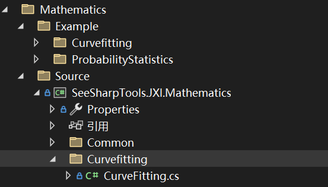

# JXI DSP-Core Note 01351_C# DSP-Core Library

# Mathematics: Exponential Fitting

**Author:** Peter Park

**Date:** Jul-27-2022


该类的定义的路径为*..\SeeSharp\Seesharp-DSP-Core-Lib\Development\CSharp\Core Library\Mathematics\Source\SeeSharpTools.JXI.Mathematics\Curvefitting*



## Exponential Fitting相关方法说明

**方法总体功能描述：** 基于已知数据序列(x, y)，借用求对数和最小二乘法计算数据点的的指数拟合。 

### (1)ExponentialFit方法重载一

**功能描述：**

基于输入的数组x和y，对某一单一位置数据点的指数拟合计算

**方法申明：**

```c#
public static void ExponentialFit(double[] x, double[] y, double interestX,                                                 out double fittedY)
```

**输入参数：**

**值参数：**

* x，所有基础数据点的横坐标，数据类型：double数组
* y，所有基础数据点的纵坐标，数据类型：double数组
* intersetX，感兴趣点的横坐标，数据类型：double

**输出参数：**

* fittedY，通过计算得到的指数函数模型，对感兴趣点横坐标拟合后所得的y值，数据类型：double


### (2)ExponentialFit方法重载二

**功能描述：**

单一位置数据点的指数拟合计算，再加上幅度系数和指数部分等系数的输出

**方法申明：**

```c#
public static void ExponentialFit(double[] x, double[] y, double interestX,                                                 out double fittedY, out double amplitude,                                                 out double damping, out double offset)
```

**输入参数：**

**值参数：**

* x，所有基础数据点的横坐标，数据类型：double数组
* y，所有基础数据点的纵坐标，数据类型：double数组
* intersetX，感兴趣点的横坐标，数据类型：double

**输出参数：**

* fittedY，通过计算得到的指数函数模型，对感兴趣点横坐标拟合后所得的y值，数据类型：double
* amplitude，拟合e指数函数模型的幅度，数据类型：double
* damping，阻尼系数，转为对数求解后的拟合直线的斜率，也即e指数部分x的系数，数据类型：double
* offset，补偿系数，默认为0，数据类型：double


### (3)ExponentialFit方法重载三

**功能描述：**

基于输入的数组x和y，对多个感兴趣位置数据点的指数拟合计算

**方法申明**

```c#
public static void ExponentialFit(double[] x, double[] y, double[] interestX, ref                                           double[] fittedY)
```

**输入参数：**

**值参数：**

* x，所有基础数据点的横坐标，数据类型：double数组
* y，所有基础数据点的纵坐标，数据类型：double数组
* intersetX，感兴趣点集的横坐标，数据类型：double数组

**引用参数：**

* fittedY，通过计算得到的指数函数模型，对所有感兴趣点横坐标集合计算得到的对应的拟合值，

  数据类型：double数组


### (4)ExponentialFit方法重载四

**功能描述：**

在对多个感兴趣位置数据点的指数拟合计算的基础上，再加上幅度系数和指数部分等系数的输出

**方法申明：**

```c#
public static void ExponentialFit(double[] x, double[] y, double[] interestX, 
                                  ref double[] fittedY, out double amplitude, 
                                  out double damping, out double offset)
```

**输入参数：**

**值参数：**

* x，所有基础数据点的横坐标，数据类型：double数组
* y，所有基础数据点的纵坐标，数据类型：double数组
* intersetX，感兴趣点集的横坐标，数据类型：double数组

**引用参数：**

* fittedY，通过计算得到的指数函数模型，对所有感兴趣点横坐标集合计算得到的对应的拟合值，

  数据类型：double数组

**输出参数：**

* amplitude，拟合e指数函数模型的幅度，数据类型：double
* damping，阻尼系数，转为对数求解后的拟合直线的斜率，也即e指数部分x的系数，数据类型：double
* offset，补偿系数，默认为0，数据类型：double


## Exponential Fitting WinForm界面及例程介绍

### 界面展示

该WinForm程序的路径为：*Core Library\Mathematics\Example\Curvefitting\ExponentialFitting*


### 界面功能介绍

该界面中GenerateRawData部分的作用是生成用于拟合的基础数据点，这些点的个数和分布由在该模块内所设置的参数a、b、Noise以及dataLenth所决定。在确定好参数后点击generate即可在坐标系中生成数据点，且作为Exponential Fitting的值参数输入；在点击Fit后，会调用Mathematics: Exponential Fitting中的方法，完成指数拟合，返回在0-20的区间内的输出点集合，绘制于坐标系中。


### 核心代码

以下代码为上面的ExponentialFittingForm类所包含的主要关键事件处理器的代码

#### Generate按键的事件处理器

**功能描述：**产生用于拟合的数据点

```c#
        /// <summary>
        /// generate array X and array Y
        /// 生成X数组以及Y数组
        /// </summary>
        /// <param name="sender"></param>
        /// <param name="e"></param>
        private void btnGenerate_Click(object sender, EventArgs e)
        {
            dataXOri = new double[(int)numericUpDownDataLength.Value];
            dataYOri = new double[(int)numericUpDownDataLength.Value];
            dataYFit = new double[(int)numericUpDownDataLength.Value];

            while (chart1.ChartAreas[0].AxisX.ScaleView.IsZoomed)
            {
                chart1.ChartAreas[0].AxisX.ScaleView.ZoomReset();
                chart1.ChartAreas[0].AxisY.ScaleView.ZoomReset();
            }
            chart1.Series[0].Points.Clear();
            chart1.Series[1].Points.Clear();
            Result.Visible = false;
            btnFit.Enabled = true;

            double[] Noise = new double[dataXOri.Length];
            Random noise = new Random(DateTime.Now.Millisecond);
            //Generate an array to be fitted based on parameters
            //根据参数生成待拟合数组
            for (int i = 0; i < dataXOri.Length; i++)
            {            
                Noise[i] = noise.Next((int)(-numericUpDown_noise.Value * 100),                                      (int)(numericUpDown_noise.Value * 100)) / 100.0;
                dataXOri[i] = i + 1;
                dataYOri[i] = (double)numericUpDown_a.Value * System.Math.Exp((double)                                  (numericUpDown_b.Value) * dataXOri[i])+Noise[i];
                chart1.Series[0].Points.AddXY(dataXOri[i], dataYOri[i]);                
            }            

        }
```


#### Fit按键的事件处理器

**功能描述：**进行指数拟合

```c#
		/// <summary>
        /// fit
        /// 拟合
        /// </summary>
        /// <param name="sender"></param>
        /// <param name="e"></param>
        private void btnFit_Click(object sender, EventArgs e)
        {
            chart1.Series[1].Points.Clear();
            Result.Visible = true;
            btnFit.Enabled = false; 


            double amplitude;
            double damping;
            double offset;
            
            
            //在此处调用了本节中所介绍的(4)ExponentialFit方法重载四
            EasyCurveFitting.ExponentialFit(dataXOri, dataYOri, dataXOri, ref dataYFit,                                                out amplitude, out damping, out offset);
            
            
            if (dataYFit == null)
            {
                //MessageBox.Show("参数设置错误，请重新设置！\n可能原因:未输入拟合参数", "提                                      示", MessageBoxButtons.OK);
                MessageBox.Show(" Parameters error, pls set again!\nPossible reason:                                 fitting parameters not input","Note",MessageBoxButtons.OK);
                return;
            }
            for (int i = 0; i < dataYFit.Length; i++)
            {
                chart1.Series[1].Points.AddXY(dataXOri[i], dataYFit[i]);
            }

            if (System.Math.Abs(amplitude) < 0.00001 && System.Math.Abs(damping) < 0.00001)
            {
                //Result.Text = "拟合公式:y = 0";
                Result.Text = "fitting formula: y=0";
            }
            else if (System.Math.Abs(damping) < 0.00001)
            {
                //Result.Text = "拟合公式:y = " + amplitude.ToString("f3");
                Result.Text = "fitting formula: y="+ amplitude.ToString("f3");
            }
            else
            {
                //Result.Text = "拟合公式:y = " + amplitude.ToString("f3") + "exp" +                                                    "(" + damping.ToString("f3") + "x)";
                Result.Text = "fitting formula: y="+ amplitude.ToString("f3")+ "exp"                                                        + "(" + damping.ToString("f3") + "x)";
            }
        }
        #endregion

```

