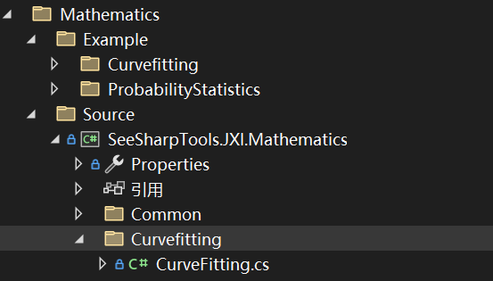
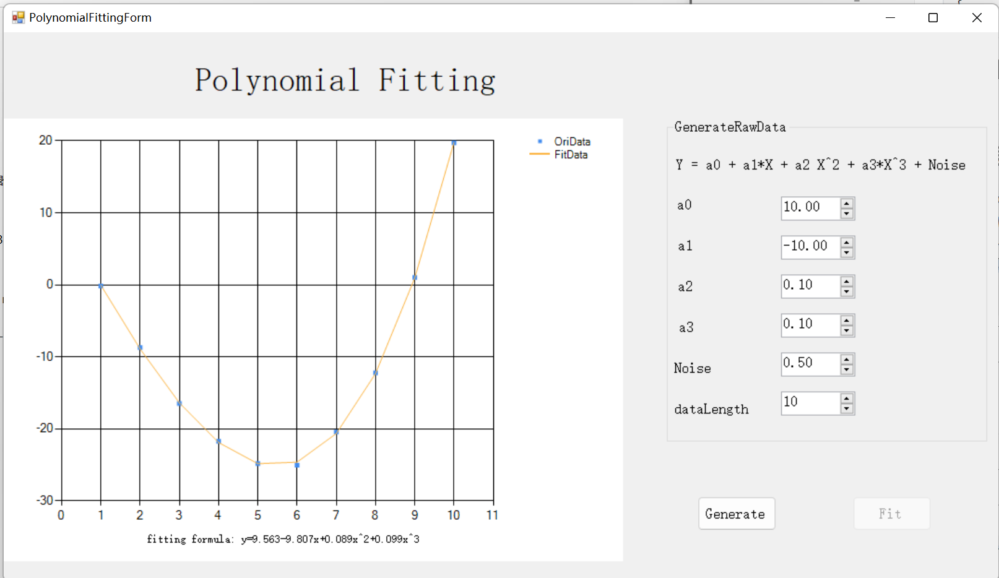

# JXI DSP-Core Note 01352_C# DSP-Core Library 

# Mathematics CurveFitting Polynomial

**Author:** LandauRZ

**Date:** July-25-2022


该类的定义的路径为*..\SeeSharp\Seesharp-DSP-Core-Lib\Development\CSharp\Core Library\Mathematics\Source\SeeSharpTools.JXI.Mathematics\Curvefitting*



## 类及方法说明

### EasyCuveFitting

```c#
public static class EasyCurveFitting
```

#### 方法

##### **1，PolynomialFit**

```c#
public static void PolynomialFit(double[] x, double[] y, int order, double interestX, out double fittedY)
public static void PolynomialFit(double[] x, double[] y, int order, double interestX, out double fittedY, ref double[] coefficients)
public static void PolynomialFit(double[] x, double[] y, int order, double[] interestX, ref double[] fittedY)
public static void PolynomialFit(double[] x, double[] y, int order, double[] interestX, ref double[] fittedY, ref double[] coefficients)
```

方法功能描述：给定阶数的多项式拟合

**输入参数：**

* x：待拟合点列的x坐标，数据类型：**double**数组
* y：待拟合点列的y坐标，数据类型：**double**数组
* order：多项式拟合的阶数
* interestX：拟合曲线上想要知道的点位置的x坐标，数据类型：
  * 第一类：**double**
  * 第二类：**double**数组
* fittedY：interestX对应到拟合曲线上点的y坐标，数据类型：
  * 第一类：**double**（**out或ref**）
  * 第二类：**double数组**（**out或ref**）
* coefficients：拟合系数数组，从低阶向高阶排序，数据类型：**ref** **double**数组

**输出参数：**

* 无返回值，仅对外部引用变量进行修改：
  * fittedY：interestX对应到拟合曲线上点的y坐标
    * 第一类：**double**（**out或ref**）
    * 第二类：**double**数组（**out或ref**）

  * coefficients：拟合系数数组，从高阶向低阶排序，数据类型：**ref double**数组

## 示例代码

```csharp
using System;
using System.Collections.Generic;
using System.Linq;
using System.Text;
using System.Threading.Tasks;
using SeeSharpTools.JXI.Mathematics;

namespace PolynomialExample
{
    internal class Program
    {
        static void PrintArray(double[] array)
        {
            for(int i = 0; i < array.Length; i++)
            {
                Console.Write(Math.Round(array[i],2));
                Console.Write(" ");
            }
            Console.WriteLine();
        }
        static void Main(string[] args)
        {
            double[] x = { 1, 2, 3, 4, 5, 6, 7 };
            double[] y = { 1, 4, 9, 16, 25, 36, 49 };
            Console.WriteLine("输入点列的x坐标：");
            PrintArray(x);
            Console.WriteLine("输入点列的y坐标：");
            PrintArray(y);

            Console.WriteLine("------------------------------");

            int order = 2;
            Console.Write("多项式拟合的阶数是：");
            Console.WriteLine(order);
            double interestX = 3.5;
            Console.Write("想要预测的点的x坐标是：");
            Console.WriteLine(interestX);
            double fittedY;
            EasyCurveFitting.PolynomialFit(x,y,order,interestX,out fittedY);
            Console.Write("经过拟合后预测的点的y坐标是：");
            Console.WriteLine(fittedY);

            Console.WriteLine("------------------------------");

            double[] interestXX = { 1, 3, 5, 7, 9, 11};
            double[] fittedYY = { 1, 2, 3, 4, 5, 6 };
            int order1 = 5;
            Console.Write("多项式拟合的阶数是：");
            Console.WriteLine(order1);
            Console.Write("想要预测的点的x坐标序列是：");
            PrintArray(interestXX);


            EasyCurveFitting.PolynomialFit(x,y,order1,interestXX,ref fittedYY);
            Console.Write("经过拟合后预测的点的y坐标是：");
            PrintArray(fittedYY);

            double[] coefficient = new double[order1 + 1];
            EasyCurveFitting.PolynomialFit(x, y, order1, interestX, out fittedY, ref coefficient);
            Console.WriteLine();
            Console.WriteLine("拟合参数是：（阶数从低到高）");
            PrintArray(coefficient);

            Console.ReadKey();

            // output:
            //输入点列的x坐标：
            //1 2 3 4 5 6 7
            //输入点列的y坐标：
            //1 4 9 16 25 36 49
            //------------------------------
            //多项式拟合的阶数是：2
            //想要预测的点的x坐标是：3.5
            //经过拟合后预测的点的y坐标是：12.25
            //------------------------------
            //多项式拟合的阶数是：5
            //想要预测的点的x坐标序列是：1 3 5 7 9 11
            //经过拟合后预测的点的y坐标是：1 9 25 49 81 121

            //拟合参数是：（阶数从低到高）
            //0 0 1 0 0 0

        }
    }
}

```

## Winform PolynomialFitting界面及例程介绍

### 界面展示

该WinForm程序的路径为*Core Library\Mathematics\Example\Curvefitting\PolynomialFitting*

### 界面功能介绍

界面左侧是直角坐标图，上面的蓝色点表示在一个三次函数基础上加上随机噪声而生成的原始数据（OriData），而黄色曲线表示经过三次多项式拟合之后的拟合曲线，而在下方展示了拟合的公式。窗体的右边是原始数据生成器(GenerateRawData)，利用公式：
$$
Y=a_0+a_1X+a_2X^2+a_3X^3+Noise
$$
对原始数据进行生成，其中Noise是随机噪声。公式下方可以对生成数据的公式中的参数进行调整，也可以选择数据的点数。单击Generate则会根据上面各个参数在窗体左侧生成原始数据，然后单击Fit则会生成拟合曲线，并显示拟合函数表达式。

### 核心代码

#### Generate事件

```C#
private void btnGenerate_Click(object sender, EventArgs e)
        {
            double a0 = (double)numericUpDown_a0.Value;
            double a1 = (double)numericUpDown_a1.Value;
            double a2 = (double)numericUpDown_a2.Value;
            double a3 = (double)numericUpDown_a3.Value;

            dataXOri = new double[(int)numericUpDownDataLength.Value];
            dataYOri = new double[(int)numericUpDownDataLength.Value];
            double[] Noise = new double[(int)numericUpDownDataLength.Value];

            while (chart1.ChartAreas[0].AxisX.ScaleView.IsZoomed)
            {
                chart1.ChartAreas[0].AxisX.ScaleView.ZoomReset();
                chart1.ChartAreas[0].AxisY.ScaleView.ZoomReset();
            }
            chart1.Series[0].Points.Clear();
            chart1.Series[1].Points.Clear();
            Result.Visible = false;
            btnFit.Enabled = true;

            Random rand = new Random(DateTime.Now.Millisecond);
            for (int i = 0; i < (int)numericUpDownDataLength.Value; i++)
            {
                Noise[i] = rand.Next((int)(-numericUpDown_noise.Value * 100), (int)(numericUpDown_noise.Value * 100)) / 100.0;
                dataXOri[i] = i + 1;
                dataYOri[i] = a0 + a1 * dataXOri[i] + a2 * dataXOri[i] * dataXOri[i] + a3 * dataXOri[i] * dataXOri[i] * dataXOri[i] + Noise[i];
                chart1.Series[0].Points.AddXY(dataXOri[i], dataYOri[i]);
            }
        }

        
```


#### Fit事件

```C#
/// <summary>
        /// fit
        /// 拟合
        /// </summary>
        /// <param name="sender"></param>
        /// <param name="e"></param>
        private void btnFit_Click(object sender, EventArgs e)
        {
            chart1.Series[1].Points.Clear();
            Result.Visible = true;
            btnFit.Enabled = false;
            string str =  "fitting formula: y=";
            int order = 3;
            int i = 0;
            double[] data = new double[dataXOri.Length];
            bool zeroFlag;
            double[] coefficient=new double [order+1];
            EasyCurveFitting.PolynomialFit(dataXOri, dataYOri, order, dataXOri, ref data, ref coefficient);
            if (data == null)
            {
                /* MessageBox.Show("参数设置错误，请重新设置！\n可能原因：\n"
                   + "1、未输入拟合参数\n2、多项式拟合阶数设置有误", "提示", MessageBoxButtons.OK); */
                MessageBox.Show("Parameter setting error, please reset!\n Possible cause: \n"
                     +"1, no fitting parameter \n2, polynomial fitting order setting error", "prompt", MessageBoxButtons.OK);
                return;
            }
            order += 1;
            for (int k = 0; k < data.Length; k++)
            {
                chart1.Series[1].Points.AddXY(dataXOri[k], data[k]);
            }

            zeroFlag = true;
            do
            {
                if (System.Math.Abs(coefficient[i]) < 0.00001)
                {
                    i++;
                    order--;
                    continue;
                }
                else
                {
                    zeroFlag = false;
                }

                if (i == 0)
                {
                    str += coefficient[i].ToString("f3");
                }
                else if (coefficient[i] < 0)
                {
                    if (i == 1)
                    {
                        str += coefficient[i].ToString("f3") + "x";
                    }
                    else
                    {
                        str += coefficient[i].ToString("f3") + "x^" + i.ToString();
                    }

                }
                else if (coefficient[i] > 0)
                {
                    if (i == 1)
                    {
                        str += "+" + coefficient[i].ToString("f3") + "x";
                    }
                    else
                    {
                        str += "+" + coefficient[i].ToString("f3") + "x^" + i.ToString();
                    }
                }
                i++;
                order--;

            } while (order != 0);

            if (zeroFlag)
            {
                str += "0";
            }
            Result.Text = str;
        }
```

