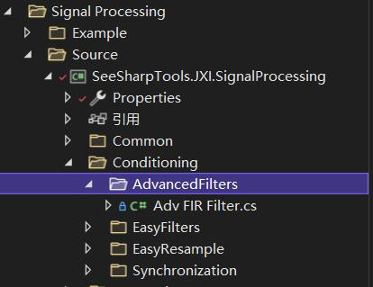
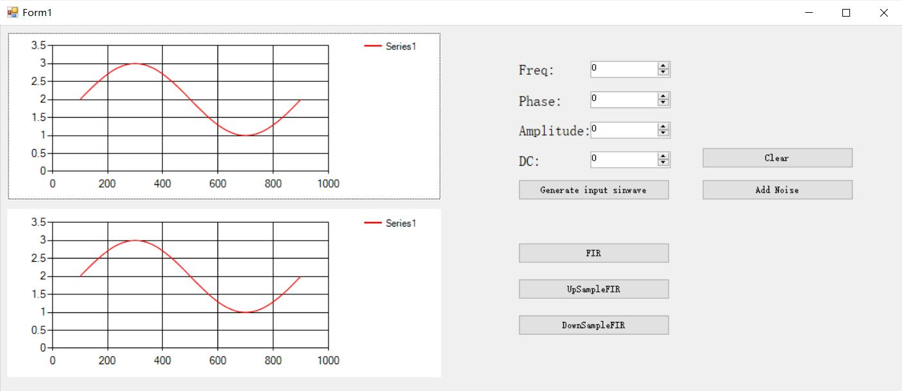
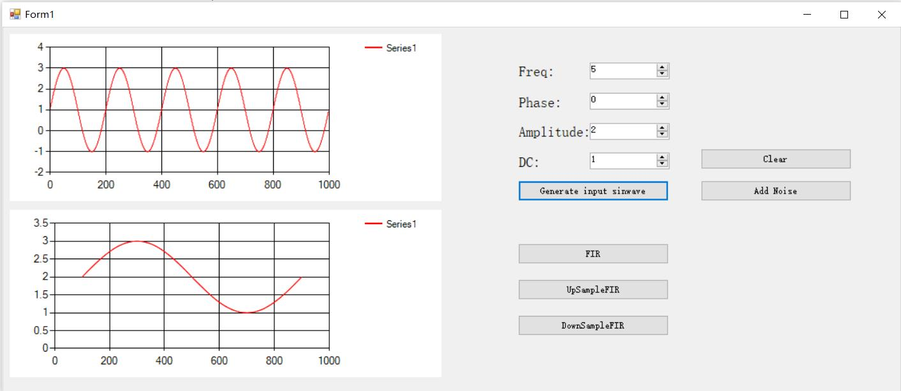
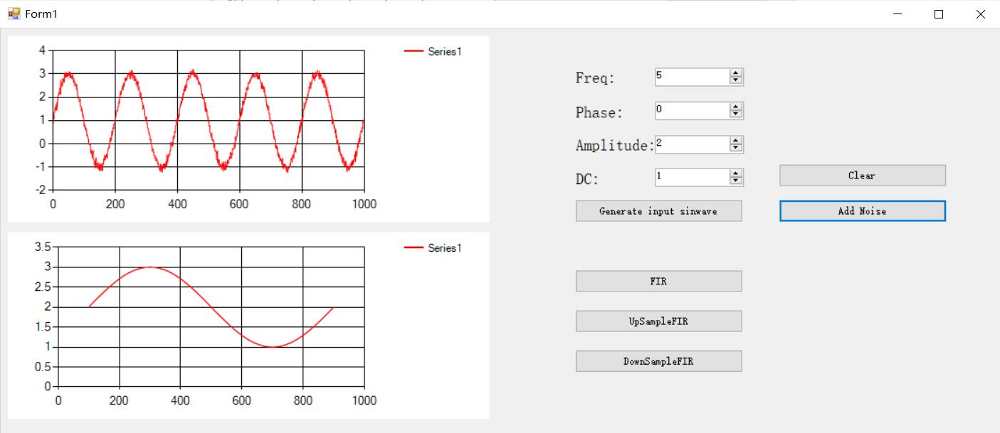
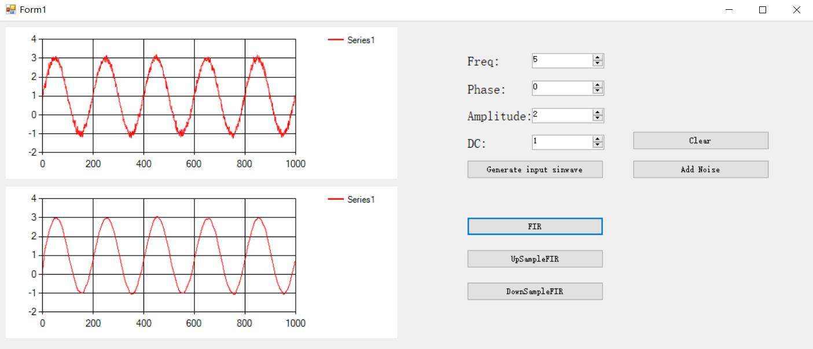
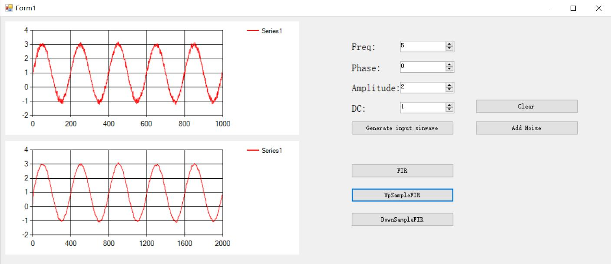
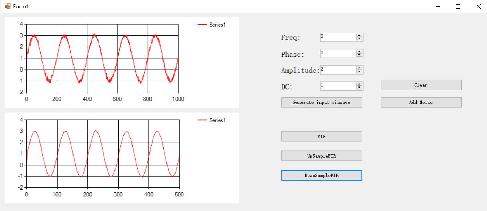
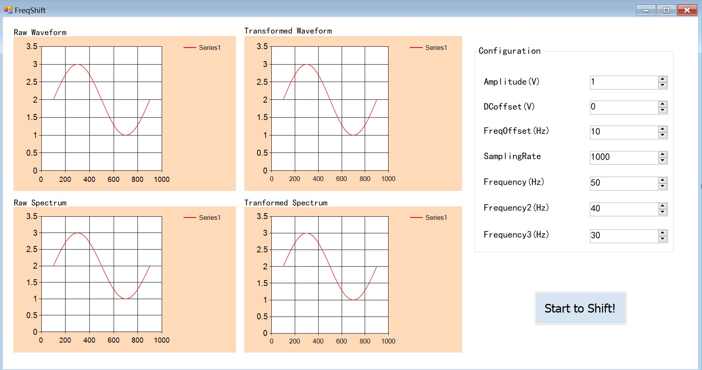
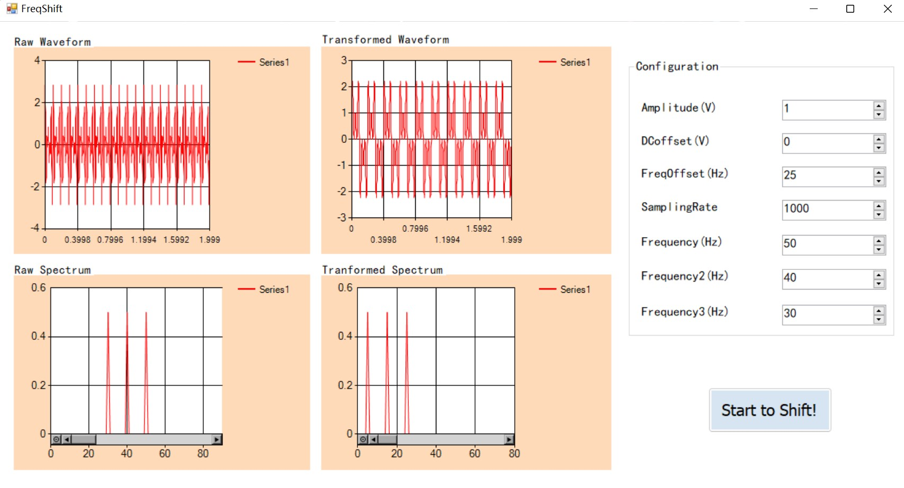

# JXI DSP-Core Note 01510_C# DSP-Core Library 

# Signal Processing Conditioning AdvancedFilter 

**Author:** Peter Park, Hamburg, LandauRZ

**Date:** Jul-29-2022


该类的定义的路径为*..\SeeSharp\Seesharp-DSP-Core-Lib\Development\CSharp\Core Library\Signal Processing\Source\Conditioning\AdvancedFilters\Adv FIR Filter.cs*



## 公共类及方法说明

### 1. FIR 滤波器类

#### 类的申明

```C#
/// <summary>
/// FIR 滤波器
/// </summary>
public class FIR<T>
```

#### 构造函数及重载

##### (1)实数域的滤波参数初始化

```C#
/// <summary>
/// 初始化实数域滤波器
/// </summary>    
public FIR(double[] coefficients)
```

**功能描述：**对实数域FIR滤波器的滤波参数进行初始化

**输入参数：**coefficients：滤波系数，数据类型：double类型的数组

##### (2)复数域的滤波参数初始化

```c#
/// <summary>
/// 初始化复数域滤波器
/// </summary>
public FIR(Complex[] coefficients)
```

**功能描述：**对复数域FIR滤波器的滤波参数进行初始化

**输入参数：**coefficients：滤波系数，数据类型：complex类型的数组


#### 方法说明

##### (1)滤波器参数重置

```C#
/// <summary>
/// 重置滤波器
/// </summary>
public void Reset()
```

**功能描述：**对现有的滤波参数进行重置，恢复为0

##### (2)执行滤波的操作

```C#
/// <summary>
/// 执行滤波器
/// </summary>
public void Process(T[] input, T[] output)  
```

**功能描述：**根据初始化的滤波参数对输入的信号进行滤波操作，该方法会根据输入信号的数据类型对滤波参数和输出信号进行类型的转换

**输入参数：**

* input：输入信号，数据类型：泛型数组

* output：输出信号，数据类型：泛型数组


### 2.多速率FIR滤波器类

#### 类的申明

```C#
/// <summary>
/// MultiRateFIR
/// </summary>
public class MultiRateFIR<T>
```


#### 构造函数及重载

##### (1)实数域的滤波参数初始化

```C#
/// <summary>
/// 初始化实数域滤波器
/// </summary>    
public MultiRateFIR(double[] coefficients, int upsampleFactor, int downsampleFactor)
```

**功能描述：**对实数域MultiRateFIR滤波器的滤波参数进行初始化

**输入参数：**

* coefficients：滤波系数，数据类型：double类型数组
* upsampleFactor：升采样倍数，数据类型 ：int
* downsampleFactor：降采样倍数，数据类型 ：int

##### (2)复数域的滤波参数初始化

```c#
/// <summary>
/// 初始化复数域滤波器
/// </summary>
public MultiRateFIR(Complex[] coefficients, int upsampleFactor, int downsampleFactor)
```

**功能描述：**对复数域MultiRateFIR滤波器的滤波参数进行初始化

**输入参数：**

* coefficients：滤波系数，数据类型：complex类型数组
* upsampleFactor：升采样倍数，数据类型 ：int
* downsampleFactor：降采样倍数，数据类型 ：int


#### 方法说明

##### (1)滤波器参数重置

```C#
/// <summary>
/// 重置滤波器
/// </summary>
public void Reset()
```

**功能描述：**

* 对现有的滤波参数进行重置，恢复为0
* 清空降采样保留历史数组
* 将降采样保留历史数组的长度重置为0

##### (2)执行滤波的操作

（滤波数据长度不是降采样率的整数倍）

```C#
/// <summary>
/// 执行滤波器
/// </summary>
public void Process(T[] input, T[] output, out int outputLength)  
```

**功能描述：**根据初始化的滤波参数、降采样倍数和对输入的信号进行滤波操作，该方法会根据输入信号的数据类型对滤波参数和输出信号进行类型的转换，最终输出滤波后的信号以及输出信号的长度。

注：需要满足滤波数据长度是降采样率的整数倍，多余的数据保留到history和下一次进行拼接。

**参数类型：**

* input：输入信号，数据类型：泛型数组

* output：输出信号，数据类型：泛型数组

* outputLength: 输出信号的长度，数据类型：int类型的输出参数

##### (3)快速降采样滤波

(当输入数据长度始终为降采样率的整备数，无需复制history数组)

```C#
/// <summary>
/// 快速降采样滤波，当输入数据长度始终为降采样率的整备数，无需复制history数组。
/// </summary>
 public void Process_Fast(T[] input, T[] output, out int outputLength)
```

**功能描述：**和上一个方法类似，根据初始化的滤波参数、降采样倍数和对输入的信号进行滤波操作，同样涉及输入参数关于输入信号数据类型转换。因为无需复制history数组，对历史剩余数据进行操作，因此运行速度会更快。

**参数类型：**

* input：输入信号，数据类型：泛型数组

* output：输出信号，数据类型：泛型数组

* outputLength: 输出信号的长度，数据类型：int类型的输出参数


### 3.滤波器计算静态类

#### 类的申明

```c#
/// <summary>
/// 滤波器计算静态类。
/// </summary>
public class EasyFIR<T>
```


#### 方法说明

##### (1)有限冲击响应滤波器

```C#
public static void FIR(T[] X, double[] coefficients, out T[] output)
```

**功能描述：**实际上就是对本篇笔记中**FIR 滤波器类**的执行滤波的操作的方法调用，只不过最终使用时将实例化的方法转化为静态方法。

**值参数：**

* X：输入信号，数据类型：泛型数组

* coefficients：滤波系数，数据类型：double类型数组

**输出参数：**

* out：输出信号，数据类型：泛型数组

##### (2)降采样滤波器

```C#
/// <summary>
/// 降采样滤波器
/// </summary>
public static void DownSampleFIR(T[] X, double[] coefficients int decimateRate, out T[] output)
```

**功能描述：**根据输入的信号，滤波系数，抽取率，实现降采样滤波功能。实际上的实现原理还是对**多速率FIR滤波器**实例化方法的调用，在初始化时将升采样倍数设为了1。

**值参数：**

* X：输入信号，数据类型：泛型数组

* coefficients：滤波系数，数据类型：double类型数组

* decimateRate：抽取率，数据类型：int

**输出参数：**

* output：输出信号，数据类型：泛型数组

##### (3)升采样滤波器

```C#
/// <summary>
/// 升采样滤波器
/// </summary>
public static void UpSampleFIR(T[] X, double[] coefficients, int interpolationRate, out T[] output)
```

**功能描述：**根据输入的信号，滤波系数，插值率，实现升采样滤波功能。实现原理也是对**多速率FIR滤波器**实例化方法的调用，在初始化时将降采样倍数设为了1。

**值参数：**

* X：输入信号，数据类型：泛型数组	

* coefficients：滤波系数，数据类型：double类型数组

* interpolationRate：插值率，数据类型：int

**输出参数：**

* output：输出信号，数据类型：泛型数组

##### (4)任意变比滤波器

```C#
/// <summary>
/// 任意变比滤波器
/// </summary>
 public static void ArbitraryFIR(T[] X, double[] coefficients, int interpolationRate, int decimateRate, out T[] output)
```

**功能描述：**根据输入的信号，滤波系数，抽取率，插值率，实现任意变比的滤波操作。

**值参数：**

* X：输入信号，数据类型：泛型数组	

* coefficients：滤波系数，数据类型：double类型数组

* interpolationRate：插值率，数据类型：int

* decimateRate：抽取率，数据类型：int

**输出参数：**

* output：输出信号，数据类型：泛型数组


#### EasyFIR调用相关例程

为了便于理解，笔者用winform做了一个交互界面调用相关的方法，界面如下：



其主要功能是可以根据输入的参数（频率、相位、幅度和直流分量）生成对应的正弦波，并在上方的坐标系中绘制出来（clear按键用于清除绘制的图像），如下图所示：



接着Add Nosie 的作用是添加标准差为0.1高斯噪声，如下所示：



为了改善高斯噪声我们滤波器采用的是长度为10的均值滤波器，按FIR即可在下方获得滤波后的效果：



对应的FIR按键的事件处理器的代码为：

```C#
private void FIR_Click(object sender, EventArgs e)
        {
            for(i=0;i<10;i++)
            {
                coe[i] = 1.0 / 10;
            }
            double[] output1 = new double[1000];
            EasyFIR<double>.FIR(sinwave, coe, out output1);
            easyChart2.Plot(output1);
        }
```


利用同样的滤波器，且调用升采样函数的结果为：



采样的点数变为原来的两倍，但是波形和FIR基本保持一致，对应的UpSampleFIR按键的事件处理器的代码为：

```C#
private void UpSampleFIR_Click(object sender, EventArgs e)
        {
            double[] output2 = new double[1000];
    		//升采样系数为2
            EasyFIR<double>.UpSampleFIR(sinwave, coe, 2, out output2);
            easyChart2.Plot(output2);
        }
```


若调用降采样函数的结果为：



采样的点数变为原来的一半，波形依然和FIR滤波后基本保持一致，对应的DownSampleFIR按键的事件处理器的代码为：

```C#
 private void DownSampleFIR_Click(object sender, EventArgs e)
        {
            double[] output3 = new double[1000];
     		//降采样系数为2
            EasyFIR<double>.DownSampleFIR(sinwave, coe, 2, out output3);
            easyChart2.Plot(output3);
        }
```


### 4. CrossCorrelation类

#### 类的申明

```C#
/// <summary>
/// 互相关
/// </summary>
public class CrossCorrelation
```

#### 公式

$$
R_{xy}(\tau) = \sum_{n=-\infin}^{+\infin}x(n)y(n-\tau)
$$

#### 方法说明

##### (1)互相关计算

```C#
/// <summary>
/// Double互相关
/// </summary>
public static void ComputeCrossCorrelation(double[] src1, double[] src2, out double[] destination)
/// <summary>
/// float互相关
/// </summary>
public static void ComputeCrossCorrelation(float[] src1, float[] src2, out float[] destination)
/// <summary>
/// Complex互相关
/// </summary>
public static void ComputeCrossCorrelation(Complex[] src1, Complex[] src2, out Complex[] destination)
/// <summary>
/// Complex32互相关
/// </summary>
public static void ComputeCrossCorrelation(Complex32[] src1, Complex32[] src2, out Complex32[] destination)
```

**功能描述：**对不同数据类型的输入数据进行互相关计算

**输入参数：**

* src1：互相关输入数组1，数据类型：
  * double数组
  * float数组
  * Complex数组
  * Complex32数组
* src2：互相关输入数组2，数据类型：
  * double数组
  * float数组
  * Complex数组
  * Complex32数组

**输出参数：**

* destination：互相关结果，数据类型：
  * double数组
  * float数组
  * Complex数组
  * Complex32数组

#### CrossCorrelation示例代码

```c#
//定义输入和输出参数
double[] src1Double = new double[7] { 0, 0, 1, 1, 1, 0, 0 };
double[] src2Double = new double[7] { 0, 0, 1, 1, 1, 0, 0 };
double[] outputDouble = new double[13];

double[] src1Float = new double[7] { 0, 0, 1, 1, 1, 0, 0 };
double[] src2Float = new double[7] { 0, 0, 1, 1, 1, 0, 0 };
double[] outputFloat = new double[13];

Complex[] src1Complex = new Complex[7] { 0, 0, 1, 1, 1, 0, 0 };
Complex[] src2Complex = new Complex[7] { 0, 0, 1, 1, 1, 0, 0 };
Complex[] outputComplex = new Complex[13];

Complex32[] src1Complex32 = new Complex32[7] { 0, 0, 1, 1, 1, 0, 0 };
Complex32[] src2Complex32 = new Complex32[7] { 0, 0, 1, 1, 1, 0, 0 };
Complex32[] outputComplex32 = new Complex32[13];

//计算互相关
CrossCorrelation.ComputeCrossCorrelation(src1Double, src2Double, out outputDouble);
CrossCorrelation.ComputeCrossCorrelation(src1Float, src2Float, out outputFloat);
CrossCorrelation.ComputeCrossCorrelation(src1Complex, src2Complex, out outputComplex);
CrossCorrelation.ComputeCrossCorrelation(src1Complex32, src2Complex32, out outputComplex32);

//Console输出
Console.WriteLine("*** Cross Correlation ***");

Console.WriteLine("\nDouble input:");
Console.Write("src1: ");
foreach (var item in src1Double) { Console.Write("{0} ", item); }
Console.Write("\nsrc2: ");
foreach (var item in src2Double) { Console.Write("{0} ", item); }
Console.WriteLine("\nDouble output:");
foreach (var item in outputDouble){Console.Write("{0} ", item);}
Console.WriteLine();

Console.WriteLine("\nFloat input:");
Console.Write("src1: ");
foreach (var item in src1Float) { Console.Write("{0} ", item); }
Console.Write("\nsrc2: ");
foreach (var item in src2Float) { Console.Write("{0} ", item); }
Console.WriteLine("\nFloat output:");
foreach (var item in outputFloat){Console.Write("{0} ", item);}
Console.WriteLine();

Console.WriteLine("\nComplex input:");
Console.Write("src1: ");
foreach (var item in src1Complex) { Console.Write("{0} ", item); }
Console.Write("\nsrc2: ");
foreach (var item in src2Complex) { Console.Write("{0} ", item); }
Console.WriteLine("\nComplex output:");
foreach (var item in outputComplex){Console.Write("{0} ", item);}
Console.WriteLine();

Console.WriteLine("\nComplex32 input:");
Console.Write("src1: ");
foreach (var item in src1Complex32) { Console.Write("{0}; ", item); }
Console.Write("\nsrc2: ");
foreach (var item in src2Complex32) { Console.Write("{0}; ", item); }
Console.WriteLine("\nComplex32 output:");
foreach (var item in outputComplex32){Console.Write("{0}; ", item);}
Console.WriteLine();

/*
*** Cross Correlation ***

Double input:
src1: 0 0 1 1 1 0 0
src2: 0 0 1 1 1 0 0
Double output:
0 0 0 0 1 2 3 2 1 0 0 0 0

Float input:
src1: 0 0 1 1 1 0 0
src2: 0 0 1 1 1 0 0
Float output:
0 0 0 0 1 2 3 2 1 0 0 0 0

Complex input:
src1: (0, 0) (0, 0) (1, 0) (1, 0) (1, 0) (0, 0) (0, 0)
src2: (0, 0) (0, 0) (1, 0) (1, 0) (1, 0) (0, 0) (0, 0)
Complex output:
(0, 0) (0, 0) (0, 0) (0, 0) (1, 0) (2, 0) (3, 0) (2, 0) (1, 0) (0, 0) (0, 0) (0, 0) (0, 0)

Complex32 input:
src1: 0, 0 i; 0, 0 i; 1, 0 i; 1, 0 i; 1, 0 i; 0, 0 i; 0, 0 i;
src2: 0, 0 i; 0, 0 i; 1, 0 i; 1, 0 i; 1, 0 i; 0, 0 i; 0, 0 i;
Complex32 output:
0, 0 i; 0, 0 i; 0, 0 i; 0, 0 i; 1, 0 i; 2, 0 i; 3, 0 i; 2, 0 i; 1, 0 i; 0, 0 i; 0, 0 i; 0, 0 i; 0, 0 i;
*/
```


### 5. FrequencyShift类

#### 类的申明

```C#
public class FrequencyShift<T>
```

#### **属性**

* Frequency：频率，数据类型：double

#### 构造函数

```C#
public FrequencyShift(double frequency = 0, double phase = 0)
```

**功能描述：**构造函数，初始化FrequencyShift类的实例

**输入参数：**

* frequency：偏移频率，(这里表示的是偏移频率对应的单周期采样频率(单位：Sample/周期))，缺省值为0，取值范围为[0,1]，超过范围的会被自动模1。数据类型：double

  

* phase：附加相位，缺省值为0，数据类型：double

**输出参数：**

* 无

#### 方法说明

##### 处理频率偏移

```C#
public void Process(T[] input, T[] output, double frequency)
public void Process(T[] input, T[] output)
public void Process(T[] inout, double frequency)
public void Process(T[] inout)
```

**功能描述：**把原始信号的每个频率分量都加上同一个给定的**向下**频率偏移量并输出。方法的具体做法是将输入信号（complex数组）的每一个复数都乘上一个由给定的frequency与phase构成的复数（即偏移信号），得到的结果便是各个分量都同时偏移同样量（包括频率与相位）的时域信号。

**解释：**假设输入信号（写为谐波和的形式）为
$$
x_{original}[n]=\sum_{i=0}^{N}{a_i exp([j(2\pi n \times f_i)])}
$$
其中$f_i$表示第i个分量的频率，$a_i$表示第i个分量的振幅，那么这里频率偏移的操作其实就是在上面的离散数字信号上乘上一个复指数因子，即得到：
$$
x_{offset}[n]=\sum^{N}_{i=0}{a_iexp([j(2\pi n \times f_i)])}\times exp([-j(2\pi n \times \Delta f)])=\sum^{N}_{i=0}{a_iexp([j(2\pi n \times (f_i-\Delta f)])}
$$
**输入参数：**

* input：输入时域信号，数据类型：泛型数组
* output：输出时域信号，数据类型：泛型数组
* frequency：同构造函数的frequency，偏移频率，(由于处理的是复指数信号，这里表示的是偏移频率对应的单周期采样频率(单位：Sample/周期))，缺省值为0，取值范围为[0,1]，数据类型：double
* inout：既作输入，又在方法运行结束后保存变换结果

**输出参数：**

* 无，仅仅改变output或者inout参数作为变换结果

#### FrequencyShift调用相关例程

为了便于理解，笔者用winform做了一个交互界面调用相关的方法，界面如下：



左侧四个图窗分别展示了原始波形(Raw Waveform)、变换波形(Transformed Waveform)、原始频谱(Raw Spectrum)、变换后频谱(Transformed Spectrum)的图像。右侧的Configuration当中展示了初始波形的参数设置与频率搬移的设定，笔者采用的是三个不同频率正弦波线性叠加的输入波形，三者的幅度均由Amplitude设定，可以通过DCoffset设置直流偏置，通过FreqOffset设置频率搬移量（向下），也可以通过SamplingRate设置采样率，注意需要符合奈奎斯特采样定律，最后三个输入项则用来设置三个频率。单击'Start to Shift!'按钮则触发Click事件，按照上面的设定生成原始波形并展示其频谱，同时借助FrequencyShift的调用实现频谱搬移，并展示在右侧两个图窗中（右上为时域，右下为频域）。



设置参数如上图所示，单击'Start to Shift!'按钮后可见左侧频谱图中的三个峰均被向下搬移了25Hz。

##### 核心代码

```C#
using System;
using System.Collections.Generic;
using System.ComponentModel;
using System.Data;
using System.Drawing;
using System.Linq;
using System.Text;
using System.Threading.Tasks;
using System.Windows.Forms;
using SeeSharpTools.JXI.SignalProcessing.Generation;
using SeeSharpTools.JY.ArrayUtility;
using SeeSharpTools.JXI.SignalProcessing.GeneralSpectrum;
using System.Numerics;
using SeeSharpTools.JXI.SignalProcessing.Conditioning.AdvancedFilters;
using SeeSharpTools.JXI.SignalProcessing.Window;

namespace PhaseShiftExample
{

    
    public partial class Form1 : Form
    {
        public Form1()
        {
            InitializeComponent();
        }

        private void Start_Click(object sender, EventArgs e)
        {
            GeneralSpectrumTask _task = new GeneralSpectrumTask();
            double _amplitude = (double)(Amplitude.Value);               // 振幅
            double _dOffset = (double)(DCoffset.Value);                  // 直流偏置
            double _fOffsetReal = (double)(FreqOffset.Value);            // 实信号频率偏移量
            double _fOffsetComplex;                                      // 实信号对应的复信号频率偏移量 
            int _samplingRate = (int)(SamplingRate.Value);               // 采样率
            double _freq = (double)(Frequency.Value);                    // 频率
            double _freq2 = (double)(Frequency2.Value);                  // 频率2
            double _freq3 = (double)(Frequency3.Value);                  // 频率3
            Complex[] Wave = new Complex[2000];                          // 波形
            var spec = new double[(int)_samplingRate / 2];               // 频谱（变换前）
            var spec2 = new double[(int)_samplingRate / 2];              // 频谱（变换后）
            double[] temp1 = new double[2000];
            double[] temp2 = new double[2000];
            double[] WaveReal = new double[2000];                        // 波形实部（变换前）
            double[] WaveReal2 = new double[2000];                       // 波形实部（变换后）
            double[] time = new double[2000];                            // 时间序列


            // 生成时间序列，离散的时间间隔dt = 1 / _samplingRate
            for (int i = 0; i < Wave.Length; i++)
                time[i] = (double)i / (double)_samplingRate;

            // 计算复信号频率搬移量
            // 一个周期内采样1 / _fOffsetComplex个点，1s采_samplingRate个点，_fOffsetReal个周期，
            // 所以 _fOffsetReal / _fOffsetComplex = _samplingRate
            _fOffsetComplex = _fOffsetReal / _samplingRate;


            // 生成对应的复数信号
            Generation.SineWave(ref temp1, _amplitude, 0, _freq, _samplingRate);     // temp1 是信号的实部
            Generation.SineWave(ref temp2, _amplitude, 90, _freq, _samplingRate);    // temp2 是信号的虚部
            for(int i = 0; i < Wave.Length; i++)
            {
                Wave[i] = new Complex(temp1[i], temp2[i]);
            }
            Generation.SineWave(ref temp1, _amplitude, 0, _freq2, _samplingRate);     // temp1 是信号的实部
            Generation.SineWave(ref temp2, _amplitude, 90, _freq2, _samplingRate);    // temp2 是信号的虚部
            for (int i = 0; i < Wave.Length; i++)
            {
                Wave[i] += new Complex(temp1[i], temp2[i]);
            }
            Generation.SineWave(ref temp1, _amplitude, 0, _freq3, _samplingRate);     // temp1 是信号的实部
            Generation.SineWave(ref temp2, _amplitude, 90, _freq3, _samplingRate);    // temp2 是信号的虚部
            for (int i = 0; i < Wave.Length; i++)
            {
                Wave[i] += new Complex(temp1[i], temp2[i]);
            }

            // 加上直流偏置,并取出实部到temp_real当中用来绘图
            for (int i = 0; i < Wave.Length; i++)
            {
                Wave[i] += new Complex(_dOffset, 0);
                WaveReal[i] = Wave[i].Real;
            }


            // 绘制原始时域实信号
            RawWaveForm.Plot(time, WaveReal);


            // 计算频谱图,设置参数
            _task.InputDataType = InputDataType.Real;
            _task.SampleRate = _samplingRate;
            _task.WindowType = WindowType.None;
            _task.Average.Mode = SpectrumAverageMode.NoAveraging;
            _task.Average.WeightingType = SpectrumWeightingType.LinearMoving;
            _task.Average.Size = 10;
            _task.Output.NumberOfLines = (int)_task.SampleRate / 2;
            _task.Unit.Type = SpectrumOutputUnit.V2;
            _task.Unit.Impedance = 50;
            _task.Unit.IsPSD = false;

            // 绘制对应的频谱图
            _task.GetSpectrum(WaveReal, ref spec);
            RawSpectrum.Plot(spec, _task.SpectralInfomation.FreqStart, _task.SpectralInfomation.FreqDelta);


            // 频率偏移器构造
            FrequencyShift<Complex> shifter = new FrequencyShift<Complex>(_fOffsetComplex, 0);
            shifter.Process(Wave);
            // 取出Wave的实部
            for (int i = 0; i < Wave.Length; i++)
                WaveReal2[i] = Wave[i].Real;

            // 绘制频率搬移之后的时域图像
            TransformedWaveForm.Plot(time, WaveReal2);

            // 绘制对应的频谱图
            _task.GetSpectrum(WaveReal2, ref spec2);
            TransformedSpectrum.Plot(spec2, _task.SpectralInfomation.FreqStart, _task.SpectralInfomation.FreqDelta);


        }
    }
}

```


