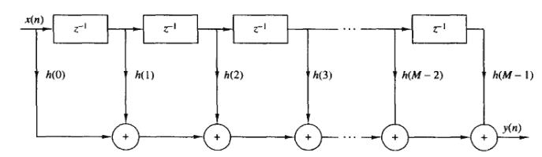
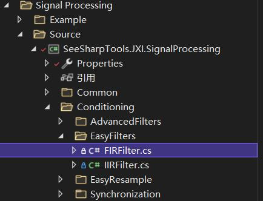
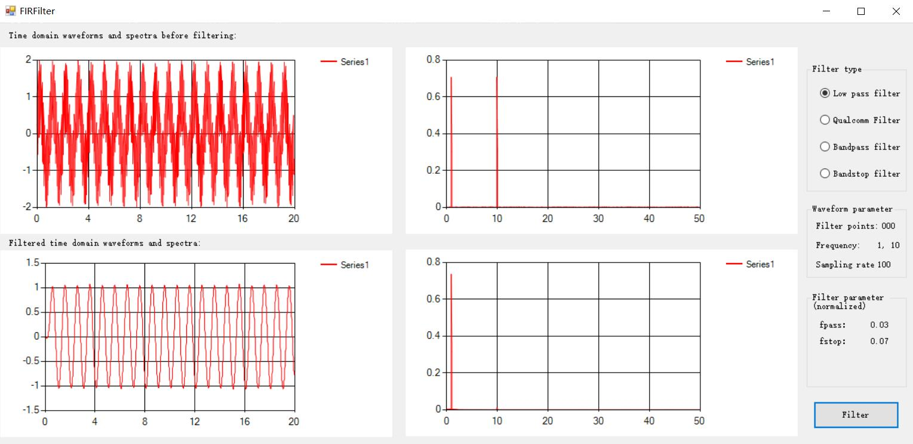
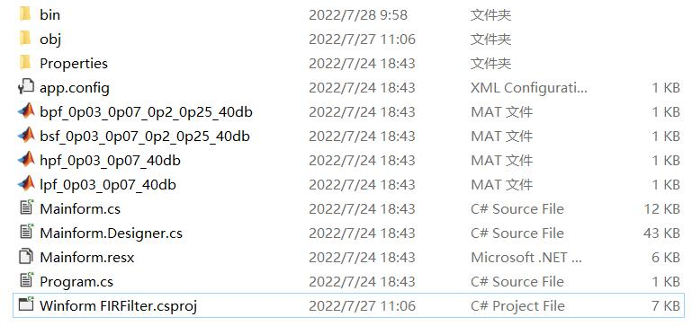

# JXI DSP-Core Note 01511_C# DSP-Core Library

# Signal Processing: Conditioning EasyFilter FIR

**Author:** Peter Park

**Date:** Jul-28-2022

## FIR系统结构简介

FIR滤波器，即有限长单位冲激响应滤波器，其包括以下几个特点：

* 系统的单位冲激响应h（n）在有限个n值处不为零  
* 系统函数H(z)在|z|>0处收敛，在|z|>0处只有零点，有限z平面只有零点，而全部极点都在z=0处（因果系统）  
* 结构上主要是非递归结构，没有输出到输入的反馈，但有些结构中（例如频率抽样结构）也包含反馈的递归部分。
* 

总体上说，一个FIR系统由差分方程
$$
y\left( n \right) =\sum_{k=0}^{M-1}{b_kx\left( n-k \right)} 
$$
描述。设FIR滤波器的单位冲激响应h（n）为一个N点序列，0<=n<=N-1,则滤波器的系统函数为：
$$
H\left( z \right) =\sum_{k=0}^{M-1}{b_kz^{-k}}
$$
描述，就是说，它有（N-1）阶极点在z=0处，有（N-1）个零点位于有限z平面的任何位置。此外，该FIR系统的单位样本冲激响应与系数{b_k}是相等的，即
$$
h\left( n \right) =\begin{cases}	b_n,\space\space\space\space\space\space      0\leqslant n\leqslant M-1      \\	0,  \space\space\space\space\space\space\space        \text{其他}\\\end{cases}
$$
FIR系统主要包括直接型结构、级联型结构、频率采样结构和格型结构。本篇笔记包括程序都主要围绕直接型（也称横截型或卷积型）结构进行展开介绍。直接型的实现可以直接由非递归差分方程得到，或由如下的卷积和得到：
$$
y\left( n \right) =\sum_{k=0}^{M-1}{h\left( k \right) x\left( n-k \right)}
$$
其结构示意图如下所示：



我们可以观察到，该结构需要M-1个存储空间来存放M-1个输入，每个输出需要M次乘法和M-1次加法.因为输出是输入的加权线性组合，故上图组成了一个抽头延迟线或一个横向系统。最后，直接型实现通常被称为横向或者抽头延迟线滤波器。

## FIRFilter 类及方法介绍介绍

### FIRFilter 类的实现代码位置



其位于功能树中的信号处理模块，具体实现的路径为

*Core Library\Signal Processing\Source\Conditioning\EasyFilters\FIRFilter*

### FIRFilter的私有字段

```C#
/// <summary>
/// 存放滤波器系数
/// </summary>
private double[] _numerator;

/// <summary>
/// 状态滤波器（用于放置部分输入的存贮空间）
/// </summary>
private double[] _status;

/// <summary>
/// 滤波器系数长度
/// </summary>
private int _numOfStatus = 0;

/// <summary>
/// 通过滤波的点数
/// </summary>
private ulong _filteredPointns = 0;
```


### FIRFilter的属性

```C#
/// <summary>
/// <para>Filter coefficient </para>
/// <para>Simplified Chinese:滤波器系数</para>
/// </summary>
public double[] Coefficients
{
	set
	{
		var datalength = value.Length;//滤波器系数长度
		if (_numerator==null || _numerator.Length!= datalength)
		{
			_numerator = new double[datalength];//分子
		}
		Buffer.BlockCopy(value, 0, _numerator, 0, sizeof(double) * datalength);
		_numOfStatus = datalength;//滤波器系数长度
		if (_status==null || _status.Length!=datalength)
		{
			_status = new double[datalength];
			Reset();
        }
		//_filteredPointns = 0;
     }
}
```

在给double[] Coefficients属性赋值的同时，会根据滤波系数Coefficients数组的长度，修改datalength的大小，并给私有字段_numerator赋值，状态滤波器status的长度也会重置，和滤波系数数组长度相匹配。


```C#
/// <summary>
/// <para>filtered Pointns</para>
/// <para>Simplified Chinese:通过滤波的点数</para>
/// </summary>
public ulong FilteredPointns
{
	get
	{
		return _filteredPointns;
	}
}
```

FilteredPointns就是对私有字段_filteredPointns的封装。


### FIRFilter的方法

#### Reset

**功能描述：**清空状态寄存器方法

**实现代码：**

```c#
/// <summary>
/// <para>Clear status registor</para>
/// <para>Simplified Chinese:清空状态寄存器</para>
/// </summary>
public void Reset()
{
	_filteredPointns = 0;
	if (_status != null)
	{
		for (int i = 0; i < _status.Length; i++)
		{
			_status[i] = 0;
		}
	}
}
```

#### Filter

**功能描述：**实现直接型FIR滤波器

**实现代码：**

```C#
/// <summary>
/// <para>This method is FIR filter direct form structure; </para>
/// <para>where _numerator=numerators, </para>
/// <para>they are sharing the same status registor _status;</para>
/// <para>Simplified Chinese:使用直接型FIR滤波器</para>
/// <para>所有输入信号共享一个状态寄存器</para>
/// </summary>
/// <param name="x">input signal Simplified Chinese:输入信号 </param>
/// <param name="y">output signal same length as _inputWaveform Simplified Chinese:输入信号，长度与输入信号一致</param>
public void Filter(double[] x, ref double[] y)
{
	int i = 0;
	int j = 0;
	int k = 0;
	int bLength = _numerator.Length;
	double forwardSum = 0;

	for (i = 0; i < x.Length; i++)
	{
		forwardSum = 0;
		for (j = 0; j < _status.Length; j++) //s1.Length = max (_demoniator.Length,     _numerator.Length) set in set _denominator/_numerator
        {
			k = _status.Length - 1 - j; //in this loop, k goes from last _status to _status[0]
			if (k > 0)
			{
				_status[k] = _status[k - 1];
				forwardSum += _numerator[k] * _status[k];
			}
			else
			{
				_status[0] = x[i];
				forwardSum += _numerator[0] * _status[0];
			}
		}
			y[i] = forwardSum;
	}
    _filteredPointns += (ulong)x.Length;
}

```

**输入参数：**

* 值参数：x，输入信号，数据类型：double类型数组
* 引用参数（输出）：y, 滤波后信号，数据类型：double类型数组

## FIRFilter的WinForm界面及部分例程介绍

### 界面展示

该WinForm程序的路径为*Core Library\Signal Processing\Example\Conditioning\FIRFilter Winform*



上图调用了低通滤波器，对输入信号（由两种频率的正弦波叠加而成）进行滤波，可以看到在滤波后从时域和频域都只剩下单一的频率。

### 界面功能介绍

该界面中Filter type中有四种类型的滤波器可以选择，也就对应着四种不同的滤波器的系数，滤波系数可以用MATLAB的FDAtool设计。然后导出系数，如下图的所示：

实际上实现直接型FIR滤波器有2个步骤：

（1）使用fir.Coefficients属性配置滤波器系数。

（2）调用Filter进行滤波。

该用户交互界面实际上就是固定好了输入信号，然后提供四种不同的滤波器给用户选择，点击Filter键即可观察到输出信号的波形以及频谱。

### 范例代码

关于FIRFilter的功能调用，这里我们选取该界面click事件所对应的事件处理器的部分代码进行举例说明，如下所示：

#### 选择低通滤波选项后所对应的事件处理器

该事件处理器包含对Coefficients属性的设定，也就是选择对应的mat文件（@"\lpf_0p03_0p07_40db.mat"）中的参数进行赋值，生成需要的滤波器。

```C#
 /// <summary>
        /// LPF low pass
        /// </summary>
        /// <param name="sender"></param>
        /// <param name="e"></param>
        private void radioButtonLPF_CheckedChanged(object sender, EventArgs e)
        {
            if (radioButtonLPF.Checked)
            {	
                //选择低通滤波器
                //Read the data corresponding to num in the .mat file
                Matrix<double> m = MatlabReader.Read<double>(path +                                       @"\lpf_0p03_0p07_40db.mat", "Num");
                //Create a filter coefficient array
                FilterCoe = new double[m.ColumnCount];
                //Get filter coefficient
                var tmp = ((MathNet.Numerics.LinearAlgebra.Double.DenseMatrix)m).Values;
                //Torture array
                Array.Copy(tmp, FilterCoe, m.ColumnCount);
                _fir.Coefficients = FilterCoe;//Filter coefficient
                //Filter parameter
                labelFilterNum1.Text = "fpass：";
                labelFilterNum1Value.Text = "0.03";
                labelFilterNum2.Text = "fstop：";
                labelFilterNum2Value.Text = "0.07";
                //Hide
                labelFilterNum3.Visible = false;
                labelFilterNum3Value.Visible = false;
                labelFilterNum4.Visible = false;
                labelFilterNum4Value.Visible = false;
                //Pre-filter time domain signal frequency
                labelFrequency.Text = "1, 10";
            }
        }
```

#### 点击Filter按键事件所对应的事件处理器

该处理器中的_fir.Filter(sinWave, ref sinWaveFiltered)，即为对直接型FIR滤波器Filter方法的调用

```C#
private void buttonStart_Click(object sender, EventArgs e)
        {
            //Generate time domain waveforms based on the selected filter
            int length = 2000;
            double[] sinWaveTemp = new double[length];
            double[] sinWave = new double[length];
            double[] noise = new double[length];//Noise
            double sampleRate = 100;//Sampling rate
            labelSampleRate.Text = sampleRate.ToString();
			
    		//Amplitude
            double Amp = 1;
    		//Generate noise
            Generation.UniformWhiteNoise(ref noise, Amp * 0.05);
     		//Low frequency signal
            Generation.SineWave(ref sinWaveTemp, Amp, 0, sampleRate * 0.01,                                               sampleRate);
            //High frequency signal
            Generation.SineWave(ref sinWave, Amp, 0, sampleRate * 0.1, sampleRate);
            //Dual frequency signal
            ArrayCalculation.Add(sinWave, sinWaveTemp, ref sinWave);
            //Plus noise
    		ArrayCalculation.Add(sinWave, noise, ref sinWave);
            labelFrequency.Text = "1, 10";

            //Clear the filter status register. If you need to use the same configuration             of the filter to continuously calculate multiple times, you don't need reset.
            _fir.Reset();//Reset            
            double[] sinWaveFiltered = new double[length];
    
    		//这里调用了本节中的方法Filter，进行了滤波
            _fir.Filter(sinWave, ref sinWaveFiltered);//Filter
    
    		//Number of points through the filter
            labelFilteredPoints.Text = _fir.FilteredPointns.ToString();
            //Calculated spectrum
            double[] spectrumSinWave = new double[length / 2];
            double[] spectrumFiltered = new double[length / 2];
            GeneralSpectrumTask _task = new GeneralSpectrumTask();
            _task.SampleRate = sampleRate;//Sampling rate
            _task.InputDataType = InputDataType.Real;//Input type
            _task.WindowType = WindowType.Hamming;//Window type
            _task.Average.Mode = SpectrumAverageMode.NoAveraging;//Average mode
            _task.Output.NumberOfLines = length / 2;//Output spectrum number
            _task.Unit.Type = SpectrumOutputUnit.V; //Unit
            //Whether the density spectrum, pay attention to true, unit must be V2
            _task.Unit.IsPSD = false;
            _task.GetSpectrum(sinWaveFiltered, ref spectrumFiltered);
            _task.GetSpectrum(sinWave, ref spectrumSinWave);
            //Drawing
            //Time domain signal before filter
            easyChartWaveform.Plot(sinWave, 0, 1 / sampleRate);
            //Time domain signal after filtering
            easyChartWaveformFilter.Plot(sinWaveFiltered, 0, 1 / sampleRate);
    		//Frequency domain signal before filter
            easyChartSpectrum.Plot(spectrumSinWave, _task.SpectralInfomation.FreqStart, 									_task.SpectralInfomation.FreqDelta);
            //Filtered frequency domain signal
            easyChartSpectrumFilter.Plot(spectrumFiltered,                        												_task.SpectralInfomation.FreqStart, 													_task.SpectralInfomation.FreqDelta);
        }
```

