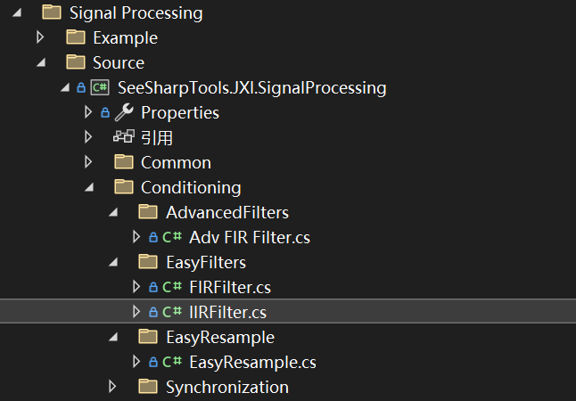
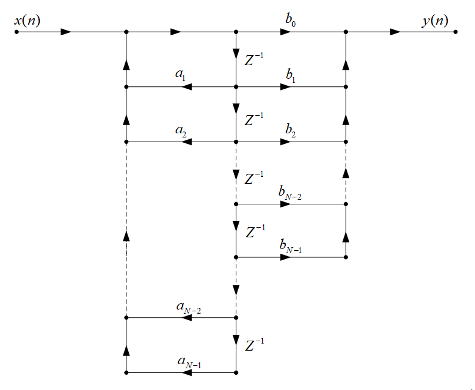
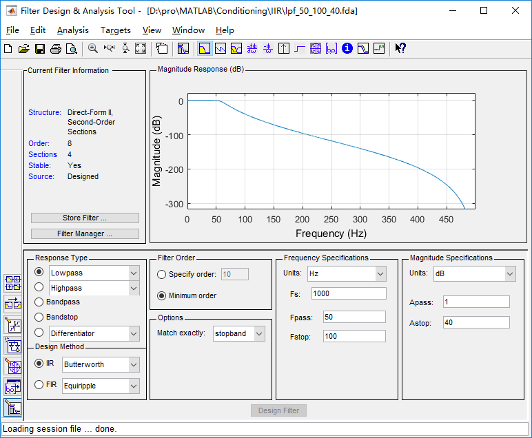
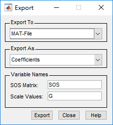

# JXI DSP-Core Note 01512_C# DSP-Core Library 

# Signal Processing Conditioning EasyFilters IIRFilter

**Author:** LandauRZ

**Date:** July-28-2022


该类的定义的路径为*..\SeeSharp\Seesharp-DSP-Core-Lib\Development\CSharp\Core Library\Signal Processing\Source\Conditioning\EasyFilters\IIRFilter.cs*



## IIR滤波器简介

 IIR（Infinite Impulse Response）滤波器是无限长冲击响应滤波器。IIR滤波器的设计主要是利用模拟滤波器成熟的设计理论来进行设计的，因而保留了一些典型模拟滤波器优良的幅度特性，特别是双线性变换法没有频率混叠，效果很好。 

IIR滤波器有以下几个**特点**：

（1）系统的单位抽样响应h（n）无限长

（2）系统函数H（z）在有限z平面（0<|z|<∞）上有极点存在

（3）存在输出到输入的反馈，递归型结构

**直接II型：**

设IIR滤波器的单位冲激响应h（n）为一个N点序列，0<=n<=N-1,则滤波器的系统函数为：


$$
H(z)=\frac{Y(z)}{X(z)}=\frac{\sum_{m=0}^{N-1}b_mz^{-m}}{1-\sum^{N-1}_{m=1}a_mz^{-m}}\tag{1}
$$
系统的差分方程表达式为：
$$
y(n)=\sum_{m=0}^{N-1}b_mx(n-m)+\sum_{m=1}^{N-1}a_my(n-m)\tag{2}
$$
直接II型结构如图所示：



SOS(second-order section)型：
$$
H(z)=\prod^L_{k=1}H_k(z)=\prod_{k=1}^L\frac{b_{0k}+b_{1k}z^{-1}+b_{2k}z^{-2}}{1+a_{1k}z^{-1}+a_{2k}z^{-2}}\tag{3}
$$
SOS矩阵：
$$
sos=
   \left[
 \begin{matrix}
   b_{01} & b_{11} & b_{21} & 1 & a_{11} & a_{21}\\
   b_{02} & b_{12} & b_{22} & 1 & a_{12} & a_{22}\\
   ... & ... & ... & ... & ... & ...\\
   b_{0L} & b_{1L} & b_{2L} & 1 & a_{1L} & a_{2L}
  \end{matrix}
  \right] \tag{4}
$$


## 公共类及方法说明

### class IIRFilter

```c#
public class IIRFilter
```


#### **属性**

* FilteredPoints：已经滤波的点数，数据类型：ulong
* IsSOS：是否使用二阶级联方式，默认为否，数据类型：bool

#### 方法

##### **1，Reset**

```c#
public void Reset()
```

**方法功能描述：**清空状态寄存器

**输入参数：**

* 无输入参数

**输出参数：**

* 无输出参数

##### **2，SetCoefficients**

```C#
public void SetCoefficients(double[] numerator, double[] demoniator)
public void SetCoefficients(double[,] SOS, double[] G)
```

**方法功能描述：**设置滤波器的系数

**输入参数**

* 第一类：
  * numerator：分子，数据类型：double数组
  * denominator：分母，数据类型：double数组
* 第二类：
  * SOS：二阶矩阵，数据类型：二阶double数组
  * G：增益，数据类型：double数组

**输出参数：**

* 无输出参数

##### **3，Filter**

```C#
public void Filter(double[] x, ref double[] y)
```

**方法功能描述：**直接II型IIR滤波器，共享一个状态寄存器

**输入参数：**

* x：输入信号，数据类型：double数组
* y：输出信号，数据类型：ref double数组

**输出参数：**

* 无返回值，仅改变引用参数y


### **使用注意事项：**

实现直接II型IIR滤波器有2个步骤：

（1）使用**SetCoefficients()**配置滤波器系数。

（2）调用**Filter()**进行滤波。

滤波器的系数可以用MATLAB的FDAtool设计。



设计完滤波器后，在文件(File)的下拉菜单选择Export，得到矩阵SOS和G

用[b,a]=sos2tf(SOS);得到滤波器系统函数的分子分母多项式系数，只是差了一个比例因子k。

K=cumprod(G);

k=K(end);

滤波输出结果filteredpWave可以这样求：

filteredpWave=filter(b,a,pWave)*k; 



### winform示例

#### 界面展示

该WinForm程序的路径为*Core Library\Mathematics\Example\Curvefitting\PolynomialFitting*


#### 界面功能介绍

界面左侧为$2\times 2$的图窗，左边两个从上到下分别为滤波前与滤波后的波形，右边两个从上到下分别为滤波前与滤波后的频谱图，右边是滤波设置，可以选择是否使用二级级联的方式（Choose SOS），以及滤波的类型，包括低通滤波、高通滤波、带通滤波、带阻滤波共计四类。单击Filter按钮，在左上角的图窗中生成一个高频正弦波叠加上低频正弦波以及一个小的随机白噪声的输入信号，可以在右上角对应的频谱图中看见出现了两个峰，如经过低通滤波（以此为例）之后去除了高频信息，时域中减少了很多细节信息，频域中从双峰变为单峰。

#### 核心代码

buttonStart_Click事件(单击Filter)

```C#
private void buttonStart_Click(object sender, EventArgs e)
        {
            //Generate time domain waveforms based on the selected filter
            int length = 2000;
            double[] sinWaveTemp = new double[length];
            double[] sinWave = new double[length];
            double[] noise = new double[length];//Noise
            double sampleRate = 100;//Sampling rate
            labelSampleRate.Text = sampleRate.ToString();
            double Amp = 1;//Amplitude
            Generation.UniformWhiteNoise(ref noise, Amp * 0.5);//Generate noise
            if (radioButtonBSF.Checked)
            {
                Generation.SineWave(ref sinWaveTemp, Amp, 0, sampleRate * 0.01, sampleRate);//Low frequency signal
                Generation.SineWave(ref sinWave, Amp, 0, sampleRate * 0.2, sampleRate);//High frequency signal
                ArrayCalculation.Add(sinWave, sinWaveTemp, ref sinWave);//Dual frequency signal
                ArrayCalculation.Add(sinWave, noise, ref sinWave);//Plus noise
                labelFrequency.Text = "1, 20";
            }
            else
            {
                Generation.SineWave(ref sinWaveTemp, Amp, 0, sampleRate * 0.01, sampleRate);//Low frequency signal
                Generation.SineWave(ref sinWave, Amp, 0, sampleRate * 0.1, sampleRate);//High frequency signal
                ArrayCalculation.Add(sinWave, sinWaveTemp, ref sinWave);//Dual frequency signal
                ArrayCalculation.Add(sinWave, noise, ref sinWave);//Plus noise
                labelFrequency.Text = "1, 10";
            }

            //Clear the filter status register. If you need to use the same configuration of the filter to continuously calculate multiple times, you don't need reset.
            //_IIR.Reset();//Reset            
            double[] sinWaveFiltered = new double[length];
            _IIR.Filter(sinWave, ref sinWaveFiltered);//Filter
            if (!checkBoxIsSOS.Checked)
            {
                ArrayCalculation.MultiplyScale(ref sinWaveFiltered, k[0]);//Scale with k
            }
            labelFilteredPoints.Text = _IIR.FilteredPointns.ToString();//Number of points through the filter
            //Calculated spectrum
            double[] spectrumSinWave = new double[length / 2];
            double[] spectrumFiltered = new double[length / 2];
            GeneralSpectrumTask _task = new GeneralSpectrumTask();
            _task.SampleRate = sampleRate;//Sampling rate
            _task.InputDataType = InputDataType.Real;//Input type
            _task.WindowType = WindowType.Hamming;//Window type
            _task.Average.Mode = SpectrumAverageMode.NoAveraging;//Average mode
            _task.Output.NumberOfLines = length / 2;//Output spectrum number
            _task.Unit.Type = SpectrumOutputUnit.V; //Unit
            _task.Unit.IsPSD = false;//Whether the density spectrum, pay attention to true, unit must be V2
            _task.GetSpectrum(sinWaveFiltered, ref spectrumFiltered);
            _task.GetSpectrum(sinWave, ref spectrumSinWave);
            //Drawing
            easyChartWaveform.Plot(sinWave, 0, 1 / sampleRate);//Time domain signal before filter
            easyChartWaveformFilter.Plot(sinWaveFiltered, 0, 1 / sampleRate);//Time domain signal after filtering
            easyChartSpectrum.Plot(spectrumSinWave, _task.SpectralInfomation.FreqStart, _task.SpectralInfomation.FreqDelta);//Frequency domain signal before filter
            easyChartSpectrumFilter.Plot(spectrumFiltered, _task.SpectralInfomation.FreqStart, _task.SpectralInfomation.FreqDelta);//Filtered frequency domain signal
        }
```

