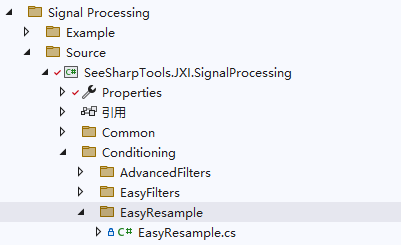
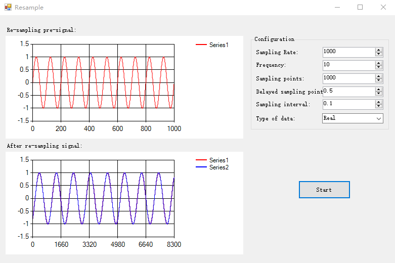

# JXI DSP-Core Note 01513_C# DSP-Core Library

# Signal Processing: Easy Resample

**Author:** Hamburg

**Date:** Jul-28-2022

## EasyResample类在Solution Explorer中的显示

该类的定义路径为Signal Processing\Source\EasyResample



## EasyResample类及方法说明

重采样，包括上采样和下采样，对原信号中不存在的数据点做插值。插值模式有临近值、线性内插、样条拟合、滤波。目前实现滤波模式。  

```c#
/// <summary>
/// Resample class
/// <para>Simplified Chinese:重采样</para>
/// </summary>
public static class EasyResample
```

### 1. 双参数输入

```c#
/// <summary>
/// <para>Resample</para>
/// <para>Simplified Chinese:重采样</para>
/// </summary>
/// <param name="data"> 
/// <para>input data</para>
/// <para>Simplified Chinese:输入信号</para>
/// </param>
/// <param name="delay">
/// <para>delay in Sample points</para>
/// <para>Simplified Chinese:延迟抽样点数</para>
/// </param>
/// <returns></returns>
public static double[] ResampleWaveform(double[] data, double delay)
```

**输入参数：**

* data，用于重采样的输入信号，数据类型：double数组
* delay，延迟采样点数，数据类型：double

**返回值：**采样后的输出信号，数据类型：double数组

### 2. 三double参数输入

```c#
/// <summary>
/// <para>Resample</para>
/// <para>Simplified Chinese:重采样</para>
/// </summary>
/// <param name="data">data contains the input signal for resampling. The sampling interval of data is 1. </param>
/// <param name="delay">delay in Sample points</param>
/// <param name="dt"> specifies the sampling interval for outputWave</param>
/// <returns></returns>
public static double[] ResampleWaveform(double[] data, double delay, double dt)
```

**输入参数：**

* data，用于重采样的输入信号，数据类型：double数组
* delay，延迟采样点数，数据类型：double
* dt，输出信号的采样间隔，数据类型：double

**返回值：**采样后的输出信号，数据类型：double数组

### 3. 三complex参数输入

```c#
/// <summary>
/// <para>Resample</para>
/// <para>Simplified Chinese:重采样</para>
/// </summary>
/// <param name="data">data contains the input signal for resampling. The sampling interval of data is 1. </param>
/// <param name="delay">delay in Sample points</param>
/// <param name="dt"> specifies the sampling interval for outputWave</param>
/// <returns></returns>
public static Complex [] ResampleWaveform(Complex[] data, double delay, double dt)
```
**输入参数：**

* data，用于重采样的输入信号，数据类型：Complex数组
* delay，延迟采样点数，数据类型：double
* dt，输出信号的采样间隔，数据类型：double

**返回值：**采样后的输出信号，数据类型： Complex数组

## EasyResample WinForm

### 界面



### 功能介绍

设置Sampling Rate、Frequency、Sampling points，在左上角的图展示重采样前的信号：
$$
S(x)=\sin(2\pi \times \frac {Frequency}{Sampling\,Rate}\times x), \quad \forall x \in N \quad and\quad 0 \leq x \leq Sampling\ points
$$
设置Delayed sampling point、Sampling interval，在左下角的图展示重采样后的信号：
$$
A(x)=SI(Sampling\ interval * x + Delay)
$$
其中，SI() 是新数据点在原信号中的插值函数。

### 核心代码

```c#
private void buttonResample_Click(object sender, EventArgs e)
{
    //Get parameters
    int length = (int)numericUpDownSamples.Value;//Sampling points
    double sampleRate = (double)numericUpDownSampleRate.Value;//Sampling rate
    double frequency = (double)numericUpDownFrequency.Value;//Signal frequency
    double delay = (double)numericUpDownDelay.Value;//Delay points
    double dt = (double)numericUpDownDt.Value;

    if (comboBoxType.Text == "Real")
    {
        //Generating a signal to be resampled
        double[] sin = new double[length];
        Generation.SineWave(ref sin, 1, 0, frequency, sampleRate);

        //Re-sampling
        var sinResample = EasyResample.ResampleWaveform(sin, delay, dt);
        double[] sin2 = new double[sinResample.Length];//According to the delay and the filter, the required number of points (85) and the signal generated by dt are established.
        double[,] sin1 = new double[sinResample.Length, 2];//Pre-synchronization signal
        double[,] sinT = new double[2, sinResample.Length];//Pre-synchronization signal
        Generation.SineWave(ref sin2, 1, (delay + 85) * 360 * frequency / sampleRate, frequency, sampleRate / dt);
        ArrayManipulation.Connected_2D_Array(sinResample, sin2, ref sin1);//Grouping two-dimensional arrays
        ArrayManipulation.Transpose(sin1, ref sinT);//Transpose
                                                    //Display
        easyChartAfter.Plot(sinT);//After sampling
        easyChartBefore.Plot(sin);//Before sampling
    }
    else
    {
        //Generating a signal to be resampled
        double[] sin = new double[length];
        double[] cos = new double[length];
        double[,] dataPlay = new double[length,2];
        double[,] dataPlayT = new double[2,length ];
        Generation.SineWave(ref sin, 1, 0, frequency, sampleRate);//Real
        Generation.SineWave(ref cos, 1, 90, frequency, sampleRate);//Imaginary
        ArrayManipulation.Connected_2D_Array(sin, cos, ref dataPlay);//Grouping two-dimensional arrays
        ArrayManipulation.Transpose(dataPlay, ref dataPlayT);//Transpose
        Complex[] data= new Complex[length];
        for (int i = 0; i < length; i++)
        {
            data[i] = new Complex(sin[i],cos[i]);
        }

        //Re-sampling
        var dataResample = EasyResample.ResampleWaveform(data, delay, dt);

        double[] sin2 = new double[dataResample.Length];//According to the delay and the filter, the required number of points (85) and the signal generated by dt are established.
        double[,] sinT = new double[4, dataResample.Length];//Before and after synchronization
        double[] cos2 = new double[dataResample.Length];//According to the delay and the filter, the required number of points (85) and the signal generated by dt are established.
        Generation.SineWave(ref sin2, 1, (delay + 85) * 360 * frequency / sampleRate, frequency, sampleRate / dt);
        Generation.SineWave(ref cos2, 1, 90+(delay + 85) * 360 * frequency / sampleRate, frequency, sampleRate / dt);

        //Take Real-Imaginary after Re-sampling
        double[] dataResampleReal = new double[dataResample.Length];
        double[] dataResampleIm = new double[dataResample.Length];
        for (int i = 0; i < dataResample.Length; i++)
        {
            dataResampleReal[i] = dataResample[i].Real;
            dataResampleIm[i] = dataResample[i].Imaginary;
        }

        //Combination array drawing
        InsetArray(ref sinT, sin2, 0);
        InsetArray(ref sinT, dataResampleReal, 1);
        InsetArray(ref sinT, cos2, 2);
        InsetArray(ref sinT, dataResampleIm, 3);
        //Display
        easyChartAfter.Plot(sinT);//After sampling
        easyChartBefore.Plot(dataPlayT);//Before sampling
    }


}
```

