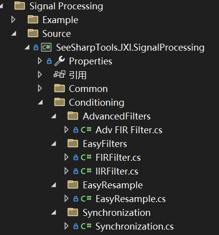
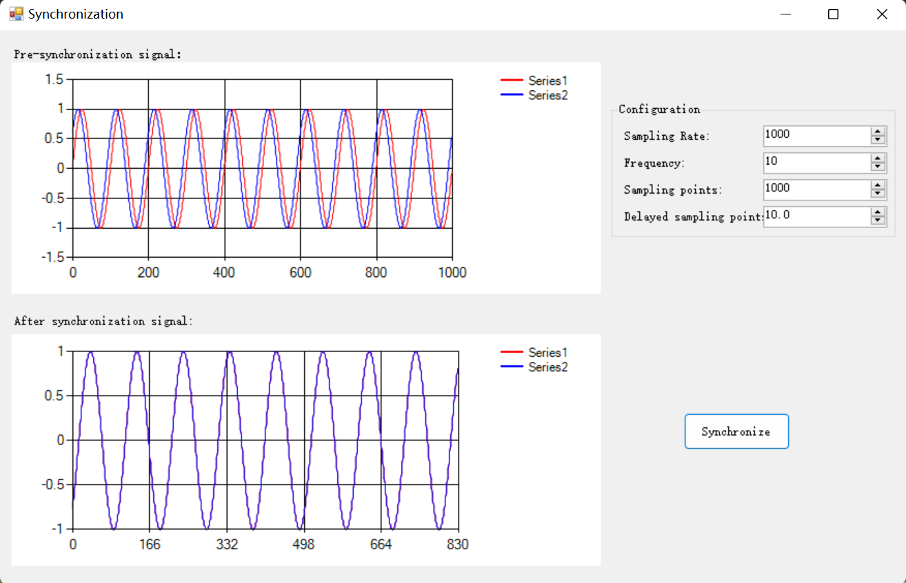

# JXI DSP-Core Note 01514_C# DSP-Core Library 

# Signal Processing Conditioning Synchronization

**Author:** LandauRZ

**Date:** August-1-2022


该类的定义的路径为*..\Core Library\Signal Processing\Source\Conditioning\Synchronization*



## 公共类及方法说明

### class Synchronization

```c#
public static class Synchronization
```

#### 公共方法

##### **1，SyncWaveform**

```c#
public static double[,] SyncWaveform(double[,] data)   
public static double[,] SyncWaveform(double[,] data, double ChannelShiftSamples)
```

**方法功能描述：**同步输入信号

**异常：**

```C#
//触发条件：输入信号点数过少（少于170点）
JXIParamException("Please input more samples")
```

**输入参数：**

* data：输入信号，数据类型：double二阶数组
* ChannelShiftSamples：通道之间延迟的抽样点数，数据类型：double

**输出参数：**

* 返回值：同步信号，数据类型：double二阶数组

## Winform案例代码

### 界面展示

该WinForm程序的路径为*..\SeeSharp\Seesharp-DSP-Core-Lib\Development\CSharp\Core Library\Signal Processing\Example\Synchronization\Synchronization Winform*



### 界面功能介绍

窗体的左侧上面一栏展示了同步之前的两个通道的信号，可以看出二者是错位的，其中红色表示原始信号，蓝色表示延时的信号；而下面一栏则展示了同步之后的两个通道的信号，可以看出二者是重合的。窗体右侧是参数的设置栏，可以对采样率、正弦信号频率、采样点数以及延时信号的延时点数进行设置。鼠标单击Synchronize则立即生成原始信号与演示信号，并再左侧下栏展示出同步之后的效果。

### 核心代码

#### buttonStart_Click事件(单击Filter)

```c#
private void buttonSyn_Click(object sender, EventArgs e)
        {
            //Get parameters
            int length = (int)numericUpDownSamples.Value;//Sampling points
            double sampleRate = (double)numericUpDownSampleRate.Value;//Sampling rate
            double frequency = (double)numericUpDownFrequency.Value;//Signal frequency
            double delay = (double)numericUpDownDelay.Value;//Delay points

            //Generate sync signal
            double[] sin1 = new double[length];//Pre-synchronization signal1
            double[] sin2 = new double[length];//Pre-synchronization signal2
            double[,] sin = new double[length,2];//Pre-synchronization signal
            double[,] sinT = new double[2,length ];//Pre-synchronization signal
            Generation.SineWave(ref sin1, 1, 0, frequency, sampleRate);
            Generation.SineWave(ref sin2, 1, delay * 360 * frequency / sampleRate, frequency, sampleRate);
            ArrayManipulation.Connected_2D_Array(sin1, sin2, ref sin);
            ArrayManipulation.Transpose(sin, ref sinT);
            //Synchronize
            var sinSyn=Synchronization.SyncWaveform(sinT, delay);
            //Display
            easyChartAfter.Plot(sinSyn);//After synchronization
            easyChartBefore.Plot(sinT);//Before synchronization
        }
```

