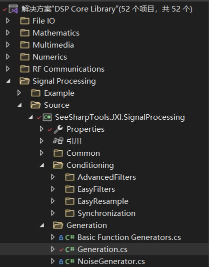
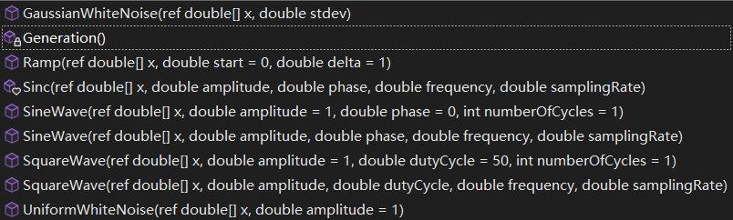
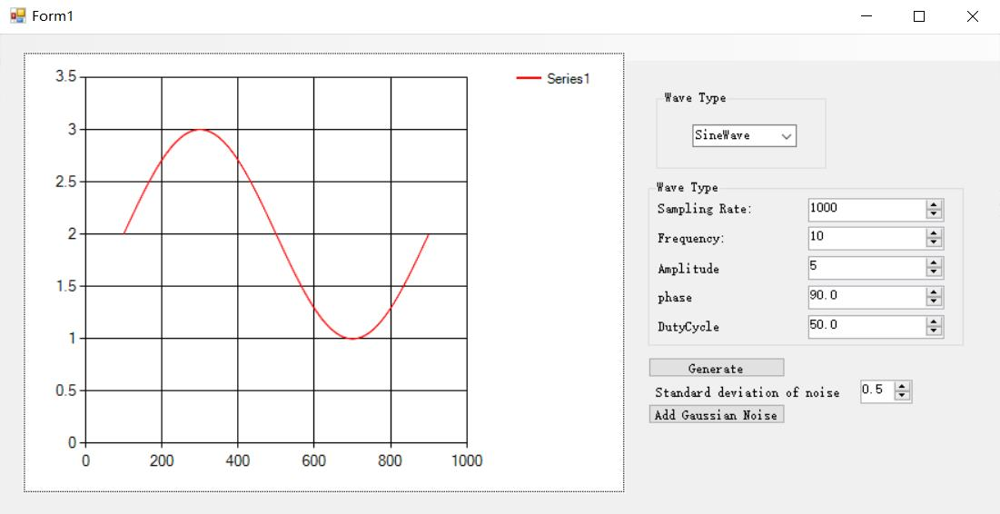
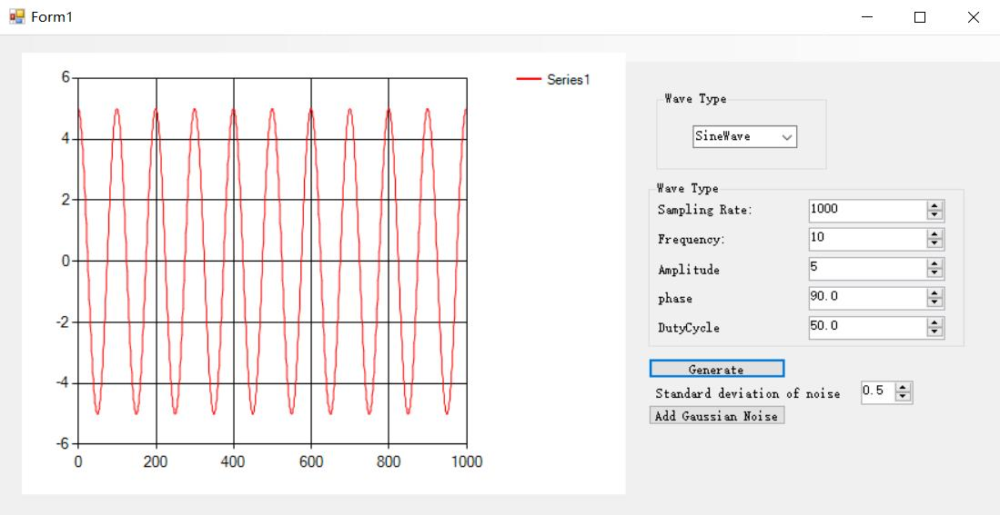
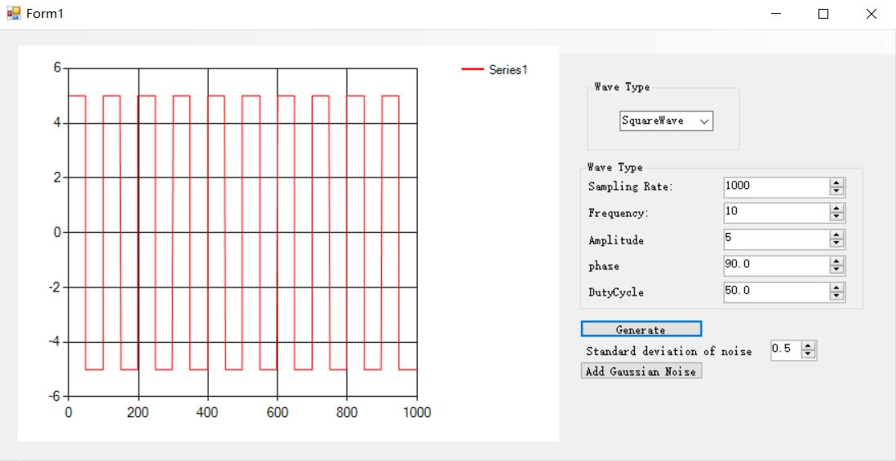
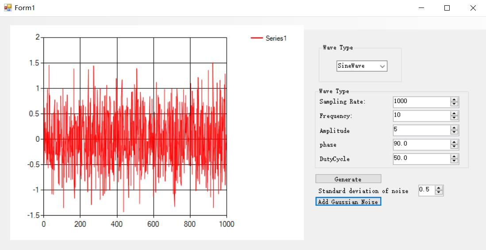
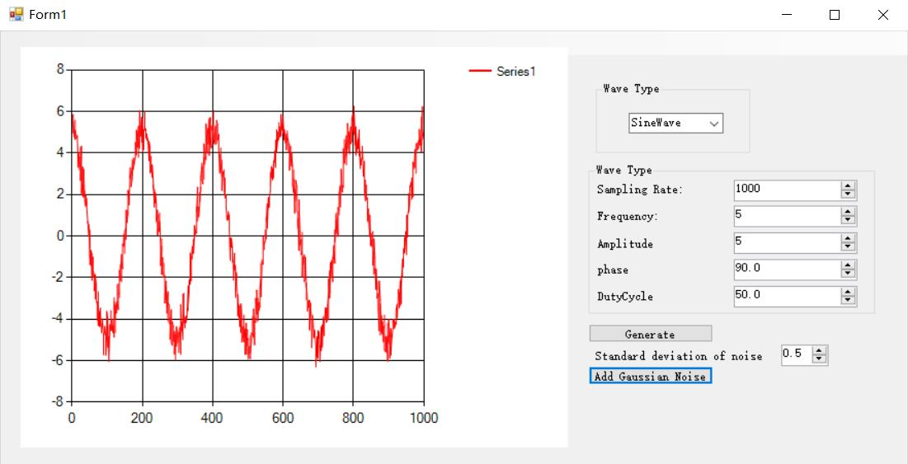
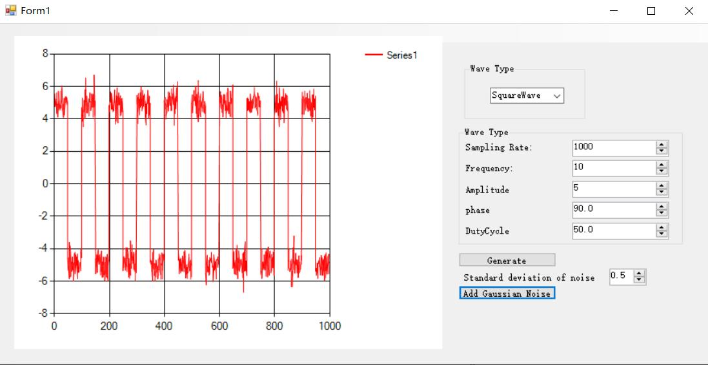

# JXI DSP-Core Note 01520_C# DSP-Core Library

# Signal Processing: Generation Generation

**Author:** Peter Park

**Date:** Jul-28-2022

## Generation类在库中的位置



如上图所示，Generation类位于Signal Processing 功能分支下的Generation模块中，其具体实现文件的路径为：

*Core Library\Signal Processing\Source\Generation*


## Generation类的介绍说明

### 方法总览



如上图所示，该类主要提供均匀和高斯白噪声、Sinc、锯齿波、正弦波、方波生成的静态方法。


### 相关原理介绍

####  正态分布数据产生的机理：

本质上来说，计算机只能生产符合均匀分布的采样。如果要生成其他分布的采样，就需要借助一些技巧性的方法。 而在众多的“其他分布”中，正态分布无疑占据着相当重要的地位。下面的Box–Muller变换，就为我们生成符合正态分布的采样（随机数）提供了一种方法，而且这也是很多软件或者编程语言的库函数中生成正态分布随机数时所采样的方法。 

#### Box–Muller变换 

**定义：**

（Box-Muller变换）：如果随机变量U1和U2是相互独立的，且U1,U2 ~U[0, 1]（0~1之间的随机数），则 ：
$$
Z_0=\sqrt{-2\ln U_1}\cos \left( 2\pi U_2 \right) 
\\
Z_1=\sqrt{-2\ln U_1}\sin \left( 2\pi U_2 \right)
$$
且有Z_0和Z_1独立且服从正态分布。

**证明：**

假设有两个独立二点标准正态分布：X~N(0,1)和Y~N(0,1)

 由于二者相互独立，则联合概率密度函数为 :
$$
f\left( x,y \right) =f\left( x \right) .f\left( y \right) =\frac{1}{\sqrt{2\pi}}e^{-\frac{x^2}{2}}.\frac{1}{\sqrt{2\pi}}e^{-\frac{y^2}{2}}=\frac{1}{2\pi}e^{-\frac{x^2+y^2}{2}}
$$
将直角坐标系转换到极坐标系下，并做如下替换：
$$
x=R\cos \theta , \space y=R\sin \theta
$$
则有分布函数：
$$
f\left( R,\theta \right) =\frac{1}{2\pi}e^{-\frac{R^2}{2}}
$$
 分别进行积分得到概率分布函数
$$
P_R\left( R<r \right) =\int\limits_0^{2\pi}{\int\limits_0^r{\frac{1}{2\pi}e^{-\frac{R^2}{2}}RdRd\theta =1-e^{-\frac{r^2}{2}}}}
\\
P_{\theta}\left( \theta <\phi \right) =\int\limits_0^{\phi}{\int\limits_0^{\infty}{\frac{1}{2\pi}e^{-\frac{R^2}{2}}RdRd\theta =\frac{\phi}{2\pi}}}
$$
显然θ为标准均匀分布，有θ ~U(0, 2π)=2π U2，那么对上面两个函数求反函数，可以选择两个服从[0,1]之间均匀分布的随机变量A，B作为概率累计分布函数的值，那么有：
$$
\theta =2\pi A
\\
R=\sqrt{-2\ln \left( 1-B \right)}
$$
令U_1=A，U_2=1-B，最终得到：
$$
\theta =2\pi U_1
\\
R=\sqrt{-2\ln U_2}
$$
再往前回代，得到：
$$
X=R\cos \theta =\sqrt{-2\ln U_2}\cos 2\pi U_1=\sqrt{-2\ln s}\left( \frac{u}{\sqrt{s}} \right) =u\sqrt{\frac{-2\ln s}{s}}
\\
Y=R\sin \theta =\sqrt{-2\ln U_2}\sin 2\pi U_1=\sqrt{-2\ln s}\left( \frac{v}{\sqrt{s}} \right) =v\sqrt{\frac{-2\ln s}{s}}
$$


相关的替换如图中所示，相当于在单位圆内不断地随机取点，利用这些点的横、纵坐标，最终可以映射到服从高斯分布的X，Y变量。

#### 高斯噪声分布信号代码实现对比

本库中产生高斯噪声噪声的方法正是Box–Muller变换，可以参考下面的实现代码进行理解。

```C#
public static void GaussianWhiteNoise(ref double[] x, double stdev)
        {
            Random rn = new Random();
            int count = x.Length % 2 == 0 ? x.Length : x.Length - 1;
            double x1 = 0, x2 = 0, w = 0, y1 = 0, y2 = 0;
            //计算偶数个点
            for (int i = 0; i < count; i++)
            {
                do
                {
                    x1 = 2.0 * rn.NextDouble() - 1.0;
                    x2 = 2.0 * rn.NextDouble() - 1.0;
                    w = x1 * x1 + x2 * x2;
                } while (w >= 1.0 || (x1 == 0 && x2 == 0));
                w = Math.Sqrt((-2.0 * Math.Log(w)) / w);
                y1 = x1 * w;
                y2 = x2 * w;
                x[i] = stdev * y1;
                x[++i] = stdev * y2;
            }
            //计算最后一个点
            if (x.Length % 2 == 1)
            {
                do
                {
                    x1 = 2.0 * rn.NextDouble() - 1.0;
                    x2 = 2.0 * rn.NextDouble() - 1.0;
                    w = x1 * x1 + x2 * x2;
                } while (w >= 1.0 || (x1 == 0 && x2 == 0));
                w = Math.Sqrt((-2.0 * Math.Log(w)) / w);
                y1 = x1 * w;
                y2 = x2 * w;
                x[x.Length - 1] = stdev * y1;
            }
        }
```


### 方法介绍

#### (1)产生一个等差数列

**方法申明**

```C#
public static void Ramp(ref double[] x, double start = 0, double delta = 1)
```

**功能介绍**

产生一个等差数列，数列的项数由数组x的长度给出，首项由start给出，公差由delta给出。

**参数说明**

* 引用参数 x：返回的等差数列，数据类型：double类型的数组

* 值参数 start：等差数列的首项，数据类型：double，默认值为0

* 值参数delta：等差数列的公差，数据类型：double，默认值为1


#### (2)生成一个正弦波形

**方法申明**

```C#
public static void SineWave(ref double[] x, double amplitude, double phase,                                           double frequency, double samplingRate)
```

**功能介绍**

生成一个正弦波形，可设定正弦波的幅度、初始相位、频率和采样率。

**参数说明**

* 引用参数 x：返回的正弦波形，数据类型：double类型的数组

* 值参数amplitude：正弦波的幅度，数据类型：double

* 值参数phase：正弦波的初始相位，以角度(Degree)为单位，数据类型：double

* 值参数frequency：正弦波的频率，以Hz为单位，数据类型：double

* 值参数samplingRate：采样频率，以Hz为单位，数据类型：double


#### (3)生成一个包含整数个周期的正弦波形

**方法申明**

```C#
 public static void SineWave(ref double[] x, double amplitude = 1, double phase = 0,                                  int numberOfCycles = 1)
```

**功能介绍**

生成一个包含整数个周期的正弦波形，可设定正弦波的幅度、初始相位和周期数。

**参数说明**

* 引用参数 x：返回的正弦波形，数据类型：double类型的数组

* 值参数amplitude：正弦波的幅度，数据类型：double，默认值为1

* 值参数phase：正弦波的初始相位，以角度(Degree)为单位，数据类型：double，默认值为0

* 值参数numberOfCycles：正弦波周期数，数据类型：double，默认值为1


#### (4)生成一个方波波形

**方法申明**

```C#
 public static void SquareWave(ref double[] x, double amplitude, double dutyCycle,                                      double frequency, double samplingRate)
```

**功能介绍**

生成一个方波波形，可设定方波的幅度、占空比、频率和采样率。

**参数说明**

* 引用参数 x：返回的方波波形，数据类型：double类型的数组

* 值参数amplitude：方波的幅度，数据类型：double

* 值参数dutyCycle：占空百分比，为0~100之间的数值，数据类型：double

* 值参数frequency：方波的频率，以Hz为单位，数据类型：double

* 值参数samplingRate：采样率，以Hz为单位，数据类型：double


#### (5)生成一个包含整数个周期的方波波形

**方法申明**

```C#
public static void SquareWave(ref double[] x, double amplitude = 1,                                                     double dutyCycle = 50, int numberOfCycles = 1)
```

**功能介绍**

生成一个包含整数个周期的方波波形，可设定方波的幅度、占空比和周期数。

**参数说明**

* 引用参数 x：返回的方波波形，数据类型：double类型的数组

* 值参数amplitude：方波的幅度，数据类型：double，默认值为1

* 值参数dutyCycle：占空百分比，为0~100之间的数值，数据类型：double，默认值为50

* 值参数numberOfCycles：方波周期数，数据类型：int，默认值为1


#### (6)生成一个幅度在[–amplitude, amplitude]之间的随机白噪声波形

**方法申明**

```C#
public static void UniformWhiteNoise(ref double[] x, double amplitude = 1)
```

**功能介绍**

生成一个幅度在[–amplitude, amplitude]之间的随机白噪声波形。

**参数说明**

* 引用参数 x：返回的白噪声波形，数据类型：double类型的数组

* 值参数amplitude：噪声幅度，数据类型：double，默认值为1


#### (7)生成高斯白噪声

**方法申明**

```C#
public static void GaussianWhiteNoise(ref double[] x, double stdev)
```

**功能介绍**

生成一个幅度在[–amplitude, amplitude]之间的随机白噪声波形。

**参数说明**

* 引用参数 x：输出高斯白噪声，数据类型：double类型的数组

* 值参数stdev：标准差，数据类型：double


## Generation类的部分调用例程

为了展现C#的便捷性，笔者用winform简单地设计了如下的界面：



该交互界面可以根据输入的参数生成不同的波形或添加高斯噪声，最终绘制在坐标系中从而实现以下功能

(1)生成正弦波：



(2)生成方波：



(3)生成高斯噪声：



(4)给正弦波添加高斯噪声：



(5)给方波添加高斯噪声：



实现代码：

```C#
namespace Generate_Different_Waves
{
    public partial class Form1 : Form
    {
        //接受输出信号的数组
        double[] outputwaveform = new double[1000];

        public Form1()
        {
            InitializeComponent();
        }

        private void Form1_Load(object sender, EventArgs e)
        {
         
        }

        private void Generate_Click(object sender, EventArgs e)
        {
            //重置easychart函数图像模组
            easyChart1.Clear();
            //获取幅度
            double A = (double)numericUpDownA.Value;
            //获取初相位
            double phase = (double)numericUpDownPhase.Value;
            //获取正弦波频率
            double f = (double)numericUpDownFrequency.Value;
            //获取采样频率
            double samplingrate = (double)numericUpDownSampleRate.Value;
            // 获取占空比
            double dutycycle = (double)numericUpDownDutyCycle.Value;

            if (WaveForm.Text=="SineWave")
            {	
                //生成正弦波
                Generation.SineWave(ref outputwaveform, A, phase, f, samplingrate);
            }
            else
            {
                //生成方波
                Generation.SquareWave(ref outputwaveform, A, dutycycle, f, samplingrate);
            }
			//绘制函数图像
            easyChart1.Plot(outputwaveform);
        }

        private void AddGaussianNoise_Click(object sender, EventArgs e)
        {
            //获取高斯噪声标准差
            double std = (double)numericUpDownNoiseStd.Value;
            //高斯噪声信号接受数组
            double[] noise = new double[1000];
            //产生高斯噪声信号
            Generation.GaussianWhiteNoise(ref noise, std);
            //叠加至原信号之上
            for (int i = 0; i < 1000; i++)
            {
                outputwaveform[i] += noise[i];
            }
            //清空并重新绘制函数图像
            easyChart1.Clear();
            easyChart1.Plot(outputwaveform);

        }
    }
}
```

