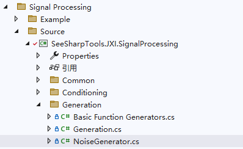
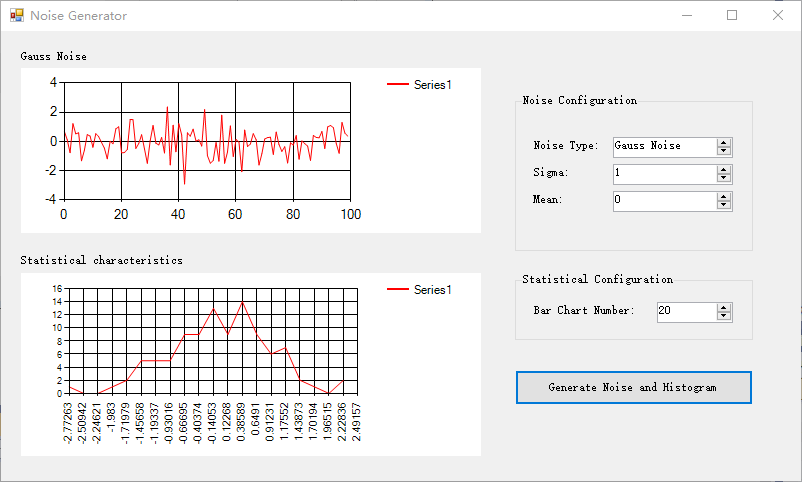
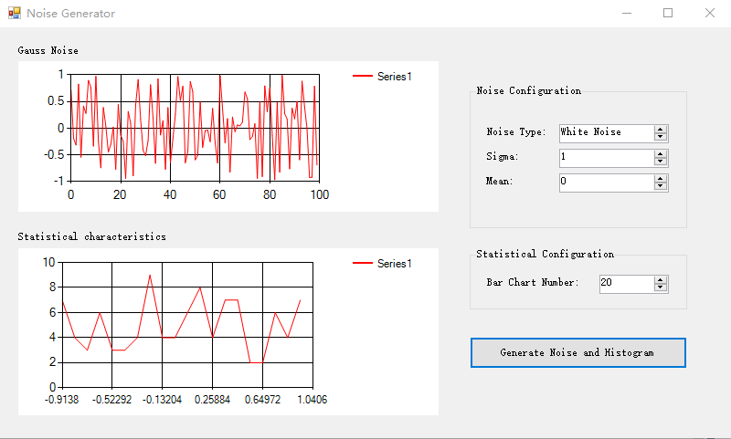

# JXI DSP-Core Note 01521_C# DSP-Core Library

# Signal Processing Generation: Noise Generator

**Author:** Hamburg

**Date:** Aug-01-2022

## NoiseGenerator类在Solution Explorer中的显示

该类的定义路径为Signal Processing\Source\Generation\NoiseGenerator



## NoiseGenerator类说明

噪声生成器，包括高斯噪声和白噪声。

```c#
/// <summary>
/// 噪声生成器
/// </summary>
public static class NoiseGenerator
```

### GetRandomSeed

```c#
/// <summary>
/// 产设种子，seed =-1 随机生成种子；seed != -1 返回seed
/// </summary>
/// <param name="seed">种子</param>
/// <returns></returns>
public static int GetRandomSeed(int seed = -1)
```

**输入参数：**

* seed，值为-1则随机生成种子，值非-1则指定种子，数据类型：int

**返回值：**用于生成随机数的种子，数据类型：int

该方法使用了在System.Security.Cryptography命名空间下提供的RNGCryptoServiceProvider类。该类利用系统当前的硬件信息、进程信息、线程信息、系统启动时间和当前精确时间作为填充因子，通过更好的算法生成高质量的随机数，即强随机数。

### GaussNoise

```c#
/// <summary>
/// 用box muller的方法产生高斯噪声
/// https://en.wikipedia.org/wiki/Box-Muller_transform
/// </summary>
/// <param name="gaussNoise">输出噪声数组</param>
/// <param name="sigma">方差</param>
/// <param name="mean">均值</param>
/// <param name="seed">种子</param>
public static void GaussNiose(double[] gaussNoise, double sigma = 1, double mean = 0, int seed = -1)
```

**输入参数：**

* gaussNoise：高斯噪声数组，数据类型：double数组
* sigma：噪声方差，默认为1，数据类型：double
* mean：噪声均值，默认为0，数据类型：double
* seed：种子，默认为-1，即随机生成的种子，数据类型：int

该方法使用box muller方法生成高斯噪声，即使用随机生成的种子进而生成一系列两个在0~1之间的随机浮点数r1、r2，并计算得到均值为0、方差为1的gaussNoise数组
$$
Noise = \sqrt{-2\ln{r_1}} \times \sin{2\pi r_2}
$$
最后通过sigma和mean参数调整其方差和均值。
$$
Noise = sigma \times Noise + mean
$$

### WhiteNoise

```c#
/// <summary>
/// 产生白噪声
/// </summary>
/// <param name="whiteNoise">输出噪声数组</param>
/// <param name="amplitude">幅度</param>
/// <param name="mean">均值</param>
/// <param name="seed">种子</param>
public static void WhiteNoise(double[] whiteNoise, double amplitude = 1, double mean = 0, int seed = -1)
```

**输入参数：**

* whiteNoise：白噪声数组，数据类型：double数组
* amplitude：噪声幅度，默认为1，数据类型：double
* mean：噪声均值，默认为0，数据类型：double
* seed：种子，默认为-1，即随机生成的种子，数据类型：int

该方法使用随机生成的种子进而生成在0~1之间的随机浮点数Random，并映射到-1~1之间得到Noise，即默认的幅度为1，均值为0
$$
Noise = 2\times Random - 1
$$
最后通过amplitude和mean参数进行调整。
$$
Noise = amplitude \times Noise + mean
$$

## Winform示例

### Gauss Noise



选择噪声类型为Gauss Noise，并设置Sigma和Mean，最后会在左上角生成噪声分布，并在左下角做直方图统计，发现其大致符合高斯分布。

### White Noise



选择噪声类型为White Noise，并设置Sigma（即Amplitude）和Mean，最后会在左上角生成噪声分布，并在左下角做直方图统计，发现其大致符合均匀分布。