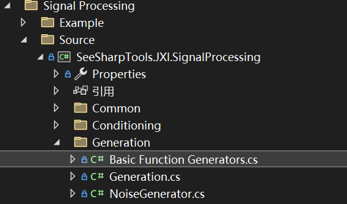

# JXI DSP-Core Note 01522_C# DSP-Core Library 

# Signal Processing Generation Basic Function

**Author:** Hamburg, LandauRZ, Peter Park

**Date:** August-02-2022


该类的定义的路径为*..\SeeSharp\Seesharp-DSP-Core-Lib\Development\CSharp\Core Library\Signal Processing\Source\Generation\Basic Function Generators.cs*



## 公共类及方法说明

### 1. 公共数据类型（噪声类型+基础波形信号类型）

```C#
/// <summary>
/// 噪声类型。
/// </summary>
public enum NoiseType { None, UniformWhiteNoise, }
    
/// <summary>
/// 基础波形信号类型。
/// </summary>
public enum FunctionGenSignalType
{
	/// <summary>
	/// 正弦波。
	/// </summary>
	Sine,

	/// <summary>
	/// 三角波。
	/// </summary>
	Triangle,

	/// <summary>
	/// 锯齿波。
	/// </summary>
	Sawtooth,

	/// <summary>
	/// 方波。
	/// </summary>
	Square
}
```

### 2. EasyGeneration类

#### 类的申明

```c#
/// <summary>
/// 波形生成静态类。
/// </summary>
public static class EasyGeneration
```

#### 方法说明

##### （1）生成单一复数正弦波

```c#
/// <summary>
/// 生成单一复数正弦波。
/// </summary>
/// <param name="x"></param>
/// <param name="frequency"></param>
/// <param name="sampleRate"></param>
/// <param name="signalAmplitude"></param>
/// <param name="snr"></param>
/// <param name="initialPhase">in Degree.</param>
public static void ComplexSine(Complex[] x, double frequency, double sampleRate, double signalAmplitude, double snr = 200, double initialPhase =0)
```

**功能描述：**生成一个Complex数组，数组内的每个成员为（实部，虚部）

**输入参数：**

* x，波形数据点，数据类型：Complex数组
* frequency，频率，数据类型：double
* sampleRate，采样率，即每个周期采样sampleRate/frequency个点，数据类型：double
* signalAmplitude，幅值，即实部虚部绝对值的最大值，数据类型：double
* snr，信噪比，即数据精度，默认为200，数据类型：double
* initialPhase，初始相位，默认为0，数据类型：double

##### （2）生成I/Q交错（Interleave）格式的单一复数正弦波

```c#
/// <summary>
/// 生成I/Q交错（Interleave）格式的单一复数正弦波。
/// </summary>
/// <param name="x"></param>
/// <param name="frequency"></param>
/// <param name="sampleRate"></param>
/// <param name="signalAmplitude"></param>
/// <param name="snr"></param>
/// <param name="initialPhase"></param>
public static void ComplexSine(short[] x, double frequency, double sampleRate, double signalAmplitude, double snr = 200, double initialPhase = 0)
```

**功能描述：**生成一个short数组，数组内以x值、y值交错排列，构成I/Q传输格式。

**输入参数：**

* x，波形数据点，数据类型：short数组
* frequency，频率，数据类型：double
* sampleRate，采样率，即每个周期采样sampleRate/frequency个点，数据类型：double
* signalAmplitude，幅值，即实部虚部绝对值的最大值，数据类型：double
* snr，信噪比，即数据精度，默认为200，数据类型：double
* initialPhase，初始相位，默认为0，数据类型：double

##### （3）生成单一正弦波

```c#
/// <summary>
/// 生成单一正弦波。
/// </summary>
/// <param name="x"></param>
/// <param name="frequency"></param>
/// <param name="sampleRate"></param>
/// <param name="signalAmplitude"></param>
/// <param name="snr"></param>
public static void Sine(short[] x, double frequency, double sampleRate, double signalAmplitude, double snr)
```

**功能描述：**生成一个short数组，数组仅有y值，即纵坐标。

**输入参数：**

* x，波形数据点，数据类型：short数组
* frequency，频率，数据类型：double
* sampleRate，采样率，即每个周期采样sampleRate/frequency个点，数据类型：double
* signalAmplitude，幅值，即实部虚部绝对值的最大值，数据类型：double
* snr，信噪比，即数据精度，默认为200，数据类型：double
* initialPhase，初始相位，默认为0，数据类型：double

### 3. FunctionGenerator类

#### 类的申明

```c#
/// <summary>
/// 基础波形生成基类。
/// </summary>
public abstract class FunctionGenerator
```

#### 属性和字段

```c#
protected double _sampleRate;
/// <summary>
/// 采样率。
/// </summary>
public double SampleRate
{
    get { return _sampleRate; }
    set { _sampleRate = value; }
}
```

SampleRate：采样率，对_sampleRate的封装，数据类型：double

```c#
protected double _frequency;
/// <summary>
/// 频率。
/// </summary>
public double Frequency
{
    get { return _frequency; }
    set { _frequency = value; }
}
```

Frequency：频率，对_frequency的封装，数据类型：double

```c#
protected double _amplitude;
/// <summary>
/// 幅度。
/// </summary>
public double Amplitude
{
    get { return _amplitude; }
    set { _amplitude = value; }
}
```

Amplitude：幅度，对_amplitude的封装，数据类型：double

```c#
protected double _initialPhase;
/// <summary>
/// 初始相位，in Degree。
/// 设置此属性值必然会触发Reset()，即重置历史数据，下一次调用Generate(...)方法时，必然从该初始相位开始生成波形。
/// </summary>
public double InitialPhase
{
    get { return _initialPhase; }
    set
    {
        _initialPhase = value;
        Reset();
    }
}
```

InitialPhase：初始相位（角度），对_initialPhase的封装，设置此属性值必然会触发Reset()，即重置历史数据，下一次调用Generate()方法时，必然从该初始相位开始生成波形，数据类型：double

```c#
protected NoiseType _noiseType;
/// <summary>
/// 噪声类型。
/// </summary>
public NoiseType NoiseType
{
    get { return _noiseType; }
    set { _noiseType = value; }
}
```

NoiseType：噪声类型，对_noiseType的封装，数据类型：NoiseType

```c#
protected double _snr;
/// <summary>
/// 信噪比，dB。
/// </summary>
public double SNR
{
    get { return _snr; }
    set { _snr = value; }
}
```

SNR：信噪比（dB），对_snr的封装，数据类型：double

#### 构造函数及重载

##### （1）初始化函数发生器，未给定参数

```c#
/// <summary>
/// 构造函数。
/// </summary>
public FunctionGenerator(): this(1000, 10, 1, 0, NoiseType.None, 200) {; }
```

**功能描述：**所有输入参数缺省，按照默认值初始化正弦波发生器参数

* 采样率：sampleRate = 1000
* 频率：frequency = 10
* 振幅：amplitude = 1
* 初始相位：initialPhase = 0
* 噪声类型：noiseType = NoiseType.None
* 信噪比：snr = 200

**输入参数：**无

##### （2）初始化函数发生器

```c#
/// <summary>
/// 构造函数。
/// </summary>
/// <param name="sampleRate"></param>
/// <param name="frequency"></param>
/// <param name="amplitude"></param>
/// <param name="initialPhase"></param>
/// <param name="noiseType"></param>
/// <param name="snr"></param>
public FunctionGenerator(double sampleRate, double frequency, double amplitude, double initialPhase, NoiseType noiseType, double snr)
```

**功能描述：**初始化函数发生器

**输入参数：**

* 采样率：sampleRate，数据类型：double
* 频率：frequency，数据类型：double
* 振幅：amplitude，数据类型：double
* 初始相位：initialPhase，缺省值为0，数据类型：double
* 噪声类型：noiseType，数据类型：NoiseType
* 信噪比：snr，数据类型：double

#### 抽象方法说明

##### （1）Reset()

```c#
/// <summary>
/// 重置，清空历史数据。
/// </summary>
public abstract void Reset();
```

基类方法，用于重置，清空历史数据。

**输入参数：**无

##### （2）Generate()

```c#
/// <summary>
/// 生成信号，double格式。
/// </summary>
/// <param name="data"></param>
public abstract void Generate(double[] data);
```

基类方法，生成double格式信号

**输入/输出参数：**

* data：信号数据，数据类型：double数组

```c#
/// <summary>
/// 生成信号，short格式。
/// </summary>
/// <param name="data"></param>
public virtual void Generate(short[] data)
{
    // 先生成double[]数据。
    if (_rawDoubleData == null || _rawDoubleData.Length != data.Length) { _rawDoubleData = new double[data.Length]; }
    Generate(_rawDoubleData);

    // 转换为short[]数据。
    for (int i = 0; i < data.Length; i++) { data[i] = (short)_rawDoubleData[i]; }
}
```

基类方法，生成short格式信号

**输入/输出参数：**

* data：信号数据，数据类型：short数组


### 4. class SineGenerator

#### 类的申明

```c#
public class SineGenerator : FunctionGenerator
```

注：继承自基类FunctionGenerator


#### 公共属性

继承自FunctionGenerator，未有新增

#### 构造函数及重载

**(1)初始化正弦波发生器，未给定参数**

```c#
public SineGenerator() : this(10000, 1000, 1)
```

**功能描述：**所有输入参数缺省，按照默认情形初始化正弦波发生器，按照默认值设置了如下参数：

* 采样率：sampleRate=10000
* 频率：frequency=1000
* 振幅：amplitude=1
* 初始相位：initialPhase=0
* 噪声类型：NoiseType.None
* 信噪比：snr=200

**输入参数：**无输入参数

**(2)初始化正弦波发生器，未给定噪声类型与信噪比**

```c#
public SineGenerator(double sampleRate, double frequency, double amplitude, double initialPhase = 0)
            : this(sampleRate, frequency, amplitude, initialPhase, NoiseType.None, 200)
```

**功能描述：**噪声类型与信噪比缺省，初始化正弦波发生器，按照默认值设置了如下参数：

* 噪声类型：NoiseType.None
* 信噪比：snr=200

**输入参数：**

* 采样率：sampleRate，数据类型：double
* 频率：frequency，数据类型：double
* 振幅：amplitude，数据类型：double
* 初始相位：initialPhase，缺省值为0，数据类型：double

**(3)初始化正弦波发生器**

```c#
public SineGenerator(double sampleRate, double frequency, double amplitude, double initialPhase, NoiseType noiseType, double snr)
            : base(sampleRate, frequency, amplitude, initialPhase, noiseType, snr)
```

**功能描述：**初始化正弦波发生器

**输入参数：**

* 采样率：sampleRate，数据类型：double
* 频率：frequency，数据类型：double
* 振幅：amplitude，数据类型：double
* 初始相位：initialPhase，缺省值为0，数据类型：double
* 噪声类型：noiseType，数据类型：NoiseType
* 信噪比：snr=200，数据类型：double

#### 方法说明

##### **(1)Reset**

```c#
public override void Reset()
```

**方法功能描述：**重写基类方法Reset()，重置下一次生成数据的初始相位为公共属性InitialPhase的值。设置起始相位，Degree -> 角度梯度 ，即[0,1)区间。 其中，角度 0度 对应 角度梯度值为 0。

**输入参数：**无输入参数

**输出参数：**无输出参数

##### **(2)Generate**

```C#
public override void Generate(double[] data)
```

**方法功能描述：**重写基类方法Generate，生成正弦波数据

**输入参数：**

* data：存储的输出正弦波数据，数据类型：double数组

**输出参数：**

* 返回值：无返回值，生成的正弦波存储在data中

### 5. class TriangleGenerator

#### 类的申明

```c#
public class TriangleGenrator : FunctionGenerator
```

注：继承自基类FunctionGenerator


#### 公共属性

继承自FunctionGenerator，未有新增

#### 构造函数及重载

**(1)初始化三角波发生器，未给定参数**

```c#
public TriangleGenrator() : this(10000, 1000, 1)
```

**功能描述：**所有输入参数缺省，按照默认情形初始化三角波发生器，按照默认值设置了如下参数：

* 采样率：sampleRate=10000
* 频率：frequency=1000
* 振幅：amplitude=1
* 初始相位：initialPhase=0
* 噪声类型：NoiseType.None
* 信噪比：snr=200

**输入参数：**无输入参数

**(2)初始化三角波发生器，未给定噪声类型与信噪比**

```c#
public TriangleGenrator()(double sampleRate, double frequency, double amplitude, double initialPhase = 0)
            : this(sampleRate, frequency, amplitude, initialPhase, NoiseType.None, 200)
```

**功能描述：**噪声类型与信噪比缺省，初始化三角波发生器，按照默认值设置了如下参数：

* 噪声类型：NoiseType.None
* 信噪比：snr=200

**输入参数：**

* 采样率：sampleRate，数据类型：double
* 频率：frequency，数据类型：double
* 振幅：amplitude，数据类型：double
* 初始相位：initialPhase，缺省值为0，数据类型：double

**(3)初始化三角波发生器**

```c#
public SineGenerator(double sampleRate, double frequency, double amplitude, double initialPhase, NoiseType noiseType, double snr)
            : base(sampleRate, frequency, amplitude, initialPhase, noiseType, snr)
```

**功能描述：**初始化三角波发生器

**输入参数：**

* 采样率：sampleRate，数据类型：double
* 频率：frequency，数据类型：double
* 振幅：amplitude，数据类型：double
* 初始相位：initialPhase，缺省值为0，数据类型：double
* 噪声类型：noiseType，数据类型：NoiseType
* 信噪比：snr=200，数据类型：double

#### 方法说明

##### **(1)Reset**

```c#
public override void Reset()
```

**方法功能描述：**重写基类方法Reset()，重置下一次生成数据的初始相位为公共属性InitialPhase的值。设置起始相位，Degree -> 角度梯度 ，即[0,1)区间。 其中，角度 0度 对应 角度梯度值为 0.75，即偏移3pi/2。

**输入参数：**无输入参数

**输出参数：**无输出参数

##### **(2)Generate**

```C#
public override void Generate(double[] data)
```

**方法功能描述：**重写基类方法Generate，生成三角波数据

**输入参数：**

* data：存储的输出三角波数据，数据类型：double数组

**输出参数：**

* 返回值：无返回值，生成的三角波存储在data中

### 6. class SawtoothGenerator

#### 类的申明

```c#
public class SawtoothGenrator : FunctionGenerator
```

注：继承自基类FunctionGenerator


#### 公共属性

继承自FunctionGenerator，未有新增

#### 构造函数及重载

**(1)初始化锯齿波发生器，未给定参数**

```c#
public SawtoothGenrator() : this(10000, 1000, 1)
```

**功能描述：**所有输入参数缺省，按照默认情形初始化锯齿波发生器，按照默认值设置了如下参数：

* 采样率：sampleRate=10000
* 频率：frequency=1000
* 振幅：amplitude=1
* 初始相位：initialPhase=0
* 噪声类型：NoiseType.None
* 信噪比：snr=200

**输入参数：**无输入参数

**(2)初始化锯齿波发生器，未给定噪声类型与信噪比**

```c#
public SawtoothGenrator(double sampleRate, double frequency, double amplitude, double initialPhase = 0)
            : this(sampleRate, frequency, amplitude, initialPhase, NoiseType.None, 200)
```

**功能描述：**噪声类型与信噪比缺省，初始化锯齿波发生器，按照默认值设置了如下参数：

* 噪声类型：NoiseType.None
* 信噪比：snr=200

**输入参数：**

* 采样率：sampleRate，数据类型：double
* 频率：frequency，数据类型：double
* 振幅：amplitude，数据类型：double
* 初始相位：initialPhase，缺省值为0，数据类型：double

**(3)初始化锯齿波发生器**

```c#
public SawtoothGenrator(double sampleRate, double frequency, double amplitude, double initialPhase, NoiseType noiseType, double snr)
            : base(sampleRate, frequency, amplitude, initialPhase, noiseType, snr)
```

**功能描述：**初始化锯齿波发生器

**输入参数：**

* 采样率：sampleRate，数据类型：double
* 频率：frequency，数据类型：double
* 振幅：amplitude，数据类型：double
* 初始相位：initialPhase，缺省值为0，数据类型：double
* 噪声类型：noiseType，数据类型：NoiseType
* 信噪比：snr=200，数据类型：double

#### 方法说明

##### **(1)Reset**

```c#
public override void Reset()
```

**方法功能描述：**重写基类方法Reset()，重置下一次生成数据的初始相位为公共属性InitialPhase的值。设置起始相位，Degree -> 角度梯度 ，即[0,1)区间。 其中，角度 0度 对应 角度梯度值为 0。

**输入参数：**无输入参数

**输出参数：**无输出参数

##### **(2)Generate**

```C#
public override void Generate(double[] data)
```

**方法功能描述：**重写基类方法Generate，生成锯齿波数据

**输入参数：**

* data：存储的输出锯齿波数据，数据类型：double数组

**输出参数：**

* 返回值：无返回值，生成的锯齿波存储在data中

### 7. class SquareGenerator

#### 类的申明

```C#
/// <summary>
/// 方波生成
/// </summary>
public class SquareGenrator : FunctionGenerator
```

可以看到，该类是对FunctionGenerator类的继承，所以也有FunctionGenerator类所具有的字段属性及相关方法

#### 属性和字段

如上所述，SquareGenrator类的实例化对象具有FunctionGenerator类的对象所具有的字段属性及相关方法，此外还自带有：

```C#
private double _dutyCycle;
/// <summary>
/// 占空比，%。
/// </summary>
```

私有字段dutyCycle：占空比，取值0~100，数据类型double

```C#
public double DutyCycle
{
	set { _dutyCycle = value; }
	get { return _dutyCycle; }
}
```

公有属性DutyCycle：占空比，对_dutyCycle的封装，取值0~100，数据类型double

#### 构造函数及重载

##### (1)构造函数一

```C#
public SquareGenrator(double sampleRate, double frequency, double amplitude,                                   double dutyCycle, double initialPhase, NoiseType noiseType,                               double snr)
: base(sampleRate, frequency, amplitude, initialPhase, noiseType, snr)
{
	// 保存参数至私有成员。           
	_dutyCycle = dutyCycle;
	// 重置参数， 需要先赋值再调用Reset
	Reset();
}
```

由关键字base可以分析该构造函数其实是对父类：FunctionGenerator构造函数的调用，其父类对应的构造函数申明如下：

```C#
public FunctionGenerator(double sampleRate, double frequency, double amplitude, double initialPhase, NoiseType noiseType, double snr)
{
	// 设置公共属性的默认值。
	_sampleRate = sampleRate;
	_frequency = frequency;
	_amplitude = amplitude;
	_initialPhase = initialPhase;
	_noiseType = noiseType;
	_snr = snr;

	// 实例化私有成员
	_randomGen = new Random(NoiseGenerator.GetRandomSeed());
}
```

所以对比之下可知，该构造函数对该类继承得到的字段和属性进行了初始化赋值，并且相比于父类还添加了占空比

**功能描述：**对方波生成类的实例化对象进行初始化（需要输入噪声类型以及信噪比）

**输入参数：**

* sampleRate：采样率，数据类型：double

* frequency：方波的频率，数据类型：double

* amplitude：方波的幅度，数据类型：double

* dutyCycle：占空比(0~100)，数据类型：double

* initialPhase：方波的初始相位（degree），数据类型：double，默认值为0

* noiseType：噪声种类，数据类型：NoiseType{ None, UniformWhiteNoise, }

* snr：信噪比(dB)，数据类型：double

##### (2)构造函数二

```c#
public SquareGenrator(double sampleRate, double frequency, double amplitude,                                   double dutyCycle = 50, double initialPhase = 0)
: this(sampleRate, frequency, amplitude, dutyCycle, initialPhase, NoiseType.None, 200)
  {; }//对构造函数一的调用
```

**功能描述：**对方波生成类的实例化对象进行初始化（无需输入信噪比和噪声类型，默认为200dB，无噪声）

**输入参数：**

* sampleRate：采样率，数据类型：double

* frequency：方波的频率，数据类型：double

* amplitude：方波的幅度，数据类型：double

* dutyCycle：占空比(0~100)，数据类型：double，默认值为50

* initialPhase：方波的初始相位（degree），数据类型：double，默认值为0

##### (3)构造函数三

```C#
public SquareGenrator() : this(10000, 1000, 1) {; }
```

**功能描述：**对方波生成类的实例化对象进行初始化，无需输入参数，默认值如下：

* 采样率：10000

* 方波的频率：1000

* 方波的幅度：1

* 占空比：50%

* 方波的初始相位：0

* 噪声类型：无

* 信噪比：200dB

#### 方法说明

##### (1)Reset()

```C#
/// <summary>
/// 重置下一次生成数据的初始相位为公共属性InitialPhase的值。
/// </summary>
public override void Reset()
```

**功能描述：**设置起始相位，Degree -> 角度梯度 ，即[0,1)区间。其中，角度0度对应角度梯度值为0。

##### (2)Generate(double[] data)

```C#
/// <summary>
/// 生成数据。
/// </summary>
/// <param name="data"></param>
public override void Generate(double[] data)
```

**功能描述：**根据初始化的相关数据生成方波信号。

**输入参数：**

data：接受信号的数组，数据类型：double类型数组


### 8. class ComplexSineGenerator

#### 类的申明

```c#
/// <summary>
/// 复数单正弦波生成。
/// </summary>
public class ComplexSineGenerator : ComplexFunctionGenerator
```

该类是对ComplexFunctionGenerator类的继承，具有ComplexFunctionGenerator类字段属性及相关方法

#### 构造函数及重载

##### (1)构造函数一

```C#
public ComplexSineGenerator(double sampleRate, double frequency, double amplitude, 
                            double initialPhase, NoiseType noiseType, double snr)
: base(sampleRate, frequency, amplitude, initialPhase, noiseType, snr)
{
	// 保存参数至私有成员，本对象没有新增属性，所有参数已在基类的构造函数中存储至私有成员。
	// 重置参数，需要先赋值再调用Reset
	Reset();
}
```

由关键字base可以分析该构造函数其实是对父类：ComplexFunctionGeneratorr构造函数的调用，其父类对应的构造函数申明如下：

```c#
public ComplexFunctionGenerator(double sampleRate, double frequency, double amplitude, 									double initialPhase, NoiseType noiseType, double snr)
        : base(sampleRate, frequency, amplitude, initialPhase, noiseType, snr) {; }
```

ComplexFunctionGenerato又继承于FunctionGenerator，所以类似的对于该构造函数有：

**功能描述：**对复数单正弦波生成类的实例化对象进行初始化（需要输入噪声类型以及信噪比）

**输入参数：**

* sampleRate：采样率，数据类型：double

* frequency：复数单正弦波的频率，数据类型：double

* amplitude：复数单正弦波的幅度，数据类型：double

* initialPhase：复数单正弦波的初始相位（degree），数据类型：double，默认值为0

* noiseType：噪声种类，数据类型：NoiseType{ None, UniformWhiteNoise, }

* snr：信噪比(dB)，数据类型：double

##### (2)构造函数二

```C#
public ComplexSineGenerator(double sampleRate, double frequency, double amplitude,                                   double initialPhase = 0)
: this(sampleRate, frequency, amplitude, initialPhase, NoiseType.None, 200) {; }
```

**功能描述：**对复数单正弦波生成类的实例化对象进行初始化（无需输入信噪比和噪声类型，默认为200dB，无噪声）

**输入参数：**

* sampleRate：采样率，数据类型：double

* frequency：复数单正弦波的频率，数据类型：double

* amplitude：复数单正弦波的幅度，数据类型：double

* initialPhase：复数单正弦波的初始相位（degree），数据类型：double，默认值为0

##### (3)构造函数三

```c#
public ComplexSineGenerator() : this(10000, 1000, 1) {; }
```

**功能描述：**对复数单正弦波生成类的实例化对象进行初始化，无需输入参数，默认值如下：

* 采样率：10000

* 复数单正弦波的频率：1000

* 复数单正弦波的幅度：1

* 复数单正弦波的初始相位：0

* 噪声类型：无

* 信噪比：200dB

#### 方法说明

##### (1)Reset()

```C#
/// <summary>
/// 重置下一次生成数据的初始相位为公共属性InitialPhase的值。
/// </summary>
public override void Reset()
```

**功能描述：**设置起始相位，Degree -> 角度梯度 ，即[0,1)区间。其中，角度0度对应角度梯度值为0。

##### (2)public override void Generate(Complex[] data)

```C#
/// <summary>
/// 生成信号，Complex格式。
/// </summary>
/// <param name="data"></param>
public override void Generate(double[] data)
```

**功能描述：** 生成正弦数据并添加噪声（若开启）。

**输入参数：**

* data：接受信号的数组，数据类型：complex类型的数组

## winform示例

### **界面展示**


### 界面功能介绍

界面左侧展示的是生成的波形图，右上侧的下拉框有8个选项，分别是：

* 生成单一复数正弦波
* 生成I/Q交错格式的单一复数正弦波
* 生成单一正弦波
* 正弦波发生器
* 三角波发生器
* 锯齿波发生器
* 方波发生器
* 复数正弦波发生器

大下拉框的正下方是波形生成的参数设定，包括采样率、频率、幅值、初相位、信噪比以及噪声类型。鼠标单击右下方的Start按钮即可调用相关的类在左侧图窗生成对应的图像。

#### 生成单一复数正弦波


#### 生成I/Q交错格式的单一复数正弦波


#### 生成单一正弦波


#### 正弦波发生器


#### 三角波发生器


#### 锯齿波发生器


#### 方波发生器


#### 复数正弦波发生器


### 核心代码

```C#
using System;
using System.Collections.Generic;
using System.ComponentModel;
using System.Data;
using System.Drawing;
using System.Linq;
using System.Text;
using System.Threading.Tasks;
using System.Windows.Forms;
using SeeSharpTools.JXI.SignalProcessing.Generation;
using System.Numerics;

namespace BasicFunctionGeneratorExample
{
    public partial class Form1 : Form
    {
        public Form1()
        {
            
            InitializeComponent();
            FunctionSelect.SelectedIndex = 0;
            NoiseSelect.SelectedIndex = 0;
        }

        private void comboBox1_SelectedIndexChanged(object sender, EventArgs e)
        {
            

        }

        private void Start_Click(object sender, EventArgs e)
        {
            double _SamplingRate = (double)SamplingRate.Value;            // 采样率
            double _Frequency = (double)Frequency.Value;                  // 频率
            double _Amplitude = (double)Amplitude.Value;                  // 幅度
            double _InitialPhase = (double)Initialphase.Value;            // 初相位
            double _SNR = (double)SNR.Value;                              // 信噪比
            double[] data = new double[2000];                             // 波形数据
            Complex[] complexdata = new Complex[2000];                    // 复数波形数据
            double[] datareal = new double[2000];                         // 复数波形实部数据
            double[] dataimg = new double[2000];                          // 复数波形虚部数据
            double[] time = new double[2000];                             // 时间序列


            // 采样点间隔为 1 / _SamplingRate
            for (int i = 0; i < time.Length; i++)
                time[i] = i / _SamplingRate;

            switch(FunctionSelect.SelectedIndex)
            {
                case (int)FunctionType.SingleComplexSineWave:             // 生成单一复数正弦波
                    {
                        Complex[] x_C = new Complex[2000];
                        EasyGeneration.ComplexSine(x_C, _Frequency, _SamplingRate, _Amplitude);

                        //分别绘制实部虚部函数图像
                        for (int i = 0; i < x_C.Length; i++)
                        {
                            datareal[i] = x_C[i].Real;
                            dataimg[i] = x_C[i].Imaginary;
                        }

                        double[][] time2 = new double[2][] { time, time };
                        double[][] data2 = new double[2][] { datareal, dataimg };

                        fig1.Plot(time2, data2);
                        break;
                    }
                case (int)FunctionType.InterleaveSingleComplexSineWave:   // 生成I/Q交错格式的单一复数正弦波
                    {
                        short[] x_s = new short[4000];
                        EasyGeneration.ComplexSine(x_s, _Frequency, _SamplingRate, _Amplitude);

                        //分别绘制实部虚部函数图像
                        for (int i = 0; i < x_s.Length; i++)
                        {
                            if (i%2 == 0)
                            {
                                datareal[i/2] = x_s[i];
                            }
                            else
                            {
                                dataimg[i/2] = x_s[i];
                            }
                        }

                        double[][] time2 = new double[2][] { time, time };
                        double[][] data2 = new double[2][] { datareal, dataimg };

                        fig1.Plot(time2, data2);

                        break;
                    }
                case (int)FunctionType.SingleSineWave:                    // 生成单一正弦波
                    {
                        short[] x_sh = new short[2000];
                        EasyGeneration.Sine(x_sh, _Frequency, _SamplingRate, _Amplitude, _SNR);

                        for (int i = 0; i < x_sh.Length; i++)
                        {
                            data[i] = x_sh[i];
                        }

                        fig1.Plot(data);

                        break; 
                    }
                case (int)FunctionType.SineGenerator:                     // 正弦波发生器
                    {
                        // 若选择的噪声类型为无噪声
                        if (NoiseSelect.SelectedIndex == (int)NoiseType.None)
                        {
                            SineGenerator s = new SineGenerator(_SamplingRate, _Frequency, _Amplitude, _InitialPhase,NoiseType.None, _SNR);
                            s.Generate(data);
                            fig1.Plot(time, data);
                        }
                        // 若选择的噪声类型为均匀白噪声
                        else if (NoiseSelect.SelectedIndex == (int)NoiseType.UniformWhiteNoise)
                        {
                            SineGenerator s = new SineGenerator(_SamplingRate, _Frequency, _Amplitude, _InitialPhase, NoiseType.UniformWhiteNoise, _SNR);
                            s.Generate(data);
                            fig1.Plot(time, data);
                        }
                        break; 
                    }
                case (int)FunctionType.TriangleGenerator:                  // 三角波发生器
                    {
                        // 若选择的噪声类型为无噪声
                        if (NoiseSelect.SelectedIndex == (int)NoiseType.None)
                        {
                            TriangleGenrator s = new TriangleGenrator(_SamplingRate, _Frequency, _Amplitude, _InitialPhase, NoiseType.None, _SNR);
                            s.Generate(data);
                            fig1.Plot(time, data);
                        }
                        // 若选择的噪声类型为均匀白噪声
                        else if (NoiseSelect.SelectedIndex == (int)NoiseType.UniformWhiteNoise)
                        {
                            TriangleGenrator s = new TriangleGenrator(_SamplingRate, _Frequency, _Amplitude, _InitialPhase, NoiseType.UniformWhiteNoise, _SNR);
                            s.Generate(data);
                            fig1.Plot(time, data);
                        }
                        break; 
                    }
                case (int)FunctionType.SawtoothGenerator:                  // 锯齿波发生器
                    {
                        // 若选择的噪声类型为无噪声
                        if (NoiseSelect.SelectedIndex == (int)NoiseType.None)
                        {
                            SawtoothGenrator s = new SawtoothGenrator(_SamplingRate, _Frequency, _Amplitude, _InitialPhase, NoiseType.None, _SNR);
                            s.Generate(data);
                            fig1.Plot(time, data);
                        }
                        // 若选择的噪声类型为均匀白噪声
                        else if (NoiseSelect.SelectedIndex == (int)NoiseType.UniformWhiteNoise)
                        {
                            SawtoothGenrator s = new SawtoothGenrator(_SamplingRate, _Frequency, _Amplitude, _InitialPhase, NoiseType.UniformWhiteNoise, _SNR);
                            s.Generate(data);
                            fig1.Plot(time, data);
                        }
                        break; 
                    }
                case (int)FunctionType.SquareGenerator:                   // 方波发生器
                    {
                        // 若选择的噪声类型为无噪声
                        if (NoiseSelect.SelectedIndex == (int)NoiseType.None)
                        {
                            SquareGenrator s = new SquareGenrator(_SamplingRate, _Frequency, _Amplitude, 50, _InitialPhase, NoiseType.None, _SNR);
                            s.Generate(data);
                            fig1.Plot(time, data);
                        }
                        // 若选择的噪声类型为均匀白噪声
                        else if (NoiseSelect.SelectedIndex == (int)NoiseType.UniformWhiteNoise)
                        {
                            SquareGenrator s = new SquareGenrator(_SamplingRate, _Frequency, _Amplitude, 50, _InitialPhase, NoiseType.UniformWhiteNoise, _SNR);
                            s.Generate(data);
                            fig1.Plot(time, data);
                        }
                        break;
                    }
                case (int)FunctionType.ComplexSineGenerator:             // 复数正弦波发生器
                    {
                        // 若选择的噪声类型为无噪声
                        if (NoiseSelect.SelectedIndex == (int)NoiseType.None)
                        {
                            ComplexSineGenerator s = new ComplexSineGenerator(_SamplingRate, _Frequency, _Amplitude, _InitialPhase, NoiseType.None, _SNR);
                            s.Generate(complexdata);

                            for (int i = 0; i < complexdata.Length; i++)
                            {
                                datareal[i] = complexdata[i].Real;
                                dataimg[i] = complexdata[i].Imaginary;
                            }

                            double[][] time2 = new double[2][] { time, time };
                            double[][] data2 = new double[2][] { datareal, dataimg };

                            fig1.Plot(time2, data2);
                        }
                        // 若选择的噪声类型为均匀白噪声
                        else if (NoiseSelect.SelectedIndex == (int)NoiseType.UniformWhiteNoise)
                        {
                            ComplexSineGenerator s = new ComplexSineGenerator(_SamplingRate, _Frequency, _Amplitude, _InitialPhase, NoiseType.UniformWhiteNoise, _SNR);
                            s.Generate(complexdata);

                            for (int i = 0; i < complexdata.Length; i++)
                            {
                                datareal[i] = complexdata[i].Real;
                                dataimg[i] = complexdata[i].Imaginary;
                            }

                            double[][] time2 = new double[2][] { time, time };
                            double[][] data2 = new double[2][] { datareal, dataimg };

                            fig1.Plot(time2, data2);

                        }
                        break;
                    }
            }       
        }
        private enum FunctionType
        {
            SingleComplexSineWave,              // 生成单一正弦波
            InterleaveSingleComplexSineWave,    // 生成单一复数正弦波
            SingleSineWave,                     // 生成I/Q交错格式的单一复数正弦波
            SineGenerator,                      // 正弦波发生器
            TriangleGenerator,                  // 三角波发生器
            SawtoothGenerator,                  // 锯齿波发生器
            SquareGenerator,                    // 方波发生器
            ComplexSineGenerator                // 复数正弦波发生器
        }
        
        
    }
}

```

