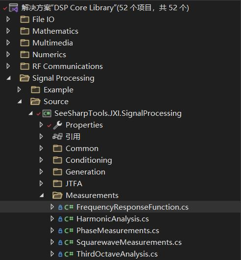
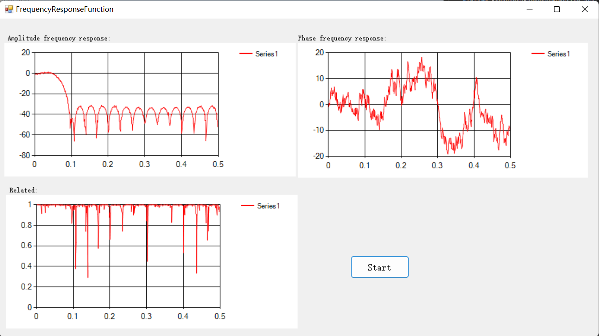
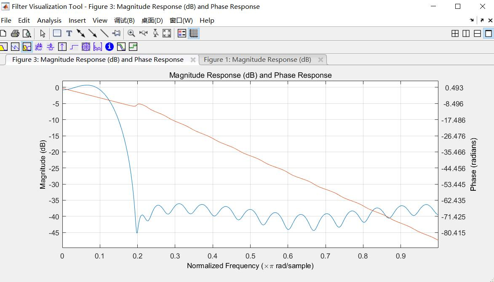

# JXI DSP-Core Note 015030_C# DSP-Core Library

# Signal Processing Measurements Freq Response Function

**Author:** Peter Park

**Date:** Aug-01-2022

## 1.Frequency Response Function文件位置



实现代码的路径为：*Core Library\Signal Processing\Source\Measurements\Frequency Response Function*

## 2.FrequencyResponseFunction类的功能说明

```C#
/// <summary>
/// <para>Frequency Response Function</para>
/// <para>Chinese Simplified：频响函数</para>
/// </summary>
public class FrequencyResponseFunction
```

频率响应函数表征了测试系统对给定频率下的稳态输出与输入的关系。这个关系具体是指输出、输入幅值之比与输入频率的函数关系，和输出、输入相位差与输入频率的函数关系。这两个关系称为测试系统的频率特性。频率响应函数一般是一个复数。频率响应函数直观地反映了测试系统对各个不同频率正弦输入信号的响应特性。通过频率响应函数可以画出反映测试系统动态特性的各种图形，简明直观。Frequency Response Function类提供的就是这样的功能，它可以计算输入和输出信号之间的频率响应函数，包括幅度和相位传递的信息。

## 3.FrequencyResponseFunction类的公有属性

### (1)Average

为了保证测量得到的结构传递函数估计可靠，通常需要多次测量FRF。通过估计相干函数来检查单个FRF的重复性，而根据期望的最终结果，使用不同的估计方法来计算平均值。 

```C#
 /// <summary>
/// 平均
/// </summary>
public AverageParam Average { set; get; }
```

**含义：**平均参数属性成员，是平均参数类**AverageParam**


平均参数类：**AverageParam：**

```C#
/// <summary>
/// 平均参数
/// </summary>
public class AverageParam
{

    public AverageMode Mode { set; get; }

    public int Number { set; get; }

    /// <summary>
    /// Construct
    /// </summary>
    /// <param name="mode"></param>
    /// <param name="num"></param>
    public AverageParam(AverageMode mode = AverageMode.None,int num = 1)
    {
    	Mode = mode;
        Number = num;
    }      
}
```

AverageParam类中的属性**AverageMode**为枚举类：


枚举类型：**AverageMode：**

```C#
/// <summary>
/// Average Mode
/// </summary>
public enum AverageMode
{
	/// <summary>
	/// No Average
	/// </summary>
	None,

    /// <summary>
    /// RMS Average
    /// </summary>
    RMS
};
```


### (2)ResetAveraging

```C#
public bool ResetAveraging
{
	set
	{
		if (value)
		{
			_averageCount = 0;
		}
	}
}
```

**含义：**该属性值若被置为1，则对私有字段_averageCount进行清零操作

### (3)AveragingDone

```C#
public bool AveragingDone
{
	get
	{
		return (_averageCount >= Average.Number);
	}
}
```

**含义：**判断平均是否完成


## 4.Frequency Response Function类的构造函数

```C#
 public FrequencyResponseFunction()
{
	Average = new AverageParam();
	_averageCount = 0;
}
```


## 5. Frequency Response Function类的方法

### (1)GetCoherente()

**方法申明**

```C#
public double[] GetCoherente()
```

**功能描述**：计算相干性，相干性是频率的函数关系，它表示有多少输出是由FRF中的输入引起的。它可以作为FRF质量的指标。它评估从测量到重复相同测量的FRF的一致性。

 **·** 在特定频率下，值为1表示FRF的振幅和相位在测量之间是非常可重复的。
 **·** 值为0表示相反–测量不可重复，这可能是测量设置中存在错误的“警告标志”。 

 当FRF的振幅非常高时，例如在共振频率下，相干性的值将接近1。
当FRF的振幅很低时，例如在反共振时，相干性的值将接近于0。这是因为信号太低，仪器的噪声使其重复性不一致。这是可以接受的/正常的。当在共振频率或整个频率范围内的相干性接近于0而不是1时，这表明测量有问题。 

**返回数据**：double类型数组


### (2)GetMagenitude(bool inDB)

**方法申明：**

```C#
public double[] GetMagenitude(bool inDB)
```

**功能描述：**计算并返回输入输出信号频响函数的幅度相关信息

**输入参数：**inDB：返回值是否要以dB为单位，数据类型：布尔类型

**返回数据：**double类型数组


### (3)GetPhase(bool inDegree)

**方法申明：**

```C#
public double[] GetPhase(bool inDegree)
```

**功能描述：**计算并返回输入输出信号频响函数的相位相关信息

**输入参数：**inDegree：返回值是否要以角度制为单位，数据类型：布尔类型

**返回数据：**double类型数组


### (4)Analyze(double[] inputWaveform, double[] outputWaveform)

**方法申明：**

```C#
public void Analyze(double[] inputWaveform, double[] outputWaveform)
```

**功能描述：**根据输入信号和输出信号的数据值，对其传递函数进行相关分析，在内部被GetCoherente()、GetMagenitude(bool inDB)、GetPhase(bool inDegree)所调用。

**输入参数：**

* inputWaveform：输入波形，数据类型：double类型数组

* outputWaveform：输出波形，数据类型：double类型数组


### (5)Reset()

**方法申明：**

```C#
public void Reset()
```

**功能描述：**初始化


## 6.Frequency Response Function相关示例代码

### (1)FRF方法的直接调用

这里就是简单地测试一下幅值和原来相反的直流分量的FRF

```C#
static void Main(string[] args)
        {
    		//实例化对象
            FrequencyResponseFunction frequencyResponseFunction = new 			    				FrequencyResponseFunction();
    
            double[] inputWaveform = new double[100];
            double[] outputWaveform = new double[100];
            double[] Magenitude = new double[50];
            double[] Phase = new double[50];
            double[] Coherente = new double[50];

            for (int i = 0; i < 100; i++) { inputWaveform[i] = 1; }
            for (int i = 0; i < 100; i++) { outputWaveform[i] = -1; }

    		//调用analysis方法
            frequencyResponseFunction.Analyze(inputWaveform, outputWaveform);
    		//设置相关计算参数
            bool indB = false;
            bool inDegree = true;
    		//调用获取幅度传递、相位传递和计算相关性的方法
            Magenitude=frequencyResponseFunction.GetMagenitude(indB);
            Phase = frequencyResponseFunction.GetPhase(inDegree);
            Coherente = frequencyResponseFunction.GetCoherente();
			//打印
            Console.WriteLine("inputWaveform:");
            foreach (var item in inputWaveform) { Console.Write("{0} ", item); }
            Console.WriteLine();

            Console.WriteLine("outputWaveform:");
            foreach (var item in outputWaveform) { Console.Write("{0} ", item); }
            Console.WriteLine();

            Console.WriteLine("Magenitude:");
            foreach (var item in Magenitude) { Console.Write("{0} ", item); }
            Console.WriteLine();

            Console.WriteLine("Phase:");
            foreach (var item in Phase) { Console.Write("{0} ", item); }
            Console.WriteLine();

            Console.WriteLine("Coherente:");
            foreach (var item in Coherente) { Console.Write("{0} ", item); }
            Console.WriteLine();
        }
/*ouput:
inputWaveform:
1 1 1 1 1 1 1 1 1 1 ...(长度为100)
outputWaveform:
-1 -1 -1 -1 -1 -1 -1 -1 -1 -1 ...(长度为100)
Magenitude:
1 1 1 1 1 ...(长度为50)
Phase:
3.14159265358979 3.14159265358979 3.14159265358979 3.14159265358979 3.14159265358979...(长度为50)
Coherente:
1 1 1 1 1...(长度为50)
*/
```

### (2)Winform例程

**功能描述：**

利用matlab导出的FIR滤波器系数，来给输入的随机白噪声进行滤波操作，之后将输出的信号和原本输入信号作为FRF方法的输入，反向求得频响函数波形。

**界面效果：**



FIR滤波器系数在matlab中绘制出来的效果如下：



FRF不同的原因推测主要是给经过FIR滤波器滤波后的输出信号还添加了额外的小幅度随机干扰白噪声

**实现代码：**

```C#
/*******************************************
 * FrequencyResponseFunction 范例
 * 使用范例FIRFilter的Low pass filter
 * 利用Dual frequency signal（带Noise）以及通过Filter器的信号求得Filter器的频响
 * *****************************************/
using System;
using System.Collections.Generic;
using System.ComponentModel;
using System.Data;
using System.Drawing;
using System.Linq;
using System.Text;
using System.Windows.Forms;
using SeeSharpTools.JXI.SignalProcessing.Measurement;
using SeeSharpTools.JXI.SignalProcessing.Generation;
using SeeSharpTools.JXI.SignalProcessing.Conditioning.EasyFilters;
using SeeSharpTools.JY.ArrayUtility;
using MathNet.Numerics.LinearAlgebra;
using MathNet.Numerics.Data.Matlab;


namespace Winform_FrequencyResponseFunction
{
    public partial class MainForm : Form
    {
        #region Private Field
        /// <summary>
        /// FIRFilter task
        /// </summary>
        private FIRFilter _fir = new FIRFilter();
        #endregion

        #region Constructor
        public MainForm()
        {
            InitializeComponent();
            double[] FilterCoe = new double[] { 0.00194150175769345, -0.00169793575520208, -0.00426956799325628, -0.00829350380976647, -0.0132303432212115, -0.0181544335557185, -0.0217585679131809, -0.0225134101549763, -0.0189478446411358, -0.00995128109977753, 0.00489205937905203, 0.0250974062726473, 0.0492006450550267, 0.0748863114260257, 0.0992878499995790, 0.119424371366942, 0.132695897659600, 0.137328720011526, 0.132695897659600, 0.119424371366942, 0.0992878499995790, 0.0748863114260257, 0.0492006450550267, 0.0250974062726473, 0.00489205937905203, -0.00995128109977753, -0.0189478446411358, -0.0225134101549763, -0.0217585679131809, -0.0181544335557185, -0.0132303432212115 - 0.00829350380976647, -0.00426956799325628, -0.00169793575520208, 0.00194150175769345 };
            _fir.Coefficients = FilterCoe;//Filter coefficient
        }
        #endregion

        #region Event Handler
        /// <summary>
        /// Start button
        /// </summary>
        /// <param name="sender"></param>
        /// <param name="e"></param>
        private void buttonStart_Click(object sender, EventArgs e)
        {
            int length = 1000;
            int freqLines = length/2;
            //Generating signal
            double[] noiseInput = new double[length];//Noise
            double sampleRate = 1000;//Sampling rate
            double Amp = 1;//Amplitude
            double[] noiseAddon = new double[length];
            double[] FIROutput = new double[length];       
            double[] bodeMag = new double[freqLines];
            double[] bodePhase = new double[freqLines];
            double[] coherent = new double[freqLines];

            int numOfAverage = 50;
            FrequencyResponseFunction FRFAnalysis = new FrequencyResponseFunction();
            FRFAnalysis.Average.Mode = AverageMode.RMS;
            FRFAnalysis.Average.Number = numOfAverage;
            FRFAnalysis.ResetAveraging = true;

            for (int i = 0; i < numOfAverage; i++)
            {
                Generation.UniformWhiteNoise(ref noiseAddon, Amp * 0.0001);//Generate noise
                Generation.UniformWhiteNoise(ref noiseInput, Amp * 0.01);//Generate noise
                _fir.Filter(noiseInput, ref FIROutput);//Filter
                ArrayCalculation.Add(FIROutput, noiseAddon, ref FIROutput);
                if (i == 0) FRFAnalysis.Reset();
                FRFAnalysis.Analyze(noiseInput, FIROutput);
                bodeMag = FRFAnalysis.GetMagenitude(true);
                bodePhase = FRFAnalysis.GetPhase(true);
                coherent = FRFAnalysis.GetCoherente();
            }
            bool averageDone = FRFAnalysis.AveragingDone;
            UnwrapPhase(ref bodePhase, bodePhase.Length );//截止频率（归一化）是0.3
            //Display
            easyChartMagenitude.Plot(bodeMag,0,1/ sampleRate);
            easyChartPhase.Plot(bodePhase,0, 1 / sampleRate);
            easyChartCoherent.Plot(coherent, 0, 1 / sampleRate);
        }

        #endregion

        #region Methods     

        /// <summary>
        /// <para>UnwrapPhase，phase is the input phase to unwrap, in radians.</para>
        /// </summary>
        /// <param name="phase">phase is the input phase to unwrap, in radians. </param>
        /// <param name="N">unwrapping length</param>
        public static void UnwrapPhase(ref double[] phase, int N)
        {
            int i = 0;
            for (i = 1; i < N; i++)
            {
                phase[i] = phase[i] - 2 * Math.PI * Math.Floor(((phase[i] - phase[i - 1]) / (2 * Math.PI)) + 0.5);//利用相位展开公式进行相位展开
            }
        }
        #endregion

        private void MainForm_Load(object sender, EventArgs e)
        {

        }
    }
}
```

