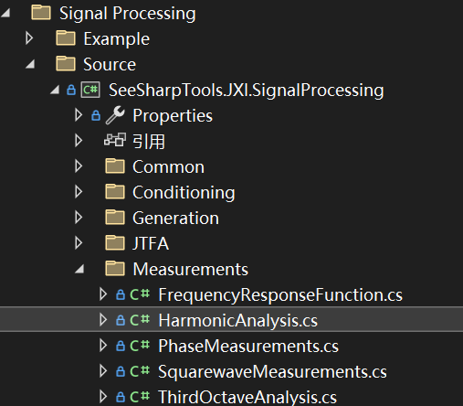
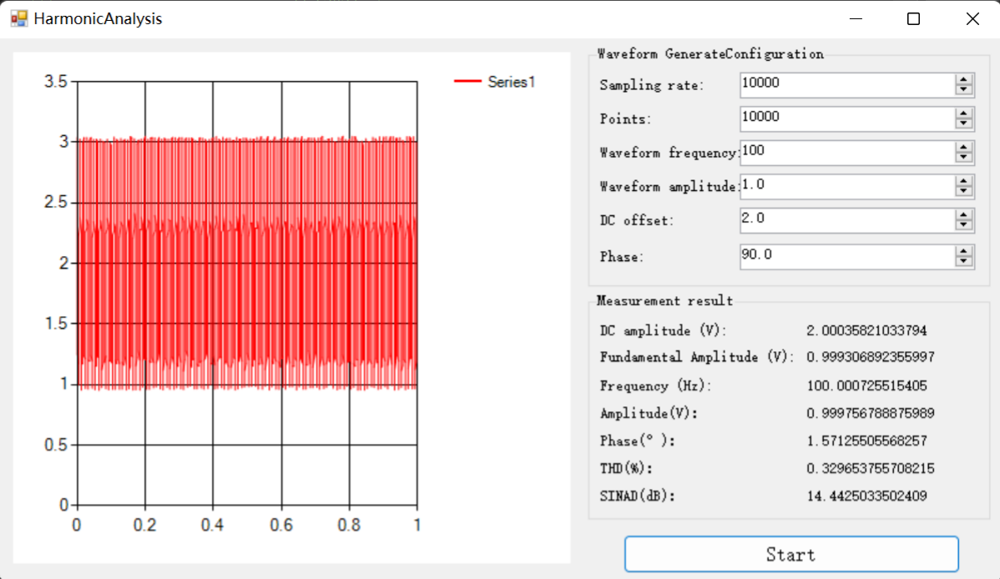

# JXI DSP-Core Note 01531_C# DSP-Core Library 

# Signal Processing Measurement Harmonic Analysis

**Author:** LandauRZ

**Date:** August-03-2022


该类的定义的路径为*..\SeeSharp\Seesharp-DSP-Core-Lib\Development\CSharp\Core Library\Signal Processing\Source\Measurements\HarmonicAnalysis.cs*



## 公共类及方法说明

### class HarmonicAnalysis

#### 类的申明

```c#
public static class HarmonicAnalysis
```

#### 公共方法说明

##### **(1)THDAnalysis**

```c#
public static void THDAnalysis(double[] timewaveform, double dt, out double detectedFundamentalFreq,out double THD, ref double[] componentsLevel, int highestHarmonic = 10)
```

**方法功能描述：**计算输入信号总谐波失真以及谐波分量，总谐波失真公式如下所示：
$$
THD=\sqrt{\sum^H_{n=2}({\frac{G_n}{G_1}})^2}\tag{1}
$$
上面公式表示的是不大于某特定阶数H的所有谐波分量有效值$G_n$与基波分量有效值$G_1$比值的方和根。

**注：**

* THD是值，而不是百分比
* component levels为有效值的1.414倍（单位$V^2$）
* component[0]为直流分量的功率; [1]为基波的功率
* 如果指定的最高谐波高于奈奎斯特频率，则超过频率分量将为0

**输入参数：**

* timewaveform：输入信号（单位：V），数据类型：double数组
* dt：时域波形的抽样间隔，数据类型：double
* detectedFundamentalFreq：基波频率，数据类型：out double
* THD：总谐波失真，数据类型：out double
* componentsLevel：谐波分量，数据类型：ref double数组
* highestHarmonic：最高谐波，缺省值为10，数据类型：int

**输出参数：**

* 返回值：无返回值，有多个引用参量用以接收处理结果，包括detectedFundamentalFreq，THD以及componentsLevel

##### **(2)ToneAnalysis**

```C#
public static void ToneAnalysis(double[] timewaveform, double dt, out double detectedFundamentalFreq,out double amplitude, out double phase, double initialGuess=0, double searchRange = 0.05)
public static void ToneAnalysis(Complex[] timewaveform, double dt, out double detectedFundamentalFreq,out double amplitude, out double phase, double initialGuess = 0, double searchRange = 0.05)
```

**方法功能描述：**计算信号基波的频率、相位、幅值。既可以对double数组的输入进行处理，也可以对Complex数组的输入进行处理。

其中计算基波频率$f_0$的方法是对信号做频谱后查找峰值，对峰值前后7个点做加权平均，求得频率。

计算相位的方法是：
$$
\theta=arctan2(\frac{I}{Q})=arctan2(\frac{\frac{1}{NT}\sum_{i=0}^{NT-1}cos(2\pi f_0i)x_i}{\frac{1}{NT}\sum_{i=0}^{NT-1}sin(2\pi f_0i)x_i})\tag{2}
$$
计算幅值的方法是：
$$
A=\sqrt{(2*I)^2+(2*Q)^2}\tag{3}
$$


**输入参数：**

* timewaveform：输入信号（单位：V），数据类型：double数组或者Complex数组
* dt：时域波形抽样间隔，数据类型：double
* detectedFundamentalFreq：基波频率，数据类型：out double
* amplitude：基波复制，数据类型：out double
* phase：基波相位，数据类型：out double
* initialGuess：预估信号的频率（单位：Hz），缺省值为0，数据类型：double
* searchRange：再预估频率附近搜索峰值的范围，缺省值为0.05，数据类型：double

**输出参数：**

* 返回值：无返回值，有多个引用参量用以接收处理结果，包括detectedFundamentalFreq，amplitude，phase

##### **(3)SINADAnalysis**

```C#
public static void SINADAnalysis(double[] timewaveform, double dt, out double detectedFundamentalFreq,out double SINAD, ref double[] componentsLevel, int highestHarmonic = 10)
```

**方法功能描述：**计算信纳比，信纳比公式：
$$
SINAD=10\times log(\frac{P_{signal}+P_{noise}+P_{distortion}}{P_{noise}+P_{distortion}})\tag{4}
$$

**输入参数：**

* timewaveform：输入信号（单位：V），数据类型：double数组
* dt：时域波形抽样间隔，数据类型：double
* detectedFundamentalFreq：基波频率，数据类型：out double
* SINAD：信纳比（单位：DB），数据类型：out double
* componentsLevel：谐波分量，数据类型：ref double数组
* highestHarmonic：最高谐波，缺省值为10，数据类型：int

**输出参数：**

* 返回值：无返回值，有多个引用参量用以接收处理结果，包括detectedFundamentalFreq，SINAD，componentsLevel

## 范例代码(没有包含在发布版本)

```csharp
using System;
using System.Collections.Generic;
using System.Linq;
using System.Text;
using System.Threading.Tasks;
using SeeSharpTools.JXI.SignalProcessing.Measurement;
using SeeSharpTools.JXI.SignalProcessing.Generation;
using System.Numerics;
using SeeSharpTools.JX.DataViewer;
using SeeSharpTools.JY.ArrayUtility;

namespace HarmonicAnalysisExample
{
    
    internal class Program
    {
        static void Main(string[] args)
        {
            // 测试调用THDAnalysis

            double[] sinWave1 = new double[1000];
            double[] sinWave2 = new double[1000];
            double[] sinWave3 = new double[1000];

            double[] DC = new double[1000];
            for (int i = 0; i < 1000; i++)
                DC[i] = 1;

            Generation.SineWave(ref sinWave1, 1, 0, 30, 1000);
            Generation.SineWave(ref sinWave2, 10, 0, 10, 1000);
            Generation.SineWave(ref sinWave3, 10, 0, 80, 1000);

            //for(int i = 0; i < 1000; i++)
            //    Console.WriteLine(Math.Round(sinWave1[i],3));
            //Console.WriteLine("---------------------------------");

            Console.WriteLine("输入的混合波频率分量有10Hz,30Hz,80Hz幅度分别为10,1,10,采样率为1000 Sample/s");
            Console.WriteLine("---------------测试调用THDAnalysis------------------");

            double[] sinWave = new double[1000];
            for (int i = 0; i < sinWave.Length; i++)
                sinWave[i] = DC[i] + sinWave1[i] + sinWave2[i] + sinWave3[i];

            double detectedFundamentalFreq;
            double THD;
            double[] ComponentsLevel = new double[50];
            HarmonicAnalysis.THDAnalysis(sinWave, 0.001, out detectedFundamentalFreq, out THD, ref ComponentsLevel);
            Console.WriteLine("基频：{0}",Math.Round(detectedFundamentalFreq, 3));
            Console.WriteLine("总谐波失真：{0}",Math.Round(THD, 3));
            Console.WriteLine("---------------------------------");
            for (int i = 0; i < ComponentsLevel.Length; i++)
                Console.WriteLine("{0}次谐波分量：{1} ", i, Math.Round(ComponentsLevel[i], 3));

            // 测试调用ToneAnalysis
            double detectedFundamentalFreq_2;
            double amplitude;
            double phase;
            HarmonicAnalysis.ToneAnalysis(sinWave, 0.001,out detectedFundamentalFreq_2,out amplitude,out phase);
            Console.WriteLine("-----------------测试调用ToneAnalysis----------------");
            Console.WriteLine("基波频率为：{0}", detectedFundamentalFreq_2);
            Console.WriteLine("基波振幅为：{0}", amplitude);
            Console.WriteLine("基波相位为：{0}", phase);

            // 测试调用SINADAnalysis
            double detectedFundamentalFreq_3;
            double SINAD;
            double[] ComponentsLevel_2 = new double[50];
            HarmonicAnalysis.SINADAnalysis(sinWave, 0.001, out detectedFundamentalFreq_3, out SINAD, ref ComponentsLevel_2);
            Console.WriteLine("-----------------测试调用SINADAnalysis----------------");
            Console.WriteLine("基波频率为：{0}", detectedFundamentalFreq_3);
            Console.WriteLine("信纳比为：{0} dB", SINAD);
            Console.WriteLine("---------------------------------");
            for (int i = 0; i < ComponentsLevel_2.Length; i++)
                Console.WriteLine("{0}次谐波分量：{1} ", i, Math.Round(ComponentsLevel_2[i], 3));

            Console.WriteLine();

            //// -----------------------------------------------------------TEST--------------------------------------------------------------------
            //THDAnalysisTest_001_Sine();
            Console.ReadLine();


        }
        /*  output:
         *  输入的混合波频率分量有10Hz,30Hz,80Hz幅度分别为10,1,10,采样率为1000 Sample/s
            ---------------测试调用THDAnalysis------------------
            基频：10
            总谐波失真：0.995
            ---------------------------------
            0次谐波分量：1
            1次谐波分量：10
            2次谐波分量：0
            3次谐波分量：0.99
            4次谐波分量：0
            5次谐波分量：0
            6次谐波分量：0
            7次谐波分量：0
            8次谐波分量：9.896
            9次谐波分量：0
            10次谐波分量：0
            -----------------测试调用ToneAnalysis----------------
            基波频率为：10
            基波振幅为：10
            基波相位为：0
            -----------------测试调用SINADAnalysis----------------
            基波频率为：10
            信纳比为：2.98874683637846 dB
            ---------------------------------
            0次谐波分量：1
            1次谐波分量：10
            2次谐波分量：0
            3次谐波分量：0.99
            4次谐波分量：0
            5次谐波分量：0
            6次谐波分量：0
            7次谐波分量：0
            8次谐波分量：9.896
            9次谐波分量：0
            10次谐波分量：0


         */
    }
}

```

## 范例：Winform HarmonicAnalysis

### 界面展示

该WinForm程序的路径为*..\SeeSharp\Seesharp-DSP-Core-Lib\Development\CSharp\Core Library\Signal Processing\Example\Measurement\HarmonicAnalysis\MainForm.cs*



### 界面功能介绍

窗体的左侧展示的是生成的波形图，面板的右侧上方栏是波形的参数设置，包括采样率、采样点数、波形频率、波形振幅、直流偏置以及相位，下方栏展示的是经过谐波分析运算之后的结果，包括直流分量的振幅、基频振幅、基频频率、相位、THD、SINAD。单击Start按钮生成波形并计算出Measurement result。

### 核心代码

#### buttonStart_Click事件(单击Start)

```c#
private void buttonStart_Click(object sender, EventArgs e)
{
    var noise = new double[(int)SampleCount.Value];
    Generation.UniformWhiteNoise(ref noise, (double)Amplitude.Value * 0.05);
    //Generating an input signal
    var sin = new double[(int)SampleCount.Value];
    Generation.SineWave(ref sin, (double)Amplitude.Value, (double)Phase.Value , (double)Frequency.Value,
                        (double)SampleRate.Value);
    for (int i = 0; i < sin.Length; i++)//Plus DC
    {
        sin[i] += (double)DCOffset.Value;
    }
    ArrayCalculation.Add(sin, noise, ref sin);//Plus noise
    easyChartWave.Plot(sin, 0, 1.0 / (double)SampleRate.Value);

    //ToneAnalysis, calculate frequency, phase, Amplitude
    double fundamentalFreq = 0;
    double phase = 0;
    double amplitude = 0;
    HarmonicAnalysis.ToneAnalysis(sin, 1 / (double)SampleRate.Value, 
                                  out fundamentalFreq, out amplitude, out phase);

    //THDAnalysis, calculate THD
    double THD = 0;
    double[] componentsLevel = new double[0];
    HarmonicAnalysis.THDAnalysis(sin, 1 / (double)SampleRate.Value, 
                                 out fundamentalFreq, out THD, ref componentsLevel);
    THD *= 100; //JXISH fix

    //SINADAnalysis, calculate SINAD
    double SINAD = 0;
    HarmonicAnalysis.SINADAnalysis(sin, 1 / (double)SampleRate.Value,
                                   out fundamentalFreq, out SINAD, ref componentsLevel);
    SINAD = 10 * Math.Log10(SINAD); //JXISH fix

    //Display
    labelAmplitude.Text = amplitude.ToString();
    labelPhase.Text = phase.ToString();
    labelFrequency.Text = fundamentalFreq.ToString();
    labelTHD.Text = THD.ToString();
    labelSINAD.Text = SINAD.ToString();
    labelFundamentalFreqV2 .Text = componentsLevel[1].ToString();
    labelDCV2 .Text = componentsLevel[0].ToString();
}
```