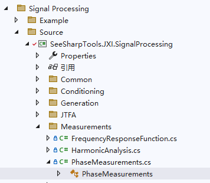

# JXI DSP-Core Note 01532_C# DSP-Core Library

# Measurements: Phase Measurements

**Author:** Hamburg

**Date:** Aug-03-2022

## PhaseMeasurements类在Solution Explorer中的显示

该类的定义路径为Signal Processing\Source\Measurements\PhaseMeasurements



## PhaseMeasurements类及方法说明

### 类的申明

```c#
/// <summary>
/// <para>PhaseMeasurements Class</para>
/// <para>Chinese Simplified：相位测量类</para>
/// </summary>
public static class PhaseMeasurements
```
用于相位测量的类，包括信号相位差等。

### 方法说明

#### 1. CalPhaseShift()，double型

```c#
/// <summary>
/// <para>Calculate the phase shift between two input waveform arrays, return value will be between -180° and 180°.</para>
/// <para>Chinese Simplified：计算输入信号之间的相位差，返回值在-180°到180之间</para>
/// </summary>
/// <param name="inputWaveform1">
/// <para>waveform array1 </para>
/// <para> Chinese Simplified：输入信号1</para>
/// </param>
/// <param name="inputWaveform2">
/// <para>waveform array1 </para>
/// <para> Chinese Simplified：输入信号2</para>
/// </param>
/// <returns></returns>
public static double CalPhaseShift(double[] inputWaveform1, double[] inputWaveform2)
```
**功能描述：**计算输入信号之间的相位差（角度制），返回值在-180°到180之间

**输入参数：**

* inputWaveform1：输入信号1，数据类型：double数组
* inputWaveform2：输入信号2，数据类型：double数组

**返回值：**输入信号之间的相位差（角度制），在-180°到180°之间，数据类型：double

#### 2. CalPhaseShift()，float型

```c#
/// <summary>
/// <para>Calculate the phase shift between two input waveform arrays, return value will be between -180° and 180°.</para>
/// <para>Chinese Simplified：计算输入信号之间的相位差，返回值在-180°到180之间</para>
/// </summary>
/// <param name="inputWaveform1">
/// <para>waveform array1 </para>
/// <para> Chinese Simplified：输入信号1</para>
/// </param>
/// <param name="inputWaveform2">
/// <para>waveform array1 </para>
/// <para> Chinese Simplified：输入信号2</para>
/// </param>
/// <returns>phase shift in unit of degree</returns>
public static double CalPhaseShift(float[] inputWaveform1, float[] inputWaveform2)
```
**功能描述：**计算输入信号之间的相位差（角度制），返回值在-180°到180之间

**输入参数：**

* inputWaveform1：输入信号1，数据类型：float数组
* inputWaveform2：输入信号2，数据类型：float数组

**返回值：**输入信号之间的相位差（角度制），在-180°到180°之间，数据类型：double

