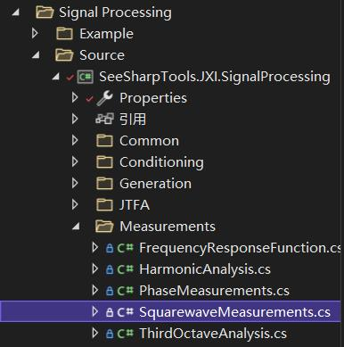

# JXI DSP-Core Note 01533_C# DSP-Core Library

# Signal Processing Measurements Square-wave Measurements

**Author:** Peter Park

**Date:** August-04-2022

## Square-wave Measurements文件位置



实现代码的路径为：*Core Library\Signal Processing\Source\Measurements\SquarewaveMeasurements*


## SquarewaveMeasurements类的说明


### 1. SquarewaveMeasurements需要用到的结构体和枚举类定义

```C#
		/// <summary>
        /// <para>Config of histogram</para>
        /// <para>Chinese Simplified：统计的参数设置</para>
        /// </summary>
        public class Histogram
        {
            /// <summary>
            /// <para>LowerLimit</para>
            /// <para>Chinese Simplified：统计范围的下限</para>
            /// </summary>
            public double LowerLimit  { set; get; }

            /// <summary>
            /// <para>Interval</para>
            /// <para>Chinese Simplified：组距</para>
            /// </summary>
            public double Interval { set; get; }

            /// <summary>
            /// <para>UpperLimit</para>
            /// <para>Chinese Simplified：统计范围的上限</para>
            /// </summary>
            public double UpperLimit  { set; get; }

            /// <summary>
            /// <para></para>
            /// <para>Chinese Simplified：构造函数</para>
            /// </summary>
            public Histogram(double lowerLimit=double.NaN,double interval=double.NaN,double upperLimit=double.NaN)
            {
                LowerLimit = lowerLimit;
                Interval = interval;
                UpperLimit = upperLimit;
            }
        }
```

Histogram这个类主要用于保存方波统计的一些相关参数设置，包括公有属性：统计范围的上下限，组距。需要通过构造函数对该类进行初始化，否则默认值均为NaN。


### 2. SquarewaveMeasurements类的申明

```c#
/// <summary>
/// <para>SquarewaveMeasurements Class</para>
/// <para>Chinese Simplified：方波测量类</para>
/// </summary>
public static class SquarewaveMeasurements
```

该类是静态类，其主要作用是用于方波的测量，具体的使用方法请看方法介绍以及示例代码。


### 3. SquarewaveMeasurements类的方法

#### (1)GetLevelHistogram

**方法申明**

```C#
public static bool GetLevelHistogram(double[] inputWaveform, ref double[] histogramX,                                          ref double[] histogramY, Histogram histogramConfig)
```

**功能描述：**获取方波幅值直方图

**输入参数：**

* inputWaveform：输入波形，数据类型：double类型数组

* histogramX：接受输出直方图X坐标，数据类型：ref double类型数组

* histogramY：接受输出直方图Y坐标，数据类型：ref double类型数组

* histogramConfig：直方图配置，数据类型：Histogram类

**返回数据：**bool类型的值，如果调用这个方法之前已经设置过波形返回值为true，否则为false


#### (2)GetDutyCycleHistogram

```C#
public static bool GetDutyCycleHistogram(double[] inputWaveform, ref double[] histogramX,                                          ref double[] histogramY,                                                                  Histogram histogramConfig)
```

**功能描述：**获取方波占空比直方图

**输入参数：**

* inputWaveform：输入波形，数据类型：double类型数组

* histogramX：接受输出直方图X坐标，数据类型：ref double类型数组

* histogramY：接受输出直方图Y坐标，数据类型：ref double类型数组

* histogramConfig：直方图配置，数据类型：Histogram类

**返回数据：**bool类型的值，如果调用这个方法之前已经设置过波形返回值为true，否则为false


#### (3)AmplitudeAnalysis

```C#
public static void AmplitudeAnalysis(double[] waveform, out double highLevel,                                                  out double lowLevel)
```

**功能描述：**对方波的幅度进行分析

**输入参数：**

* waveform：输入波形，数据类型：double类型数组

* highLevel：高电平，数据类型：out double

* lowLevel：低电平，数据类型：out double


#### (4)PeriodAnalysis

```C#
 public static void PeriodAnalysis(double[] waveform, out double period,                                                    out double dutyCycleAvg,out double pulseCount,                                            out double pulseMaxWidth, out double pulseMinWidth)
```

**功能描述：**对方波的周期进行分析

**输入参数：**

* waveform：输入波形，数据类型：double类型数组

* period：方波的周期，数据类型：out double类型数组

* dutyCycleAvg：平均后的占空比，数据类型：out double

* pulseCount：脉冲个数，数据类型：out double

* pulseMaxWidth：脉冲宽度最大值，数据类型：out double

* pulseMinWidth：脉冲宽度最小值，数据类型：out double


#### (5)PhaseAnalysis

```C#
public static void PhaseAnalysis(double[] waveform, double[] waveformRef,                                                  out double phase)
```

**功能描述：**对方波进行相位分析

**输入参数：**

* waveform：输入波形，数据类型：double类型数组

* waveformRef：参考波形，数据类型：double类型数组

* phase：输入波形相对于参考波形的相位，数据类型：out double


#### (6)TimeAnalysis

```C#
public static void TimeAnalysis(double[] waveform, out double risingSamples, 
                                out double fallingSamples)
```

**功能描述：**计算电平归一化后0.1~0.9的上升下降的抽样点数

**输入参数：**

* waveform：输入波形，数据类型：double类型数组

* risingSamples：上升的抽样点数，数据类型：out double

* fallingSamples：下降的抽样点数，数据类型：out double

**输入参数：**

* waveform：输入波形，数据类型：double类型数组

* waveformRef：参考波形，数据类型：double类型数组

* phase：输入波形相对于参考波形的相位，数据类型：out double


## SquarewaveMeasurement方法的示例相关代码

### (1)GetLevelHistogram

```C#
internal class Program
    {
        static void Main(string[] args)
        {
            //定义输入方波
            double[] inputWaveform = new double[12]{ 1, 1, 2, 2, 1, 1 ,1, 1, 1, 1, 3, 3,};
			//直方图横纵坐标
            double[] hx = new double[10];
            double[] hy = new double[10];

            //设置直方图属性x轴的单位间隔为(1/50)*(3-0)=0.06
            SquarewaveMeasurements.Histogram histogram = new SquarewaveMeasurements.Histogram(0,1,3);
            //调用方法:GetLevelHistogram
            SquarewaveMeasurements.GetLevelHistogram(inputWaveform, ref hx, ref hy, histogram);

           //打印直方图信息
            Console.WriteLine("HistorgramX:");
            foreach (var item in hx) { Console.Write("{0} ",item); }
            Console.WriteLine();

            Console.WriteLine("HistorgramY:");
            foreach (var item in hy) { Console.Write("{0} ",item); }
            Console.WriteLine();
        }
    }
/*output:
HistorgramX:
0 0.06 0.12
HistorgramY:
8 2 2
*/
```

### (2)AmplitudeAnalysis+PeriodAnalysis+PhaseAnalysis

```C#
static void Main(string[] args)
        {
            /**************************
             * 产生频率为20Hz，采样率为1000Hz，幅值为2V，占空比为50%的方波
             * 测量方波的高电平、低电平、周期、相位
             * ***************************/

            double[] waveformTmp = new double[1000];
            double[] waveformRef = new double[1000];
    		//调用方波生成方法
            Generation.SquareWave(ref waveformTmp, 2, 50, 20, 1000);
            Generation.SquareWave(ref waveformRef, 2, 50, 20, 1000);
            double highLevel;
            double lowLevel;
            double period;
            double dutycycle;
            double phase;
            double pulseCount;
            double pulseMaxLength;
            double pulseMinLength;
    		//方波幅度分析方法
            SquarewaveMeasurements.AmplitudeAnalysis(waveformTmp, out highLevel,                                                              out lowLevel);
    		//方波周期分析方法
            SquarewaveMeasurements.PeriodAnalysis(waveformTmp, out period, out dutycycle,
                                                  out pulseCount, out pulseMaxLength,                                                       out pulseMinLength);
    		//方波相位分析方法
            SquarewaveMeasurements.PhaseAnalysis(waveformTmp, waveformRef, out phase);
            double[] levelHistogramX = new double[0];
            double[] levelHistogramY = new double[0];
    		//获得方波分布直方图
            SquarewaveMeasurements.GetLevelHistogram(waveformTmp, ref levelHistogramX,                                                        ref levelHistogramY,                                                                new SquarewaveMeasurements.Histogram());
            //打印直方图对应数值以及分析结果
    		for (int j = 0; j < levelHistogramX.Length; j++)
            {
                Console.WriteLine("{0}:{1}", levelHistogramX[j], levelHistogramY[j]);
            }
            Console.WriteLine("highLevel:{0}", highLevel);
            Console.WriteLine("lowLevel:{0}", lowLevel);
            Console.WriteLine("period:{0}", period);
            Console.WriteLine("phase:{0}", phase);

        }
/*output:
2:0
2.08:0
2.16:0
2.24:0
2.32:0
2.4:0
2.48:0
2.56:0
2.64:0
2.72:0
2.8:0
2.88:0
2.96:0
3.04:0
3.12:0
3.2:0
3.28:0
3.36:0
3.44:0
3.52:0
3.6:0
3.68:0
3.76:0
3.84:0
3.92:500
highLevel:2
lowLevel:-2
period:50
phase:0
*/
```

