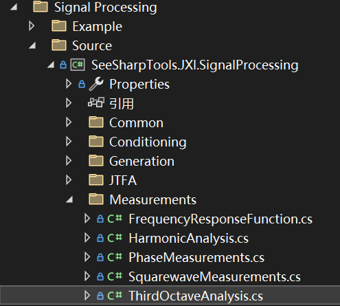
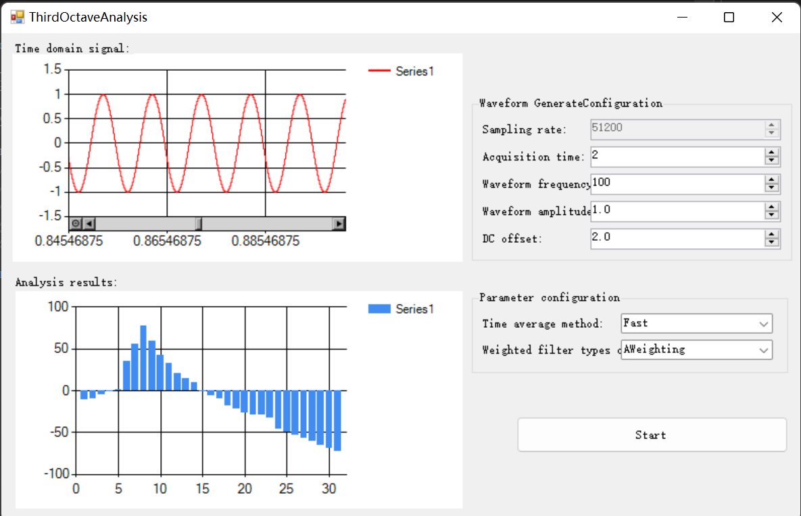

# JXI DSP-Core Note 01534_C# DSP-Core Library 

# Signal Processing Measurement ThirdOctaveAnalysis

**Author:** LandauRZ

**Date:** August-04-2022


该类的定义的路径为*..\SeeSharp\Seesharp-DSP-Core-Lib\Development\CSharp\Core Library\Signal Processing\Source\Measurements\ThirdOctaveAnalysis.cs*



## 公共类及方法说明

### 1，前置知识：三分之一倍频程

人耳听音的频率范围为20Hz到20KHz，在声音信号频谱分析一般不需要对每个频率成分进行具体分析。为了方便起见，人们把20Hz到20KHz的声频范围分为几个段落，每个频带成为一个频程。频程的划分采用恒定带宽比，即保持频带的上、下限之比为一常数。实验证明，**当声音的声压级不变而频率提高一倍时，听起来音调也提高一倍**。若使每一频带的上限频率比下限频率高一倍，即频率之比为2，这样划分的每一个频程称1倍频程，简称倍频程。如果在一个倍频程的上、下限频率之间再插入两个频率，使 4个频率之间的比值相同（相邻两频率比值=1.26倍）。这样将一个倍频程划分为3个频程，称这种频程为1／3倍频程。**所以我们通常使用的31段均衡器也称为1／3倍频程均衡器。**

在噪音测量中，通常用倍频程和1／3倍频程。目前常用的倍频程的中心频率为：31.5 63 125 250 500 1000 2000 4000 8000 和16000Hz ，1／3倍频程就是把上述每个频程再一分为三，分成31个频段，此时所用的中心频率为：<u>**20 25 31.5 40 50 63 80 100 125 160 200 250 320 400 500 630 800 1000 1250 1600 2000 2500 3150 4000 5000 6300 8000 10000 12500 16000 20000**</u>，以此频带为横坐标，将在各频带测得的噪音标为纵坐标，即得到噪音频谱。

1/3倍频程谱反应了**声源的能量分布情况**。

### 2，公共数据类型（加权方式+分析之后得到的结果类型）

```c#
 /// <summary>
    /// <para>The type of weighting</para>
    /// <para>Chinese Simplified：加权方式</para>
    /// </summary>
    public enum WeightingType
    {
        /// <summary>
        /// 不加权
        /// </summary>
        None,

        /// <summary>
        /// 加权
        /// </summary>
        AWeighting
    };   
    
    /// <summary>
    /// 分析（Analyze)之后得到的结果类型
    /// </summary>
    public class ThirdThirdOctaveResult
    {
        /// <summary>
        /// <para>1/3 Octave Levels</para>
        /// <para>Chinese Simplified：三分之一倍频程分析后的能量</para>
        /// </summary>
        public double[] ThirdOctaveLevels { get; }

        /// <summary>
        /// <para>The center frequency of each frequency band</para>
        /// <para>Chinese Simplified：每个频段对应的中心频率</para>
        /// </summary>
        public double[] NominalFrequencies { get; }

        /// <summary>
        /// <para>Chinese Simplified：构造函数</para>
        /// </summary>
        /// <param name="thirdOctaveLevels"></param>
        /// <param name="nominalFrequencies"></param>
        public ThirdThirdOctaveResult(double[] thirdOctaveLevels,double[] nominalFrequencies)
        {
            ThirdOctaveLevels = thirdOctaveLevels;
            NominalFrequencies = nominalFrequencies;
        }
    }
```


### 3，class ThirdOctaveAnalysis

#### 类的申明

```c#
public class ThirdOctaveAnalysis
```

#### 公共属性和字段

* NumOfBands：频段数，数据类型：int
* ThirdOctaveLevels：三分之一倍频程分析之后的能量，数据类型：double数组
* NominalFrequencies：每个频段对应的中心频率，数据类型：double数组
* AverageMode：平均方式，数据类型：TimeAveragingMode，是IIR滤波器中的参数设置，有三种可供选择（三类之外一律默认为Fast方式）
  * TimeAveragingMode.Fast
  * TimeAveragingMode.Slow
  * TimeAveragingMode.Impulsive
* Debug：修正，数据类型：bool
* WeightingType：加权滤波器的类型，数据类型：WeightingType

#### 方法说明

##### **Analyze**

```c#
public ThirdThirdOctaveResult Analyze(double[] x, double sampleRate)
```

**方法功能描述：**三分之一倍频程分析

**输入参数：**

* x：输入信号，数据类型：double数组
* sampleRate：采样率，数据类型：double

**输出参数：**

* 返回值：三分之一倍频程分析后每个频段对应的能量

#### 示例代码

```csharp
using System;
using System.Collections.Generic;
using System.Linq;
using System.Text;
using System.Threading.Tasks;
using SeeSharpTools.JXI.SignalProcessing.Measurement;
using SeeSharpTools.JXI.SignalProcessing.Conditioning.EasyFilters;
using SeeSharpTools.JX.DataViewer;
using SeeSharpTools.JXI.SignalProcessing.Generation;

namespace ThirdOctaveAnalysisExample
{
    internal class Program
    {
        static void Main(string[] args)
        {
            

            /*****************************
             * 产生50Hz的正弦信号
             * 做1/3倍频程分析
             * 时间平均方式为Fast
             * 加权滤波器的类型为A加权
             * 中心频率为50即第4频段（从0开始）的能量最高
             * ******************************/
            double duration = 2; //seconds;
            double sampleRate = 51200; //you cannot change this
            int dataLength = (int)(duration * sampleRate);
            double[] sin1 = new double[dataLength];
            Generation.SineWave(ref sin1, 1.414, 0, 50, sampleRate);
            ThirdOctaveAnalysis analysis = new ThirdOctaveAnalysis();
            analysis.AverageMode = TimeAveragingMode.Fast;
            analysis.WeightingFilterType = WeightingType.AWeighting;
            var result = analysis.Analyze(sin1, sampleRate);
            double[] octaveLevels = new double[result.ThirdOctaveLevels.Length];
            Console.WriteLine("各频段对应能量");
            for (int i = 0; i < octaveLevels.Length; i++)
            {
                octaveLevels[i] = 20 * Math.Log10(result.ThirdOctaveLevels[i]) + 100;
                Console.WriteLine("第{0}频段：{1}",i, octaveLevels[i]);
            }
            Console.ReadKey();
            }
        /* output:
         *  各频段对应能量
            第0频段：-2.85695517594729
            第1频段：-1.35181003110775
            第2频段：27.3022164201878
            第3频段：47.3240824624242
            第4频段：69.6966979427294
            第5频段：51.719295873138
            第6频段：33.9204069842035
            第7频段：24.2016743966448
            第8频段：12.8645646136679
            第9频段：6.34693519742802
            第10频段：1.32334859234719
            第11频段：-8.29281997830333
            第12频段：-13.0967890767521
            第13频段：-17.011704880579
            第14频段：-23.3837425299742
            第15频段：-26.4021424888219
            第16频段：-28.8959846982015
            第17频段：-32.1717421633968
            第18频段：-35.9361258536504
            第19频段：-38.0107849648221
            第20频段：-42.2645318659756
            第21频段：-49.8325897962434
            第22频段：-47.3903344196927
            第23频段：-49.4769320329743
            第24频段：-52.7116362980063
            第25频段：-56.0343413219892
            第26频段：-59.4346471224111
            第27频段：-62.7372196052079
            第28频段：-65.780882078121
            第29频段：-68.2719941913703
            第30频段：-69.7083595809339

         */
    }
}

```

## Winform  ThirdOctaveAnalysis

### 界面展示

该WinForm程序的路径为*..\SeeSharp\Seesharp-DSP-Core-Lib\Development\CSharp\Core Library\Signal Processing\Example\Measurement\ThirdOctaveAnalysis\MainForm.cs*



### 界面功能介绍

窗体的左侧上方图窗展示的是生成的波形图，下方图窗展示的是1/3倍频程分析结果图。右侧也分为上下两栏，右上侧为波形的参数设置，包括持续时间、波形频率、波形振幅、直流偏置，右下侧为分析参数设置，包括平均方式以及加权滤波器类型。单击Start按钮可以生成波形，并进行1/3倍频程分析，将结果展示在Analysis results的图当中。

### 核心代码

#### buttonStart_Click事件(单击Start)

```C#
private void buttonStart_Click(object sender, EventArgs e)
{
    double duration = (int)(CycleCount.Value); //seconds;
    double sampleRate = (double)(SampleRate.Value); //you cannot change this
    int dataLength = (int)(sampleRate* duration);
    double[] sin = new double[dataLength];
    Generation.SineWave(ref sin,(double )Amplitude.Value, 0, (double)Frequency.Value, sampleRate);
    //Initialization
    ThirdOctaveAnalysis analysis = new ThirdOctaveAnalysis();
    //Configuration
    analysis.AverageMode =(TimeAveragingMode)Enum.Parse(typeof(TimeAveragingMode), comboBoxTimeAveragingMode .Text);
    analysis.WeightingFilterType =(WeightingType)Enum.Parse(typeof(WeightingType), comboBoxWeightingFilterType .Text);
    //Analysis
    var result = analysis.Analyze(sin, sampleRate);

    double[] octaveLevels = new double[result.ThirdOctaveLevels.Length];
    double[] nominalFrequencies = new double[result.ThirdOctaveLevels.Length];
    for (int i = 0; i < octaveLevels.Length; i++)
    {
        octaveLevels[i] = 20 * Math.Log10(result.ThirdOctaveLevels[i]) + 100;
        nominalFrequencies[i] = result.NominalFrequencies[i];
    }
    //Display
    //chartResult.Series[0].Points.DataBindXY(nominalFrequencies,octaveLevels);
    chartResult.Series[0].Points.DataBindY(octaveLevels);            easyChartWave.Plot(sin,0,1/ (double)SampleRate.Value);
}
```

