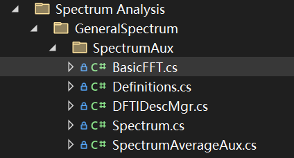

# JXI DSP-Core Note 01540_C# DSP-Core Library 

# Signal Processing Spectrum Analysis GeneralSpectrum SpectrumAux BasicFFT

**Author:** LandauRZ

**Date:** August-05-2022


该类的定义的路径为*..\SeeSharp\Seesharp-DSP-Core-Lib\Development\CSharp\Core Library\Signal Processing\Source\Spectrum Analysis\GeneralSpectrum\SpectrumAux\BasicFFT.cs*



## 公共类及方法说明

### 1，class SineGenerator

#### 类的申明

```c#
internal static class BasicFFT
```

#### 构造函数及重载

```c#
static BasicFFT()
{
    DftiDescMgr = DFTIDescMgr.GetInstance();
}
```

**功能描述：**设置DFT的描述符管理器

**输入参数：**无输入参数

**输出参数：**无输出参数

#### 方法说明

##### **(1)RealFFT**

```c#
public static void RealFFT(double[] xIn, ref Complex[] xOut)
public static void RealFFT(double[] xIn, ref double[] xOut)
```

**方法功能描述：**对输入的实信号进行傅里叶变换

**输入参数：**

* xIn：输入的实信号，数据类型：double数组
* xOut：输出频谱，数据类型：
  * 第一类：ref Complex数组
  * 第二类：ref double数组

**输出参数：**

* 返回值：无返回值，输出的频谱储存在xOut当中，数据类型：
  * 第一类：ref Complex数组
  * 第二类：ref double数组

##### **(2)RealIFFT**

```c#
public static void RealIFFT(double[] xIn, ref double[] xOut)
public static void RealIFFT(Complex[] xIn, ref double[] xOut)
```

**方法功能描述：**对实信号频谱进行逆傅里叶变换

**输入参数：**

* xIn：输入的频谱
  * 第一类：数组当中的数据按照$[Re(z_1),Im(z_1),Re(z_2),Im(z_2)...]$的形式进行排列。数据类型：double数组
  * 第二类：复数频谱，数据类型：Complex数组
* xOut：输出时域信号，数据类型：ref double数组

**输出参数：**

* 返回值：无返回值，输出的频谱储存在xOut当中，数据类型：ref double数组

##### **(3)ComplexFFT**

```C#
public static void ComplexFFT(double[] xIn, ref Complex[] xOut)
public static void ComplexFFT(double[] xIn, ref double[] xOut)
public static void ComplexFFT(Complex[] xIn, ref Complex[] xOut)
```

**方法功能描述：**复数信号的傅里叶变换

**输入参数：**

* xIn：输入的复信号，
  * 第一类：数组当中的数据按照$[Re(z_1),Im(z_1),Re(z_2),Im(z_2)...]$的形式进行排列。数据类型：double数组
  * 第二类：复数频谱，数据类型：Complex数组
* xOut：输出频谱，数据类型：
  * 第一类：ref Complex数组
  * 第二类：ref double数组

**输出参数：**

* 返回值：无返回值，输出的频谱储存在xOut当中，数据类型：
  * 第一类：ref Complex数组
  * 第二类：ref double数组

##### **(4)ComplexIFFT**

```C#
public static void ComplexIFFT(Complex[] xIn, ref Complex[] xOut)
public static void ComplexIFFT(double[] xIn, ref double[] xOut)
public static void ComplexIFFT(Complex[] xIn, ref double[] xOut)
```

**方法功能描述：**对复数信号频谱进行逆傅里叶变换

**输入参数：**

* xIn：输入的频谱
  * 第一类：数组当中的数据按照$[Re(z_1),Im(z_1),Re(z_2),Im(z_2)...]$的形式进行排列。数据类型：double数组
  * 第二类：复数频谱，数据类型：Complex数组
* xOut：输出时域信号，数据类型：
  * 第一类：ref Complex数组
  * 第二类：ref double数组

**输出参数：**

* 返回值：无返回值，输出的频谱储存在xOut当中，数据类型：
  * 第一类：ref Complex数组
  * 第二类：ref double数组

