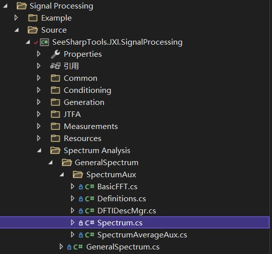

# JXI DSP-Core Note 01544_C# DSP-Core Library 

# Signal Processing Spectrum Analysis GeneralSpectrum SpectrumAux Spectrum

**Author:** Peter Park

**Date:** August-05-2022

该类定义的路径为：

*Core Library\Signal Processing\Source\Spectrum Analysis\GeneralSpectrum\SpectrumAux*



## Spectrum类方法的说明

### PowerSpectrum方法重载一

**方法申明：**

```C#
public static void PowerSpectrum(double[] x, double samplingRate,ref double[] spectrum, out double df, SpectrumOutputUnit unit = SpectrumOutputUnit.V2, WindowType windowType = WindowType.Hanning,double windowPara = double.NaN, bool PSD = false)
```

**功能描述：**计算输入信号的功率频谱

**输入参数：**

* x：输入的时域波形，数据类型：double类型数组

* samplingRate：输入信号的采样率，以S/s为单位，数据类型：double

* spectrum：输出功率谱，数据类型：ref double类型数组

* df：功率谱的频谱间隔，以Hz为单位，数据类型：out double

* unit：设置功率谱的单位，数据类型：公共枚举（频谱的输出单位），默认值为V2

* windowType：窗类型，数据类型：窗函数类型枚举，默认为Hanning（汉宁窗）

* windowPara：窗调整系数，仅用于Kaiser/Gaussian/Dolph-Chebyshev窗，数据类型：double，默认值为NaN

* PSD：输出的频谱是否为功率谱密度，数据类型：bool，默认值为false


### PowerSpectrum方法重载二

**方法申明：**

```C#
public static void PowerSpectrum(double[] x, double samplingRate, ref double[] spectrum, out double df, UnitConvSetting unitSettings, WindowType windowType, double windowPara)
```

**功能描述：**计算输入信号的功率频谱

**输入参数：**

* x：输入的时域波形，数据类型：double类型数组

* samplingRate：输入信号的采样率，以S/s为单位，数据类型：double

* spectrum：输出功率谱，数据类型：ref double类型数组

* df：功率谱的频谱间隔，以Hz为单位，数据类型：out double

* unitSettings：设置功率谱的单位，数据类型：单位转换定义结构体UnitConvSetting

* windowType：窗类型，数据类型：窗函数类型枚举 WindowType

* windowPara：窗调整系数，仅用于Kaiser/Gaussian/Dolph-Chebyshev窗，数据类型：double


### PeakSpectrumAnalysis

**方法申明：**

```C#
public static void PeakSpectrumAnalysis(double[] timewaveform, double dt,                                                         out double peakFreq, out double peakAmp)
```

**功能描述：**得到谐波频谱的峰值进行分析

**输入参数：**

* timewaveform：时域的波形信号，数据类型：double类型数组

* dt：时域波形信号的采样间隔，数据类型：double

* peakFreq：计算得到的峰值频率，数据类型：out double

* peakAmp：计算得到的峰值频率分量对应的幅度，数据类型：out double


### UnitConversion方法重载一

**方法申明：**

```C#
internal static void UnitConversion(double[] spectrum, double df, SpectrumType spectrumType, UnitConvSetting unitSetting, double equivalentNoiseBw)
```
**功能描述：**频谱单位转换函数

**输入参数：**

* spectrum：输入频谱，单位转换后返回的序列也保存在里面，数据类型：double类型数组

* df：频谱间隔，数据类型：double

* spectrumType：频谱类型，数据类型：枚举类（0为幅度谱，1为功率谱）

* unitSetting：单位转换设置，数据类型：单位转换定义结构体UnitConvSetting

* equivalentNoiseBw：计算频谱时，加窗所用窗函数的等效噪声带宽，数据类型：double


### UnitConversion方法重载二

**方法申明：**

```C#
internal static void UnitConversion(ref double[] spectrum,SpectrumOutputUnit unit)
```

**功能描述：**将非线性单位转变成线性单位

**输入参数：**

* spectrum：输入的频谱，数据类型：ref double类型数组

* unit：频谱的单位，数据类型：枚举类型SpectrumOutputUnit


### UnitConversionToV2

**方法申明**

```C#
internal static void UnitConversionToV2(ref double[] spectrum, SpectrumUnitInfo unit)
```

**功能描述：**将单位转变为V2

**输入参数：**

* spectrum：输入的频谱，数据类型：ref double类型数组

* unit：输入频谱的单位，数据类型：枚举类型SpectrumOutputUnit


### UnitConversionV2ToOther

**方法申明：**

```C#
internal static double UnitConversionV2ToOther( double data, SpectrumUnitInfo unit)
```

**功能描述：**将单位V2转变为其他单位

**输入参数：**

* spectrum：输入的频谱，数据类型：ref double类型数组

* unit：目标频谱的单位，数据类型：枚举类型SpectrumOutputUnit


### AdvanceComplexFFT方法重载一

**方法申明：**

```C#
internal static void AdvanceComplexFFT(double[] waveform, WindowType windowType,                                                ref Complex[] spectrum)
```

**功能描述：**计算时域信号的复数频谱，包含幅度谱和相位谱信息

**输入参数：**

* waveform：时域波形数据，数据类型：double类型数组

* windowType：窗类型，数据类型：窗函数类型枚举 WindowType

* spectrum：计算后的复数频谱数据，数据类型：ref complex类型数组


### AdvanceComplexFFT方法重载二

**方法申明：**

```c#
internal static void AdvanceComplexFFT(Complex[] waveform, WindowType windowType,                                                ref Complex[] spectrum)
```

**功能描述：**计算复数信号的复数频谱，包含幅度谱和相位谱信息

**输入参数：**

* waveform：复数信号的波形数据，数据类型：Complex类型数组

* windowType：窗类型，数据类型：窗函数类型枚举 WindowType

* spectrum：计算后的复数频谱数据，数据类型：ref complex类型数组


### AdvanceRealFFT

**方法申明：**

```C#
internal static void AdvanceRealFFT(double[] xIn, int spectralLines,                                                         WindowType windowType, double[] xOut,                                                     ref SpectralInfo spectralInfo)
```

**功能描述：**计算输入实数信号的实数谱

**输入参数：**

* xIn：输入实数信号波形，数据类型：double

* spectralLines：输入的线数，数据类型：int

* windowType：窗类型，数据类型：窗函数类型枚举 WindowType

* xOut：输出的实数频谱（求模），数据类型：double类型数组

* spectralInfo：谱结构信息，数据类型：ref SpectralInfo，谱信息结构体