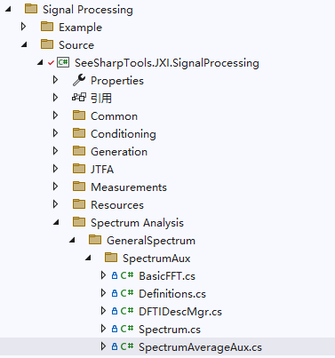

# JXI DSP-Core Note 01545_C# DSP-Core Library

# Signal Processing Spectrum Analysis GeneralSpectrum SpectrumAux SpectrumAverageAux

**Author:** Hamburg

**Date:** Aug-05-2022

## Window类在Solution Explorer中的显示

该类的定义路径为Signal Processing\Source\Spectrum Analysis\GeneralSpectrum\SpectrumAux



## SpectrumAverageAux类及方法说明

### 1. 类的申明

```c#
internal class SpectrumAverageAux
```

谱平均类，提供了一些辅助方法。

### 2. 枚举

```c#
public enum LinearAveragingMode
{
    OneShot,
    AutoRestartOneShot,
    MovingAveraging,
    Continuous
}
```
线性平均模式，包括OneShot、AutoRestartOneShot、MovingAveraging、Continuous。

### 3. 私有字段

```c#
/// <summary>
/// 用于缓存平均后的频谱
/// </summary>
private double[] _averagedSpectrum;

/// <summary>
/// 已平均的次数
/// </summary>
private int _averageCount;

/// <summary>
/// 频谱链表，用于存储平均的多个频谱
/// </summary>
private List<double[]> _spectrumList;

private List<Complex[]> _vectorList;

/// <summary>
/// 平均模式
/// </summary>
private SpectrumAverageMode _averagingMode;

/// <summary>
/// 平均的最大次数
/// </summary>
private double _averagingSize;

/// <summary>
/// 平均的加权方式
/// </summary>
private SpectrumWeightingType _weightingType;

/// <summary>
/// 线性平均的方式
/// </summary>
private LinearAveragingMode _linearAveragingMode;

/// <summary>
/// 数据的单位
/// </summary>
private SpectrumAveragingDataUnit _dataUnit;
```
### 4. 公有属性

#### （1）Mode

```c#
/// <summary>
/// 频谱平均模式，无平均/矢量/RMS/PeakHold
/// </summary>
public SpectrumAverageMode Mode
{
    get
    {
        return _averagingMode;
    }
    set
    {
        var toReset = _averagingMode != value;
        _averagingMode = value;
        if (toReset)
        {
            Reset();
        }
    }
}
```
含义：频谱的平均模式

#### （2）Size

```c#
/// <summary>
/// 平均次数
/// </summary>
public double Size
{
    get
    {
        return _averagingSize;
    }
    set
    {
        if (_averagingSize <= 0)
        {
            throw new JXIParamException("Size must greater than 0!");
        }
        var toReset = _averagingSize != value;
        _averagingSize = value;
        if (!toReset) return;
        //清理多余的
        while (_spectrumList.Count > _averagingSize)
        {
            _spectrumList.RemoveAt(0);
        }
    }
}
```
含义：平均的次数

#### （3）WeightingType

```c#
/// <summary>
/// 加权类型
/// </summary>
public SpectrumWeightingType WeightingType
{
    get { return _weightingType; }
    set
    {
        var toReset = _weightingType != value;
        _weightingType = value;
        if (toReset)
        {
            Reset();
        }
    }
}
```
含义：加权类型

#### （4）DataUnit

```c#
/// <summary>
/// the spectral data is linear or logarithm.
/// </summary>
public SpectrumAveragingDataUnit DataUnit
{
    get { return _dataUnit; }
    set
    {
        var toReset = _dataUnit != value;
        _dataUnit = value;
        if (toReset)
        {
            Reset();
        }
        _dataUnit = value;
        Reset();
    }
}
```
含义：光谱数据类型，线型或对数型。

### 5. 方法说明

#### （1）Reset()

```c#
/// <summary>
/// Reset the spectrum averaging, set the average count to zero.
/// </summary>
public void Reset()
```
重置频谱的平均，即将均值置0.

**输入参数：**无

#### （2）AverageSpectrum()，含输出参数

```c#
/// <summary>
/// 频谱平均
/// </summary>
/// <param name="averageCount">已平均的次数</param>
/// <param name="newSpectrum">新输入的频谱</param>
public void AverageSpectrum(double[] newSpectrum, out int averageCount)
```
对频谱做平均

**输入参数：**

* newSpectrum：新输入的频谱，数据类型：double数组

**输出参数：**

* averageCount：已平均的次数

平均后的频谱保存在averagedSpectrum中。

#### （3）AverageSpectrum()，无输出参数

```c#
/// <summary>
/// 频谱平均
/// </summary>
/// <param name="newSpectrum"></param>
public void AverageSpectrum(double[] newSpectrum)
```
对频谱做平均

**输入参数：**

* newSpectrum：新输入的频谱，数据类型：double数组

**输出参数：**无

平均后的频谱保存在averagedSpectrum中。