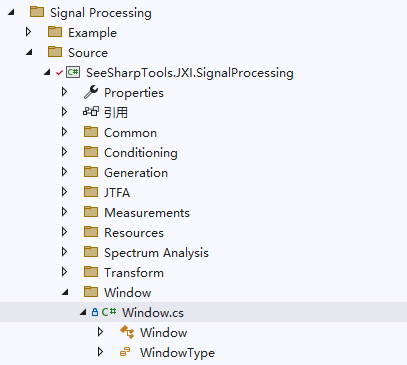

# JXI DSP-Core Note 01570_C# DSP-Core Library

# Window: Window

**Author:** Hamburg

**Date:** Aug-04-2022

## Window类在Solution Explorer中的显示

该类的定义路径为Signal Processing\Source\Window\Window



## Window类及方法说明

### 1. 类的申明

```c#
/// <summary>
/// 窗函数
/// </summary>
public static class Window
```
该类可对信号加窗，输出窗内的窗函数

### 2. 枚举

```c#
public enum WindowProperty
{
    /// <summary>
    /// 对称窗：常用于设计滤波器
    /// </summary>
    SymmetricWindow,

    /// <summary>
    /// 周期窗：常用于频谱计算
    /// </summary>
    PeriodicWindow,
}
```
WindowProperty描述了窗的特性，通常为周期窗（用于频谱计算）或对称窗（用于滤波）。

```c#
/// <summary>
/// <para>window type</para>
/// <para>Chinese Simplified: 窗类型</para>
/// </summary>
public enum WindowType : int //窗函数类型枚举
{
    /// <summary>
    /// <para>Rectangle</para>
    /// <para>Chinese Simplified: 矩形窗</para>
    /// </summary>
    None,

    /// <summary>
    /// <para>Hanning (2-Term)</para>
    /// <para>Chinese Simplified: 汉宁窗</para>
    /// </summary>
    Hanning,

    /// <summary>
    /// <para>Hamming (2-Term)</para>
    /// <para>Chinese Simplified: 海明窗</para>
    /// </summary>
    Hamming,

    /// <summary>
    /// <para>Blackman Harris (3-Term)</para>
    /// <para>Chinese Simplified: 布莱克曼-哈里斯窗</para>
    /// </summary>
    Blackman_Harris,

    /// <summary>
    /// <para>Exact Blackman  (3-Term)</para>
    /// </summary>
    Exact_Blackman,

    /// <summary>
    /// <para>Blackman  (3-Term)</para>
    /// <para>Chinese Simplified: 布莱克曼窗</para>
    /// </summary>
    Blackman,

    /// <summary>
    /// 3_Term_Nuttal(3-Term with Continous First Derivative /Nuttal3a)
    /// </summary>
    Three_Term_Nuttal,

    /// <summary>
    /// 3_Term_Blackman_Nuttal(3-Term Minimum)
    /// </summary>
    Three_Term_Blackman_Nuttal,

    /// <summary>
    /// <para>4 Term B-Harris</para>
    /// </summary>																																						
    Four_Term_B_Harris,

    /// <summary>
    /// 4_Term_Nuttal(4-Term with Continous First Derivative /Nuttal4b)
    /// </summary>
    Four_Term_Nuttal,

    /// <summary>
    /// 4_Term_Blackman_Nuttal(4-Term Minimum)
    /// </summary>
    Four_Term_Blackman_Nuttal,

    /// <summary>
    /// <para>5-Term Flat Top(HFT95), the highest sidelobe is −95.0dB, located at f = ±7.49 bins. </para>
    /// <para>Chinese Simplified: 平顶窗</para>	
    /// </summary>
    Flat_Top_95,

    /// <summary>
    /// <para>5-Term Flat Top(HFT90D),the highest sidelobe is −90.2dB, located at f = ±5.58 bins</para>
    /// <para>Chinese Simplified: 平顶窗</para>	
    /// </summary>
    Flat_Top_90D,

    /// <summary>
    /// 5_Term_Least_Sidelobe(Low Sidelobe)
    /// </summary>
    Five_Term_Least_Sidelobe,

    /// <summary>
    /// 6_Term_Flat_Top(HFT116D),the highest sidelobe is −116.8dB, located at f = ±7.52 bins
    /// </summary>
    Six_Term_Flat_Top,

    /// <summary>
    /// 6_Term_Least_Sidelobe
    /// </summary>
    Six_Term_Least_Sidelobe,

    /// <summary>
    /// 7_Term_Flat_Top(HFT144D),the highest sidelobe is −144.1dB, located at f = ±7.07 bins.
    /// </summary>
    Seven_Term_Flat_Top,

    /// <summary>
    /// 7_Term_Least_Sidelobe(7-Term B-Harris)
    /// </summary>
    Seven_Term_Least_Sidelobe,
    ///// <summary>
    ///// <para>Kaiser</para>
    ///// <para>Chinese Simplified: 凯塞窗</para>	
    ///// </summary>
    //Kaiser,
}
```

WindowType规定了窗的类型。

### 3. 方法说明

```c#
/// <summary>
/// 获取窗数据
/// </summary>
/// <param name="WindowType">窗类型</param>
/// <param name="windowdata">窗数据</param>
/// <param name="CG">相干增益</param>
/// <param name="ENBW">等效噪声带宽</param>
/// <param name="windowType">对称窗还是周期窗 </param>
public static void GetWindow(WindowType WindowType, ref double[] windowdata,out double CG, out double ENBW, WindowProperty windowType = WindowProperty.PeriodicWindow)
```
**输入参数：**

* WindowType：窗的类型，如Hanning窗等，数据类型：WindowType
* windowType：窗的类型，默认为周期窗，数据类型：WindowProperty

**输出参数：**

* CG：相干增益，数据类型：double
* ENBW： effective noise bandwidth，等效噪声带宽，数据类型：double

**ref参数：**

* windowdata，窗函数，即窗内每个数据点的系数，也即窗的形状，数据类型：double数组

### 4. 示例代码

```c#
#region --- Windows ---
Console.WriteLine("*** Windows ***");
double CG;
double ENBW;
double[] origin_data = new double[9] { 1, 2, 3, 4, 5, 6, 7, 8, 9 };
double[] origin_winData = origin_data.Skip(2).Take(6).ToArray();

Console.WriteLine("* Rectangle window *");
Window.GetWindow(WindowType.None, ref origin_winData, out CG, out ENBW);
Console.Write("Rectangle window data: ");
foreach (var item in origin_winData) { Console.Write("{0} ", item); }
Console.WriteLine();
Console.WriteLine("Rectangle window CG: {0}", CG);
Console.WriteLine("Rectangle window ENBW: {0}", ENBW);
Console.WriteLine();

Console.WriteLine("* Hanning window *");
Window.GetWindow(WindowType.Hanning, ref origin_winData, out CG, out ENBW);
Console.Write("Hanning window data: ");
foreach (var item in origin_winData) { Console.Write("{0} ", item); }
Console.WriteLine();
Console.WriteLine("Hanning window CG: {0}", CG);
Console.WriteLine("Hanning window ENBW: {0}", ENBW);
Console.WriteLine();
#endregion
    
/*
output:
*** Windows ***
* Rectangle window *
Rectangle window data: 1 1 1 1 1 1
Rectangle window CG: 1
Rectangle window ENBW: 1

* Hanning window *
Hanning window data: 0 0.25 0.75 1 0.75 0.25
Hanning window CG: 0.5
Hanning window ENBW: 1.5
*/
```