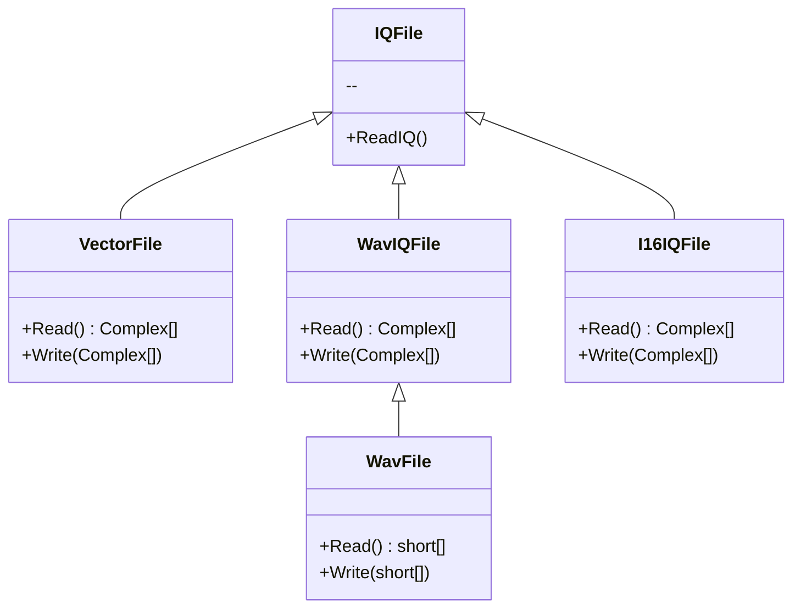

# SeeSharp JXI DSP CORE Library

R0.2 增加wav lib说明

## About

### 缘起

自2016年到2021年C#开发测试测量软件的工作表明，业界缺少贴合测试测量编程使用的数字信号处理类库。聚星仪器决定将多年积累的类库规整汇编，以源代码形式发布。本项目自2021年11月20日线上会议发起，计划2022年2月28日发布。

为什么轮到我们？聚星具有广泛全面的测试测量经验，和专业的C#编程经验。 就像音乐需要原创，经典科技可可以原创的。我们以聚星一部分经验丰富的工程师为核心，招募和欢迎聚星其他员工、简仪员工，以及全社会有志之士，实现这个可以使用20年甚至更长时间的，经典的，面向测试测量应用的数字信号处理类库

本项目产出知识产权属于参与开发的各个公司实体各自独立享用，并保留知识产权。对于未获得书面授权的单位和个人，其在此类库基础上开发的软件需要开源，不然将可能构成侵权。

### 最初基础

JXI DSP library (独立工具包项目)

JXI RF DSP library (源码在VST 项目 Git\RF\VST\CSharp Source)

JXISH's works from Modulation ID project （ModClass 项目)

### 应用推广

本项目基础工具已经在聚星频谱检测平台(SMP)、解调仪(ModClass)等项目成功使用。将来计划安排实习生做小课题，编写范例，撰写应用笔记。

市场推广信息将通过自媒体发布传播。

## Function Groups

最新功能树描述在 Git\SeesharpTools\JXI\DSP-Core\Document\Notes

JXI DSP-Core Note 00100_C# DSP-Core Library 功能树.md

### Numerics

#### Init

初始化数组并赋值常数

初始化复数数组

-需要将JXI.RF.DSP.Mathematics.Vector初始化波形部分转移到Generation吧？

#### Copy

-from JXI.RF.DSP.Mathematics.Vector

需要yym说明和Array.Copy区别

#### Convert

1. double[] <-> float[]

#### Math

1.  (double[] + double)|(float[] + float)
2. (double[]+double[])|(float[]+float[])
3. Conjugate, Add, Substract, Scale, Multiply, Divide, Max, Min, Root, Log10
4. Complex Array Convertion (Complex[]|Complex32[])
   1. complex array to magnitude array
   2. complex array to phase array
   3. complex array to magnitude and phase array
   4. complex array to power array
   5. complex array to real array
   6. complex array to real and imaginery array

### Mathematics

#### Curve Fitting

#### Probability Statistics

可增加x% tile分析

### Signal Processing

#### Conditioning

##### Easy Filters

1. FIR
2. IIR

##### Advanced Filters

1. FIR
2. Multi-rate FIR

#### Synchronization

#### Easy Resample

#### Generation

##### Gaussian White Noise

##### Sinc

-JXI.RF.DSP.Mathematics.MathUtility

##### Complex Waveforms

-from JXI.RF.DSP.Generation & JXI.RF.DSP.Mathematics

这里需要yym整理，有哪些波形，支持哪些输出数据类型；然后看和DSP lib如何协调

#### Measurements

##### Frequency Response Function

##### Harmonic Analysis

##### Square-wave Measurement

##### Third Octave Analysis

#### Spectrum Analysis

##### General Spectrum

##### RFSA Spectrum

from JXI.RF.DSP.Spectrum

##### Spectrum Measurements

频谱平均、OBW(多种方法和去除本底)、Fc(多种方法) 等ITU测量

可被General Spectrum 和 RFSA Spectrum使用

#### Transform

##### DFT

1. Forward(shifted|not shifted, Complex|Complex32|double)
2. Backward(shifted|not shifted, Complex|Complex32|double)

#### JTFA

##### General JTFA

##### RFSA JTFA

##### STFT

### Communication

#### Analog Modulation

-from JXI.RF.DSP.Modem

	1. AM
	2. FM
	3. Pulse Modulation

#### Analog Demodulation

-from ModClass

1. AM
2. FM
3. PM

#### Convertion

1. Frequency Shift
2. Up|Down Sampling

### File Exchange

### 层次关系

#### Vector File

#### Wav File

- 音频: from \\BMS4\CSharp Source\Public\Wav File Library

`

Wav File Library

关键属性，对于写入文件，在任何时候设置，关闭文件时最终写入Wav文件头；对于读取文件，在打开文件时获取。

ushort BitsPerSample = 8|16|24|32

ushort NumberOfChannels = 1|2

double SampleRate

辅助属性

string Name - 文件路径全名

ulong Length - 总每个通道的采样点数

ulong Position - 当前文件读写指针位置，采样点数为单位

创建流程：

创建文件WavFileStream()-写入数据Write(byte[]|short[])-...-写入数据-关闭文件Close()

读取流程：

打开文件WavFileStream()-[设定位置Seek(long, SeekOrigin)]-读取数据Read(short[])-...-[设定位置]-读取数据-关闭文件Close()

- IQ: from ModClass

Wav File Generator

属性

uint SampleRate

ushort Channels

double WavRange

从double波形创建文件流程

构建WavFileGenerator()-设置属性-导入波形SetWaveform(double[])-写入文件Save(string)

Wav File Reader

属性 (打开文件时获得)

int SamplePerSec

int DataSize

int Num_Channels

读取波形流程

打开文件OpenWAVFile(string)-short[] 读数据ReadWavFIleData(int)-关闭文件CloseWavFile()

* http://git.jxinst.com:8081/SeeSharpTools/JXI/wavfile  代码

WavFileGenerator

比ModClass多

SetMonoWaveform(short[])

SetStereoWaveform(short[], short[])

WavFileReader

与ModClass相同

#### I16 File

读取bin + json文件 返回IQ复数数组

Complex[] ReadBinFile(string)

#### IQFile.cs

GetTestFiles

GetMatchedTestFiles

ReadIQFile(string, IQInfo): Complex[]

## Definitions

各方法定义列表

## Glossary

专有名词列表和解释

## Credits

对类库有实质贡献的人员列表如下，排列不分次序，一并致谢：

Hui Shao

Yuanchao Li

Wei Jin

Xiaojiao Xie

Yiming Yu

随项目展开，参与人员将根据实际情况逐步添加。

